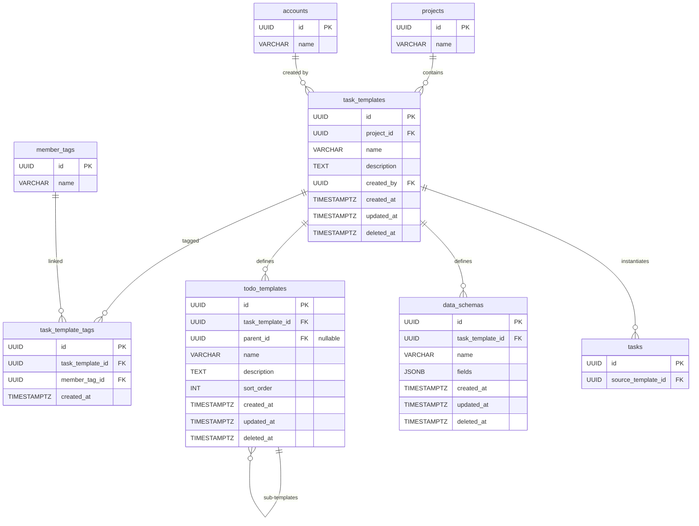

# 07 — TaskTemplate / TodoTemplate / DataSchema（任務模板 / 待辦事項模板 / 資料表定義）

## 1. Entity 總覽

**TaskTemplate（任務模板）** 是 Conf-Ops 系統中標準工作流程的定義單位。每個任務模板描述一種可重複執行的工作類型（例如「講者邀約」、「贊助商聯繫」），並透過以下結構組成完整的工作流程定義：

- **MemberTag（成員標籤）**：透過多對多關聯（`task_template_tags`），定義哪些角色組別負責此類型任務。當任務從模板實例化時，系統根據此關聯決定任務的擁有者標籤。
- **TodoTemplate（待辦事項模板）**：定義任務實例化後應包含的待辦事項清單，支援最多一層巢狀結構。
- **DataSchema（資料表定義）**：定義任務需要蒐集的結構化資料欄位，例如贊助商資訊、講者資訊等。

當專案從模板實例化任務時，系統會根據 TaskTemplate 的定義，自動建立對應的 Todo、DataEntry 等子實體。

### 關聯關係

```
MemberTag ←─ task_template_tags ─→ TaskTemplate
                                        │
                                        ├──→ TodoTemplate（1:N，支援一層巢狀）
                                        │       └──→ TodoTemplate（子待辦模板）
                                        │
                                        └──→ DataSchema（1:N）
```

---

## 2. 資料表定義

### 2.1 `task_templates`（任務模板）

```sql
CREATE TABLE task_templates (
    id          UUID        PRIMARY KEY,
    project_id  UUID        NOT NULL REFERENCES projects(id),
    name        VARCHAR     NOT NULL,
    description TEXT,
    created_by  UUID        NOT NULL REFERENCES accounts(id),
    created_at  TIMESTAMPTZ NOT NULL DEFAULT NOW(),
    updated_at  TIMESTAMPTZ NOT NULL DEFAULT NOW(),
    deleted_at  TIMESTAMPTZ
);
```

### 2.2 `task_template_tags`（任務模板 ↔ 成員標籤 關聯）

```sql
CREATE TABLE task_template_tags (
    id               UUID        PRIMARY KEY,
    task_template_id UUID        NOT NULL REFERENCES task_templates(id),
    member_tag_id    UUID        NOT NULL REFERENCES member_tags(id),
    created_at       TIMESTAMPTZ NOT NULL DEFAULT NOW()
);
```

### 2.3 `todo_templates`（待辦事項模板）

```sql
CREATE TABLE todo_templates (
    id               UUID        PRIMARY KEY,
    task_template_id UUID        NOT NULL REFERENCES task_templates(id),
    parent_id        UUID        REFERENCES todo_templates(id),
    name             VARCHAR     NOT NULL,
    description      TEXT,
    sort_order       INTEGER     NOT NULL,
    created_at       TIMESTAMPTZ NOT NULL DEFAULT NOW(),
    updated_at       TIMESTAMPTZ NOT NULL DEFAULT NOW(),
    deleted_at       TIMESTAMPTZ
);
```

### 2.4 `data_schemas`（資料表定義）

```sql
CREATE TABLE data_schemas (
    id               UUID        PRIMARY KEY,
    task_template_id UUID        NOT NULL REFERENCES task_templates(id),
    name             VARCHAR     NOT NULL,
    fields           JSONB       NOT NULL,
    created_at       TIMESTAMPTZ NOT NULL DEFAULT NOW(),
    updated_at       TIMESTAMPTZ NOT NULL DEFAULT NOW(),
    deleted_at       TIMESTAMPTZ
);
```

---

## 3. 索引定義

```sql
-- task_templates
CREATE INDEX idx_task_templates_project_id ON task_templates (project_id)
    WHERE deleted_at IS NULL;
CREATE INDEX idx_task_templates_created_by ON task_templates (created_by);
CREATE INDEX idx_task_templates_deleted_at ON task_templates (deleted_at);

-- task_template_tags
CREATE INDEX idx_task_template_tags_task_template_id ON task_template_tags (task_template_id);
CREATE INDEX idx_task_template_tags_member_tag_id    ON task_template_tags (member_tag_id);
CREATE UNIQUE INDEX uq_task_template_tags_template_tag
    ON task_template_tags (task_template_id, member_tag_id);

-- todo_templates
CREATE INDEX idx_todo_templates_task_template_id ON todo_templates (task_template_id);
CREATE INDEX idx_todo_templates_parent_id        ON todo_templates (parent_id);
CREATE INDEX idx_todo_templates_deleted_at       ON todo_templates (deleted_at);

-- data_schemas
CREATE INDEX idx_data_schemas_task_template_id ON data_schemas (task_template_id);
CREATE INDEX idx_data_schemas_deleted_at       ON data_schemas (deleted_at);
```

---

## 4. JSONB 欄位結構：`data_schemas.fields`

`fields` 欄位儲存資料表的欄位定義陣列，結構如下：

```json
[
  {
    "key": "string (schema 內唯一識別鍵)",
    "label": "string (顯示名稱)",
    "description": "string (用途說明、範例，供 AI 理解上下文)",
    "type": "single_line_text | multi_line_text | number | date | email | url | select | boolean | image | file",
    "required": true,
    "constraints": {
      // 依 type 而異，詳見下方說明
    }
  }
]
```

### 各 `type` 對應的 `constraints`

| type | constraints 欄位 | 說明 |
|------|-----------------|------|
| `single_line_text` | `maxLength: number` | 最大字元數 |
| `multi_line_text` | `maxLength: number`, `maxLines: number` | 最大字元數、最大行數 |
| `number` | `min: number`, `max: number`, `decimal: boolean` | 最小值、最大值、是否允許小數 |
| `date` | `minDate: string`, `maxDate: string` | 最小日期、最大日期（ISO 8601 格式） |
| `email` | — | 無額外約束 |
| `url` | — | 無額外約束 |
| `select` | `options: string[]` | 可選選項列表 |
| `boolean` | — | 無額外約束 |
| `image` | `maxFileSize: number`, `accept: string[]` | 最大檔案大小（bytes）、允許的 MIME 類型 |
| `file` | `maxFileSize: number`, `accept: string[]` | 最大檔案大小（bytes）、允許的 MIME 類型 |

---

## 5. Rust 結構體定義

### 5.1 TaskTemplate

```rust
use chrono::{DateTime, Utc};
use serde::{Deserialize, Serialize};
use uuid::Uuid;

pub struct TaskTemplate {
    pub id: Uuid,
    pub project_id: Uuid,
    pub name: String,
    pub description: Option<String>,
    pub created_by: Uuid,
    pub created_at: DateTime<Utc>,
    pub updated_at: DateTime<Utc>,
    pub deleted_at: Option<DateTime<Utc>>,
}

pub struct TaskTemplateTag {
    pub id: Uuid,
    pub task_template_id: Uuid,
    pub member_tag_id: Uuid,
    pub created_at: DateTime<Utc>,
}
```

### 5.2 TodoTemplate

```rust
pub struct TodoTemplate {
    pub id: Uuid,
    pub task_template_id: Uuid,
    pub parent_id: Option<Uuid>,
    pub name: String,
    pub description: Option<String>,
    pub sort_order: i32,
    pub created_at: DateTime<Utc>,
    pub updated_at: DateTime<Utc>,
    pub deleted_at: Option<DateTime<Utc>>,
}
```

### 5.3 DataSchema

```rust
pub struct DataSchema {
    pub id: Uuid,
    pub task_template_id: Uuid,
    pub name: String,
    pub fields: Vec<DataSchemaField>,
    pub created_at: DateTime<Utc>,
    pub updated_at: DateTime<Utc>,
    pub deleted_at: Option<DateTime<Utc>>,
}
```

### 5.4 JSONB 欄位型別

```rust
#[derive(Serialize, Deserialize)]
pub struct DataSchemaField {
    pub key: String,
    pub label: String,
    pub description: String,
    #[serde(rename = "type")]
    pub field_type: FieldType,
    pub required: bool,
    #[serde(default, skip_serializing_if = "Option::is_none")]
    pub constraints: Option<FieldConstraints>,
}

#[derive(Serialize, Deserialize)]
#[serde(rename_all = "snake_case")]
pub enum FieldType {
    SingleLineText,
    MultiLineText,
    Number,
    Date,
    Email,
    Url,
    Select,
    Boolean,
    Image,
    File,
}

#[derive(Serialize, Deserialize)]
pub struct FieldConstraints {
    #[serde(default, skip_serializing_if = "Option::is_none")]
    pub max_length: Option<u32>,
    #[serde(default, skip_serializing_if = "Option::is_none")]
    pub max_lines: Option<u32>,
    #[serde(default, skip_serializing_if = "Option::is_none")]
    pub min: Option<f64>,
    #[serde(default, skip_serializing_if = "Option::is_none")]
    pub max: Option<f64>,
    #[serde(default, skip_serializing_if = "Option::is_none")]
    pub decimal: Option<bool>,
    #[serde(default, skip_serializing_if = "Option::is_none")]
    pub min_date: Option<String>,
    #[serde(default, skip_serializing_if = "Option::is_none")]
    pub max_date: Option<String>,
    #[serde(default, skip_serializing_if = "Option::is_none")]
    pub options: Option<Vec<String>>,
    #[serde(default, skip_serializing_if = "Option::is_none")]
    pub max_file_size: Option<u64>,
    #[serde(default, skip_serializing_if = "Option::is_none")]
    pub accept: Option<Vec<String>>,
}
```

---

## 6. 關聯圖（Mermaid ER Diagram）



---

## 7. 業務規則

### 7.1 待辦事項模板巢狀限制

- **最多一層巢狀**：`parent_id` 僅可參照 `parent_id IS NULL` 的待辦事項模板。
- 應用層在建立或更新 `todo_templates` 時必須驗證：若指定了 `parent_id`，該父項的 `parent_id` 必須為 `NULL`。
- 資料庫層不設 CHECK 約束，由應用層 Rust 程式碼保證。

### 7.2 欄位 key 唯一性

- `data_schemas.fields` JSONB 陣列中，每個元素的 `key` 在同一個 schema 內必須唯一。
- 由應用層在寫入前驗證，不依賴資料庫約束。

### 7.3 欄位型別驗證規則

- `constraints` 中的屬性必須與 `type` 匹配。例如 `options` 僅在 `type = select` 時有效，`maxLength` 僅在 `single_line_text` 或 `multi_line_text` 時有效。
- 應用層透過 Rust 型別系統與 `serde` 反序列化驗證，拒絕不合法的組合。

### 7.4 專案複製時的模板行為

- 當專案被複製（`projects.source_project_id`）時，所有關聯的 `task_templates` 及其子實體（`todo_templates`、`data_schemas`、`task_template_tags`）會進行**深層複製（deep copy）**。
- 複製後的模板為獨立實體，修改不影響原始模板。
- 複製流程：
  1. 複製 `task_templates`，產生新 UUID
  2. 複製 `todo_templates`，更新 `task_template_id` 與 `parent_id` 指向新 UUID
  3. 複製 `data_schemas`，更新 `task_template_id` 指向新 UUID
  4. 複製 `task_template_tags`，更新 `task_template_id` 與 `member_tag_id`（指向新專案中對應的新標籤）

### 7.5 `task_template_tags` 唯一性

- 同一個 `task_template_id` 與 `member_tag_id` 的組合不可重複，由唯一索引 `uq_task_template_tags_template_tag` 保證。

### 7.6 軟刪除

- `task_templates`、`todo_templates`、`data_schemas` 皆使用軟刪除（`deleted_at`）。
- 所有查詢預設加上 `WHERE deleted_at IS NULL`。
- `task_template_tags` 為關聯表，不使用軟刪除，直接實體刪除。

---

## 8. CRDT 標記

| 實體 | CRDT 管理 | 說明 |
|------|----------|------|
| `task_templates` | 否 | 模板為靜態定義，由單一使用者編輯，不需多人即時協作同步 |
| `todo_templates` | 否 | 同上，模板定義階段為單一編輯 |
| `data_schemas` | 否 | 同上，schema 定義為單一編輯 |
| `task_template_tags` | 否 | 關聯表，不適用 CRDT |

> **注意**：CRDT 機制適用於任務實例化後的運行時實體（如 `todos`、`data_entries`、`memories`），而非模板定義階段的實體。模板相關的記憶（`memories` 中 `scope_type = 'task_template'`）的 `content` 欄位由 CRDT 管理，但該機制定義於 [13-memory.md](./13-memory.md)。
