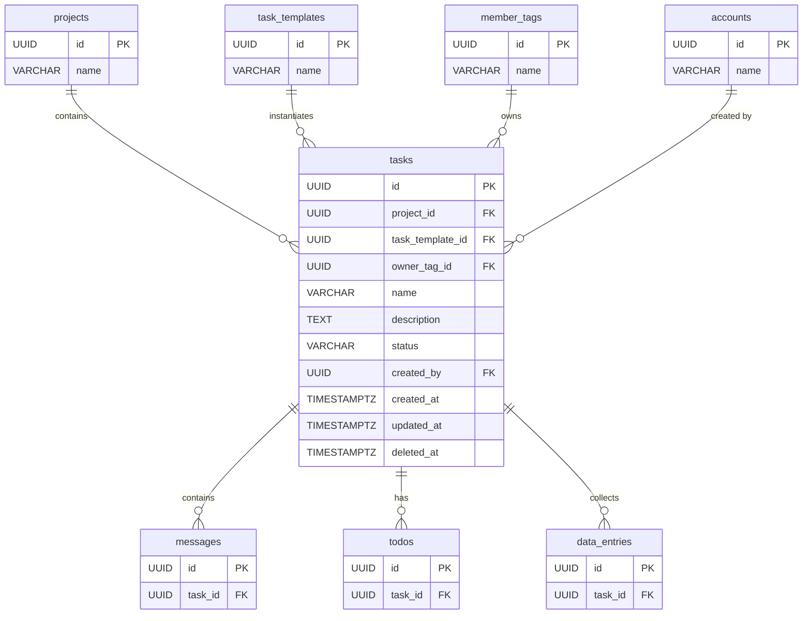

# 08 — Task（任務）

## 1. 實體總覽

**Task（任務）** 是從任務模板（TaskTemplate）實例化而來的具體工作單位。每個任務代表一項需要執行的具體工作（例如「與 A 贊助商保持聯絡」、「邀請講者 B」），歸屬於特定的成員標籤（MemberTag），由建立者（Account）建立。

任務是系統中最核心的運作單位，包含：
- **任務對話（Conversation）**：所有操作的主要介面與完整審計追蹤
- **待辦事項（Todos）**：從模板實例化或臨時建立的可追蹤工作項目
- **資料列（DataEntries）**：對應任務模板的結構化資料蒐集
- **記憶（Memories）**：繼承自模板與任務專屬的經驗累積

### 參與人（Participants）

任務的參與人由系統**自動計算**，決定誰能查看與操作該任務。參與人不儲存於資料庫，而是在查詢時由應用層即時計算。計算來源包含：

- `owner_tag_id` 成員標籤下的所有成員
- 在任務對話中被 `@` 提及的成員
- 任務建立者 `created_by`
- 待辦事項的被指派者（`todo_assignees`）

### 關聯實體

- `projects`：所屬專案
- `task_templates`：來源任務模板
- `member_tags`：歸屬的成員標籤（`owner_tag_id`）
- `accounts`：建立者（`created_by`）
- `messages`：任務對話中的訊息
- `todos`：任務中的待辦事項
- `data_entries`：任務的資料列
- `memories`：任務層級的記憶
- `scheduled_reminders`：任務的排程提醒
- `email_threads`：任務的 Email 執行緒

---

## 2. Table 定義

### 2.1 `tasks` 主表

```sql
CREATE TYPE task_status AS ENUM ('pending', 'in_progress', 'completed', 'cancelled');

CREATE TABLE tasks (
    id               UUID        PRIMARY KEY,
    project_id       UUID        NOT NULL REFERENCES projects(id),
    task_template_id UUID        NOT NULL REFERENCES task_templates(id),
    owner_tag_id     UUID        NOT NULL REFERENCES member_tags(id),
    name             VARCHAR     NOT NULL,
    description      TEXT,
    status           task_status NOT NULL DEFAULT 'pending',
    created_by       UUID        NOT NULL REFERENCES accounts(id),
    created_at       TIMESTAMPTZ NOT NULL DEFAULT NOW(),
    updated_at       TIMESTAMPTZ NOT NULL DEFAULT NOW(),
    deleted_at       TIMESTAMPTZ
);
```

**欄位說明：**

| 欄位 | 型別 | 說明 |
|------|------|------|
| `id` | UUID | 主鍵，UUID v7，應用層產生 |
| `project_id` | UUID | 所屬專案 ID，FK → `projects(id)` |
| `task_template_id` | UUID | 來源任務模板 ID，FK → `task_templates(id)` |
| `owner_tag_id` | UUID | 歸屬的成員標籤 ID，FK → `member_tags(id)` |
| `name` | VARCHAR | 任務名稱，可自訂（如「與 A 贊助商保持聯絡」） |
| `description` | TEXT | 任務描述，可為 NULL |
| `status` | task_status | 任務狀態（PostgreSQL ENUM），預設 `'pending'`，可選值見下方 |
| `created_by` | UUID | 建立者帳號 ID，FK → `accounts(id)` |
| `created_at` | TIMESTAMPTZ | 建立時間，UTC |
| `updated_at` | TIMESTAMPTZ | 最後更新時間，UTC |
| `deleted_at` | TIMESTAMPTZ | 軟刪除時間，NULL 表示有效 |

**`status` 可選值：**

| 狀態 | 說明 |
|------|------|
| `pending` | 待開始 — 任務剛建立，尚未有實質活動 |
| `in_progress` | 進行中 — 任務有了實質活動 |
| `completed` | 已完成 — 所有待辦事項皆已完成，由參與人手動標記 |
| `cancelled` | 已取消 — 由參與人手動標記 |

---

## 3. 索引定義

```sql
-- 依專案與狀態查詢任務列表
CREATE INDEX idx_tasks_project_id_status ON tasks (project_id, status);

-- 依歸屬標籤查詢任務
CREATE INDEX idx_tasks_owner_tag_id ON tasks (owner_tag_id);

-- 依來源模板查詢任務
CREATE INDEX idx_tasks_task_template_id ON tasks (task_template_id);

-- 依建立者查詢任務
CREATE INDEX idx_tasks_created_by ON tasks (created_by);

-- 軟刪除過濾
CREATE INDEX idx_tasks_deleted_at ON tasks (deleted_at);
```

---

## 4. Rust 結構體定義

```rust
use chrono::{DateTime, Utc};
use uuid::Uuid;

pub struct Task {
    pub id: Uuid,
    pub project_id: Uuid,
    pub task_template_id: Uuid,
    pub owner_tag_id: Uuid,
    pub name: String,
    pub description: Option<String>,
    pub status: TaskStatus,
    pub created_by: Uuid,
    pub created_at: DateTime<Utc>,
    pub updated_at: DateTime<Utc>,
    pub deleted_at: Option<DateTime<Utc>>,
}

#[derive(Debug, Clone, PartialEq, Eq)]
pub enum TaskStatus {
    Pending,
    InProgress,
    Completed,
    Cancelled,
}
```

---

## 5. 狀態轉換規則

```
                    ┌──────────────────────────────────┐
                    │                                  │
                    ▼                                  │
              ┌──────────┐    首次活動（自動）    ┌─────────────┐
  建立任務 →  │ pending  │ ─────────────────→ │ in_progress │
              └──────────┘                    └─────────────┘
                    │                                  │
                    │         手動標記                   │  手動標記（所有 todo 完成）
                    ▼                                  ▼
              ┌──────────┐                    ┌─────────────┐
              │cancelled │                    │  completed  │
              └──────────┘                    └─────────────┘
```

**轉換規則：**

| 來源狀態 | 目標狀態 | 觸發條件 |
|----------|----------|----------|
| `pending` | `in_progress` | **自動**：任務對話中出現訊息、待辦事項被指派、或有任何操作時 |
| `pending` | `completed` | **手動**：由參與人標記，前提是所有待辦事項已完成 |
| `in_progress` | `completed` | **手動**：由參與人標記，前提是所有待辦事項已完成 |
| `pending` | `cancelled` | **手動**：由參與人標記 |
| `in_progress` | `cancelled` | **手動**：由參與人標記 |

---

## 6. 關聯圖（Mermaid ER Diagram）



---

## 7. 業務規則

### 7.1 參與人計算

參與人（Participants）不儲存於資料庫，而是在查詢時由應用層即時計算。計算邏輯如下：

```
participants =
    ownerTag 下的所有成員（members）
  ∪ 任務對話中被 @mentioned 的成員
  ∪ 任務建立者 createdBy
  ∪ 所有 todo_assignees 中的成員
```

參與人決定了誰能查看與操作該任務（包含查看對話、確認 AI 建議、使用執行工具）。

### 7.2 任務建立

- 任務必須從任務模板實例化，`task_template_id` 不可為 NULL。
- 建立時必須指定 `owner_tag_id`，確定任務的組別歸屬與可見性。
- `owner_tag_id` 必須是該任務模板所關聯的成員標籤之一（透過 `task_template_tags`）。
- 建立任務時，系統自動從任務模板的 `todo_templates` 建立對應的 `todos`，並為每個 `data_schemas` 建立對應的 `data_entries`。

### 7.3 狀態完成條件

- 將任務標記為 `completed` 時，所有待辦事項（`todos`）必須為 `completed` 狀態。
- 應用層在狀態轉換前驗證此條件。

### 7.4 軟刪除

- 使用 `deleted_at` 軟刪除，所有查詢預設加上 `WHERE deleted_at IS NULL`。
- 刪除任務時不連帶刪除子實體（`messages`、`todos`、`data_entries`），子實體透過 `task_id` 關聯仍可查詢。

---

## 8. CRDT 標記

| 實體 | CRDT 管理 | 說明 |
|------|----------|------|
| `tasks` | 否 | 任務主表欄位（`name`、`status` 等）由單一操作修改，不需多人即時協作同步。狀態轉換有明確規則，不存在衝突情境 |

> **注意**：任務的子實體（`messages`、`todos`、`data_entries`）由 CRDT 管理，詳見各自的資料模型文件。
