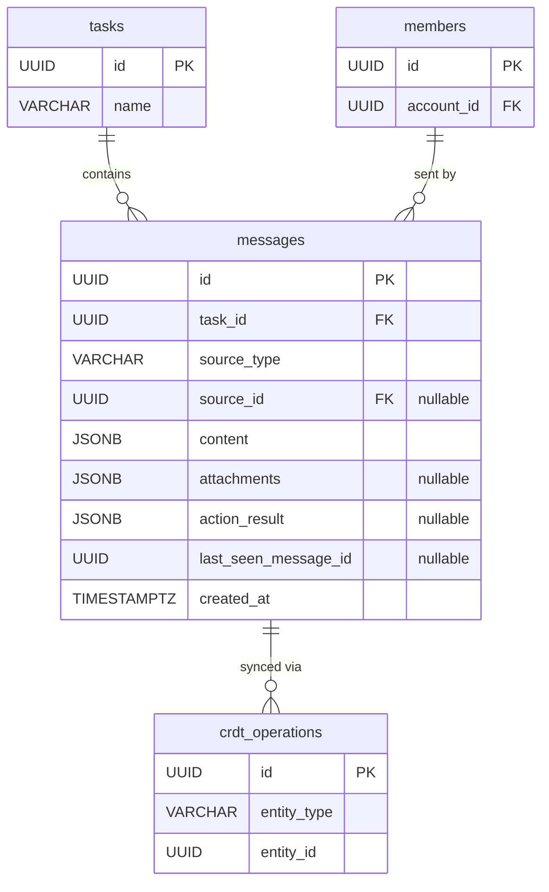

# 09 — Message（訊息）

## 1. 實體總覽

**Message（訊息）** 是任務對話（Task Conversation）中的單則記錄。任務對話是使用者操作的主要介面，也是完整的審計追蹤——每個動作（誰做了什麼、AI 建議了什麼、人類如何決策）都記錄為一則訊息。

訊息依 `source_type` 區分為五種來源類型：
- **`member`**：成員或外部聯絡人的發言（Web 介面留言）
- **`ai_suggestion`**：AI 建議群組，包含一或多個工具執行建議
- **`tool_execution`**：工具執行結果記錄
- **`system`**：系統事件通知
- **`email_inbound`**：透過 Email 收件（Inbound Webhook）進入的外部來信

訊息使用 UUID v7 作為主鍵，天然具備時間排序能力，確保對話時間線的正確順序。

### CRDT 同步

訊息表儲存物化狀態（最新狀態），搭配 `crdt_operations` 表儲存 CRDT 操作日誌。當多人同時在同一任務對話中留言或操作時，CRDT 保證所有參與人看到一致的訊息順序。

### 關聯實體

- `tasks`：所屬任務
- `members`：訊息來源成員（當 `source_type = 'member'` 時透過 `source_id` 關聯）
- `crdt_operations`：CRDT 操作日誌（`entity_type = 'message'`）

---

## 2. Table 定義

### 2.1 `messages` 主表

```sql
CREATE TYPE message_source_type AS ENUM ('member', 'ai_suggestion', 'tool_execution', 'system', 'email_inbound');

CREATE TABLE messages (
    id                   UUID                 PRIMARY KEY,
    task_id              UUID                 NOT NULL REFERENCES tasks(id),
    source_type          message_source_type  NOT NULL,
    source_id            UUID,
    content              JSONB                NOT NULL,
    attachments          JSONB,
    action_result        JSONB,
    last_seen_message_id UUID,
    created_at           TIMESTAMPTZ          NOT NULL DEFAULT NOW()
);
```

**欄位說明：**

| 欄位 | 型別 | 說明 |
|------|------|------|
| `id` | UUID | 主鍵，UUID v7，應用層產生。UUID v7 前 48 位元為時間戳，天然按建立時間排序 |
| `task_id` | UUID | 所屬任務 ID，FK → `tasks(id)` |
| `source_type` | message_source_type | 來源類型（PostgreSQL ENUM）：`'member'`、`'ai_suggestion'`、`'tool_execution'`、`'system'`、`'email_inbound'` |
| `source_id` | UUID | 來源者 ID。`source_type = 'member'` 時為 `members(id)`；其他類型為 NULL |
| `content` | JSONB | 訊息內容，結構依 `source_type` 不同，詳見第 4 節 |
| `attachments` | JSONB | 附件陣列，可為 NULL。結構見第 4 節 |
| `action_result` | JSONB | AI 建議的決策與執行結果，可為 NULL。結構見第 4 節 |
| `last_seen_message_id` | UUID | 寫入操作時客戶端附帶的已讀訊息 ID，用於已讀保護驗證 |
| `created_at` | TIMESTAMPTZ | 建立時間，UTC |

> **注意**：`messages` 表不包含 `updated_at` 和 `deleted_at`。訊息為不可變記錄（append-only），建立後不修改也不刪除。AI 建議的決策結果透過 `action_result` 欄位記錄，而非修改原始訊息。

---

## 3. 索引定義

```sql
-- 依任務查詢對話時間線（UUID v7 自帶時間排序）
CREATE INDEX idx_messages_task_id_created_at ON messages (task_id, created_at);

-- 依來源類型篩選訊息
CREATE INDEX idx_messages_source_type ON messages (source_type);

-- 搜尋訊息內容（GIN 索引）
CREATE INDEX idx_messages_content ON messages USING GIN (content jsonb_path_ops);
```

---

## 4. JSONB 欄位結構

### 4.1 `content` — 訊息內容

結構依 `source_type` 不同：

#### `source_type = 'member'`（成員發言）

```json
{
  "text": "string (訊息文字內容)",
  "mentions": [
    {
      "type": "member | tag",
      "id": "UUID (成員 ID 或標籤 ID)"
    }
  ]
}
```

| 欄位 | 型別 | 說明 |
|------|------|------|
| `text` | string | 訊息文字內容 |
| `mentions` | array | 提及列表，可為空陣列 |
| `mentions[].type` | string | 提及類型：`member`（提及成員）或 `tag`（提及標籤下所有成員） |
| `mentions[].id` | UUID | 被提及的成員 ID 或標籤 ID |

#### `source_type = 'ai_suggestion'`（AI 建議）

```json
{
  "suggestionGroup": {
    "id": "UUID",
    "trigger": "task_created | todo_completed | message_sent | tool_error | source_data_changed | manual_request",
    "suggestions": [
      {
        "id": "UUID",
        "summary": "string (建議摘要)",
        "tool": "string (MCP 工具名稱)",
        "parameters": {},
        "reasoning": "string (建議理由)",
        "contextUsed": [
          {
            "scopeType": "string (記憶範圍類型)",
            "memoryId": "UUID (記憶 ID)",
            "content": "string (記憶內容摘要)"
          }
        ],
        "decision": "pending | accept | modify_and_accept | reject | re_suggest",
        "decidedBy": "UUID (決策者帳號 ID)",
        "decidedAt": "timestamp (決策時間)",
        "modifiedParameters": {},
        "executionResult": {}
      }
    ],
    "createdAt": "timestamp"
  }
}
```

**SuggestionGroup 結構說明：**

| 欄位 | 型別 | 說明 |
|------|------|------|
| `id` | UUID | 建議群組唯一識別碼 |
| `trigger` | string | 觸發此建議的事件類型 |
| `suggestions` | array | 建議列表，一個群組可包含多個建議 |
| `createdAt` | timestamp | 建議群組建立時間 |

**Suggestion 結構說明：**

| 欄位 | 型別 | 說明 |
|------|------|------|
| `id` | UUID | 單一建議的唯一識別碼 |
| `summary` | string | 建議摘要，供人類快速理解 |
| `tool` | string | 建議執行的 MCP 工具名稱 |
| `parameters` | object | 工具參數 |
| `reasoning` | string | AI 提出此建議的理由 |
| `contextUsed` | SuggestionContextRef[] | 建議生成時參考的記憶引用，每筆包含 `scopeType`、`memoryId`、`content` |
| `decision` | string | 決策狀態，預設 `pending` |
| `decidedBy` | UUID | 做出決策的帳號 ID，`pending` 時為 NULL |
| `decidedAt` | timestamp | 決策時間，`pending` 時為 NULL |
| `modifiedParameters` | object | 當 `decision = 'modify_and_accept'` 時，人類修改後的參數 |
| `executionResult` | object | 工具執行結果，`accept` 或 `modify_and_accept` 後填入 |

**`trigger` 可選值：**

| 觸發事件 | 說明 |
|----------|------|
| `task_created` | 任務剛建立 |
| `todo_completed` | 待辦事項完成 |
| `message_sent` | 成員發送訊息 |
| `tool_error` | 工具執行失敗 |
| `source_data_changed` | 來源資料變更（跨任務資料分享） |
| `manual_request` | 使用者透過 API 手動觸發建議 |

**`decision` 可選值：**

| 決策 | 說明 |
|------|------|
| `pending` | 待決策 |
| `accept` | 接受並執行 |
| `modify_and_accept` | 修改參數後接受並執行 |
| `reject` | 拒絕此建議 |
| `re_suggest` | 要求 AI 重新建議 |

#### `source_type = 'tool_execution'`（工具執行結果）

```json
{
  "toolName": "string (工具名稱)",
  "parameters": {},
  "result": {},
  "status": "success | error"
}
```

| 欄位 | 型別 | 說明 |
|------|------|------|
| `toolName` | string | 執行的工具名稱 |
| `parameters` | object | 執行時的參數 |
| `result` | object | 工具回傳結果 |
| `status` | string | 執行狀態：`success` 或 `error` |

#### `source_type = 'system'`（系統事件）

```json
{
  "event": "string (事件類型)",
  "details": {}
}
```

| 欄位 | 型別 | 說明 |
|------|------|------|
| `event` | string | 系統事件類型（如 `task_status_changed`、`member_joined`、`linked_task_completed` 等） |
| `details` | object | 事件的詳細資訊，結構依事件類型而異 |

#### `source_type = 'email_inbound'`（Email 來信）

```json
{
  "emailThreadId": "UUID (信件串 ID)",
  "emailMessageId": "UUID (email_messages 表的 ID)",
  "from": "string (寄件人 Email)",
  "subject": "string (信件主旨)",
  "bodyPreview": "string (內文摘要)",
  "senderType": "member | contact | unknown",
  "senderId": "UUID (resolved 的 member_id 或 contact_id, nullable)"
}
```

| 欄位 | 型別 | 說明 |
|------|------|------|
| `emailThreadId` | UUID | 所屬信件串 ID，FK → `email_threads(id)` |
| `emailMessageId` | UUID | 對應的 email_messages 記錄 ID |
| `from` | string | 寄件人 Email 地址 |
| `subject` | string | 信件主旨 |
| `bodyPreview` | string | 信件內文摘要（前 200 字元） |
| `senderType` | string | 寄件人身份類型：`member`（已知成員）、`contact`（已知聯絡人）、`unknown`（未知） |
| `senderId` | UUID | 解析後的寄件人 ID（member_id 或 contact_id），未知時為 NULL |

### 4.2 `attachments` — 附件

```json
[
  {
    "fileId": "UUID (關聯至 files 表)",
    "fileName": "string (檔案名稱)",
    "mimeType": "string (MIME 類型)",
    "fileSize": 12345,
    "storagePath": "string (儲存路徑)"
  }
]
```

| 欄位 | 型別 | 說明 |
|------|------|------|
| `fileId` | UUID | 關聯至 files 表的檔案 ID |
| `fileName` | string | 原始檔案名稱 |
| `mimeType` | string | 檔案的 MIME 類型 |
| `fileSize` | number | 檔案大小（bytes） |
| `storagePath` | string | 系統儲存路徑 |

### 4.3 `action_result` — AI 建議決策與執行結果

此欄位為 `content.suggestionGroup` 中個別建議的決策與執行結果的扁平化摘要，方便查詢：

```json
{
  "suggestionGroupId": "UUID",
  "suggestions": [
    {
      "id": "UUID",
      "decision": "accept | modify_and_accept | reject | re_suggest",
      "executionResult": {}
    }
  ],
  "decision": "string (群組整體決策摘要)",
  "executionResult": {}
}
```

### 2.2 `conversation_states` 表

追蹤每位使用者在每個任務對話中的閱讀狀態。

```sql
CREATE TABLE conversation_states (
    id                   UUID        PRIMARY KEY,
    task_id              UUID        NOT NULL REFERENCES tasks(id),
    account_id           UUID        NOT NULL REFERENCES accounts(id),
    last_read_message_id UUID,
    unread_count         INTEGER     NOT NULL DEFAULT 0,
    created_at           TIMESTAMPTZ NOT NULL DEFAULT NOW(),
    updated_at           TIMESTAMPTZ NOT NULL DEFAULT NOW(),

    CONSTRAINT uq_conversation_states_task_account
        UNIQUE (task_id, account_id)
);
```

**欄位說明：**

| 欄位 | 型別 | 說明 |
|------|------|------|
| `id` | UUID | 主鍵，UUID v7，應用層產生 |
| `task_id` | UUID | 任務 ID，FK → `tasks(id)` |
| `account_id` | UUID | 帳號 ID，FK → `accounts(id)` |
| `last_read_message_id` | UUID | 最後已讀訊息 ID，可為 NULL |
| `unread_count` | INTEGER | 未讀訊息數，預設 0 |
| `created_at` | TIMESTAMPTZ | 建立時間，UTC |
| `updated_at` | TIMESTAMPTZ | 最後更新時間，UTC |

**索引：**

```sql
CREATE INDEX idx_conversation_states_task_id
    ON conversation_states (task_id);

CREATE INDEX idx_conversation_states_account_id
    ON conversation_states (account_id);
```

### 2.3 `last_seen_positions` 表

追蹤 CRDT 同步位置，記錄每位使用者在每個任務對話中的 Yjs clock 位置。

```sql
CREATE TABLE last_seen_positions (
    id              UUID        PRIMARY KEY,
    task_id         UUID        NOT NULL REFERENCES tasks(id),
    account_id      UUID        NOT NULL REFERENCES accounts(id),
    y_clock         BIGINT      NOT NULL,
    updated_at      TIMESTAMPTZ NOT NULL DEFAULT NOW(),

    CONSTRAINT uq_last_seen_positions_task_account
        UNIQUE (task_id, account_id)
);
```

**欄位說明：**

| 欄位 | 型別 | 說明 |
|------|------|------|
| `id` | UUID | 主鍵，UUID v7，應用層產生 |
| `task_id` | UUID | 任務 ID，FK → `tasks(id)` |
| `account_id` | UUID | 帳號 ID，FK → `accounts(id)` |
| `y_clock` | BIGINT | Yjs CRDT clock 位置 |
| `updated_at` | TIMESTAMPTZ | 最後更新時間，UTC |

**索引：**

```sql
CREATE INDEX idx_last_seen_positions_task_id
    ON last_seen_positions (task_id);

CREATE INDEX idx_last_seen_positions_account_id
    ON last_seen_positions (account_id);
```

---

## 5. Rust 結構體定義

```rust
use chrono::{DateTime, Utc};
use serde::{Deserialize, Serialize};
use uuid::Uuid;

pub struct Message {
    pub id: Uuid,
    pub task_id: Uuid,
    pub source_type: MessageSourceType,
    pub source_id: Option<Uuid>,
    pub content: serde_json::Value,
    pub attachments: Option<Vec<Attachment>>,
    pub action_result: Option<serde_json::Value>,
    pub last_seen_message_id: Option<Uuid>,
    pub created_at: DateTime<Utc>,
}

#[derive(Debug, Clone, PartialEq, Eq)]
pub enum MessageSourceType {
    Member,
    AiSuggestion,
    ToolExecution,
    System,
    EmailInbound,
}

#[derive(Serialize, Deserialize)]
pub struct Attachment {
    pub file_id: Uuid,
    pub file_name: String,
    pub mime_type: String,
    pub file_size: u64,
    pub storage_path: String,
}
```

### 5.1 Content 型別

```rust
/// 對話閱讀狀態
pub struct ConversationState {
    pub id: Uuid,
    pub task_id: Uuid,
    pub account_id: Uuid,
    pub last_read_message_id: Option<Uuid>,
    pub unread_count: i32,
    pub created_at: DateTime<Utc>,
    pub updated_at: DateTime<Utc>,
}

/// CRDT 同步位置
pub struct LastSeenPosition {
    pub id: Uuid,
    pub task_id: Uuid,
    pub account_id: Uuid,
    pub y_clock: i64,
    pub updated_at: DateTime<Utc>,
}

/// source_type = 'member' 時的 content 結構
#[derive(Serialize, Deserialize)]
pub struct MemberContent {
    pub text: String,
    #[serde(default)]
    pub mentions: Vec<Mention>,
}

#[derive(Serialize, Deserialize)]
pub struct Mention {
    #[serde(rename = "type")]
    pub mention_type: MentionType,
    pub id: Uuid,
}

#[derive(Serialize, Deserialize)]
#[serde(rename_all = "snake_case")]
pub enum MentionType {
    Member,
    Tag,
}

/// source_type = 'ai_suggestion' 時的 content 結構
#[derive(Serialize, Deserialize)]
pub struct AiSuggestionContent {
    pub suggestion_group: SuggestionGroup,
}

#[derive(Serialize, Deserialize)]
pub struct SuggestionGroup {
    pub id: Uuid,
    pub trigger: SuggestionTrigger,
    pub suggestions: Vec<Suggestion>,
    pub created_at: DateTime<Utc>,
}

#[derive(Serialize, Deserialize)]
#[serde(rename_all = "snake_case")]
pub enum SuggestionTrigger {
    TaskCreated,
    TodoCompleted,
    MessageSent,
    ToolError,
    SourceDataChanged,
    ManualRequest,
}

#[derive(Serialize, Deserialize)]
pub struct Suggestion {
    pub id: Uuid,
    pub summary: String,
    pub tool: String,
    pub parameters: serde_json::Value,
    pub reasoning: String,
    #[serde(default)]
    pub context_used: Vec<SuggestionContextRef>,
    pub decision: SuggestionDecision,
    #[serde(default, skip_serializing_if = "Option::is_none")]
    pub decided_by: Option<Uuid>,
    #[serde(default, skip_serializing_if = "Option::is_none")]
    pub decided_at: Option<DateTime<Utc>>,
    #[serde(default, skip_serializing_if = "Option::is_none")]
    pub modified_parameters: Option<serde_json::Value>,
    #[serde(default, skip_serializing_if = "Option::is_none")]
    pub execution_result: Option<serde_json::Value>,
}

#[derive(Serialize, Deserialize)]
pub struct SuggestionContextRef {
    pub scope_type: String,
    pub memory_id: Uuid,
    pub content: String,
}

#[derive(Serialize, Deserialize)]
#[serde(rename_all = "snake_case")]
pub enum SuggestionDecision {
    Pending,
    Accept,
    ModifyAndAccept,
    Reject,
    ReSuggest,
}

/// source_type = 'tool_execution' 時的 content 結構
#[derive(Serialize, Deserialize)]
pub struct ToolExecutionContent {
    pub tool_name: String,
    pub parameters: serde_json::Value,
    pub result: serde_json::Value,
    pub status: ToolExecutionStatus,
}

#[derive(Serialize, Deserialize)]
#[serde(rename_all = "snake_case")]
pub enum ToolExecutionStatus {
    Success,
    Error,
}

/// source_type = 'system' 時的 content 結構
#[derive(Serialize, Deserialize)]
pub struct SystemContent {
    pub event: String,
    pub details: serde_json::Value,
}
```

---

## 6. 關聯圖（Mermaid ER Diagram）



---

## 7. 業務規則

### 7.1 訊息不可變性

- 訊息建立後不可修改、不可刪除（append-only）。
- 因此 `messages` 表不包含 `updated_at` 和 `deleted_at` 欄位。
- AI 建議的決策結果透過更新 `content` 中 `suggestionGroup.suggestions[].decision` 相關欄位記錄，此為唯一允許的「更新」情境，由應用層嚴格控制。

### 7.2 已讀保護機制（`lastSeenMessageId`）

- 所有對話中的寫入操作（送出留言、確認 AI 建議、執行工具等）須附帶 `last_seen_message_id`。
- 伺服器驗證：若 `last_seen_message_id` 不等於對話中實際的最後一則訊息 ID，拒絕操作並回傳新訊息，要求使用者先閱讀後再操作。
- 此機制確保使用者在做決策前已掌握完整的對話脈絡。

### 7.3 來源類型與來源者

- `source_type = 'member'` 時，`source_id` 為必填，指向 `members(id)`。
- `source_type = 'email_inbound'` 時，`source_id` 可為 NULL（未知寄件人），或指向解析後的 `members(id)` / `contacts(id)`。
- `source_type` 為其他類型時，`source_id` 可為 NULL。
- Contact 透過 Email 的來信使用 `source_type = 'email_inbound'`，Web 介面的成員發言使用 `source_type = 'member'`。

### 7.4 AI 建議生命週期

1. 系統偵測到觸發事件後，生成 `SuggestionGroup`，建立 `source_type = 'ai_suggestion'` 的訊息。
2. 所有建議的 `decision` 初始為 `pending`。
3. 任一參與人可對每個建議做出決策（`accept`、`modify_and_accept`、`reject`、`re_suggest`）。
4. 決策為 `accept` 或 `modify_and_accept` 時，系統執行對應工具，執行結果記錄到 `executionResult`。
5. 決策為 `re_suggest` 時，系統重新生成建議，產生新的訊息。

---

## 8. CRDT 標記

| 實體 | CRDT 管理 | 說明 |
|------|----------|------|
| `messages` | 是 | 多人同時留言、確認 AI 建議時，透過 CRDT 保證訊息順序一致。`crdt_operations` 表中 `entity_type = 'message'` |

**CRDT 儲存模式：**
- **主表（物化狀態）**：`messages` 表儲存最新狀態，供一般查詢使用
- **操作日誌**：`crdt_operations` 表儲存所有 CRDT 操作，用於衝突解決與狀態重建
- 當發生衝突時，從 `crdt_operations` 重新播放操作日誌以重建物化狀態
