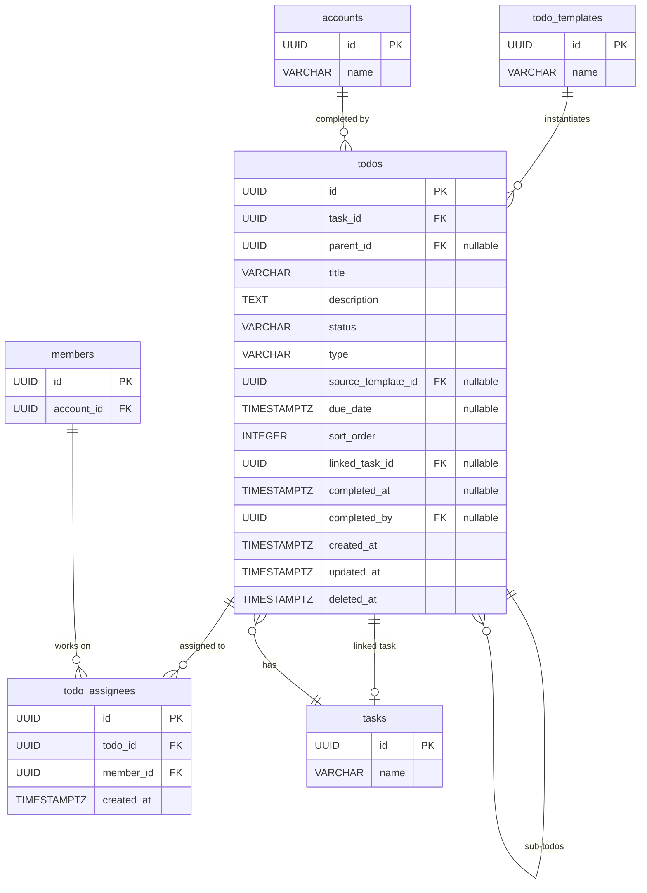

# 10 — Todo（待辦事項）

## 1. 實體總覽

**Todo（待辦事項）** 是任務中的可追蹤工作項目。待辦事項可從任務模板的待辦事項模板（TodoTemplate）實例化，也可在任務執行過程中臨時建立（ad_hoc）。

待辦事項支援最多一層巢狀結構（父待辦→子待辦），可指派給一或多位成員，並可關聯到其他任務以實現跨組協作。所有參與人皆可操作待辦事項，不限於被指派者。

### 關聯實體

- `tasks`：所屬任務
- `todos`（自身參照）：父子待辦關係（`parent_id`）
- `tasks`（透過 `linked_task_id`）：跨組協作的關聯任務
- `todo_templates`：來源待辦事項模板（`source_template_id`）
- `todo_assignees`：指派關聯表
- `members`：透過 `todo_assignees` 關聯的被指派成員
- `accounts`：完成者（`completed_by`）

---

## 2. Table 定義

### 2.1 `todos` 主表

```sql
CREATE TYPE todo_status AS ENUM ('open', 'completed');
CREATE TYPE todo_type AS ENUM ('template', 'ad_hoc');

CREATE TABLE todos (
    id                 UUID        PRIMARY KEY,
    task_id            UUID        NOT NULL REFERENCES tasks(id),
    parent_id          UUID        REFERENCES todos(id),
    title              VARCHAR     NOT NULL,
    description        TEXT,
    status             todo_status NOT NULL DEFAULT 'open',
    type               todo_type   NOT NULL,
    source_template_id UUID        REFERENCES todo_templates(id),
    due_date           TIMESTAMPTZ,
    sort_order         INTEGER     NOT NULL,
    linked_task_id     UUID        REFERENCES tasks(id),
    completed_at       TIMESTAMPTZ,
    completed_by       UUID        REFERENCES accounts(id),
    created_at         TIMESTAMPTZ NOT NULL DEFAULT NOW(),
    updated_at         TIMESTAMPTZ NOT NULL DEFAULT NOW(),
    deleted_at         TIMESTAMPTZ
);
```

**欄位說明：**

| 欄位 | 型別 | 說明 |
|------|------|------|
| `id` | UUID | 主鍵，UUID v7，應用層產生 |
| `task_id` | UUID | 所屬任務 ID，FK → `tasks(id)` |
| `parent_id` | UUID | 父待辦 ID，FK → `todos(id)`，NULL 表示頂層待辦。最多一層巢狀 |
| `title` | VARCHAR | 待辦標題 |
| `description` | TEXT | 待辦描述，可為 NULL |
| `status` | todo_status | 狀態（PostgreSQL ENUM）：`'open'`（未完成）或 `'completed'`（已完成） |
| `type` | todo_type | 類型（PostgreSQL ENUM）：`'template'`（從模板產生）或 `'ad_hoc'`（臨時建立） |
| `source_template_id` | UUID | 來源待辦模板 ID，FK → `todo_templates(id)`。`type = 'template'` 時填入，`type = 'ad_hoc'` 時為 NULL |
| `due_date` | TIMESTAMPTZ | 截止日期時間，可為 NULL。支援精確到時分的截止要求（如「下午 5 點前」） |
| `sort_order` | INTEGER | 排序順序 |
| `linked_task_id` | UUID | 關聯任務 ID，FK → `tasks(id)`。用於跨組協作，可為 NULL |
| `completed_at` | TIMESTAMPTZ | 完成時間，狀態為 `open` 時為 NULL |
| `completed_by` | UUID | 完成者帳號 ID，FK → `accounts(id)`，狀態為 `open` 時為 NULL |
| `created_at` | TIMESTAMPTZ | 建立時間，UTC |
| `updated_at` | TIMESTAMPTZ | 最後更新時間，UTC |
| `deleted_at` | TIMESTAMPTZ | 軟刪除時間，NULL 表示有效 |

### 2.2 `todo_assignees`（待辦指派關聯表）

```sql
CREATE TABLE todo_assignees (
    id         UUID        PRIMARY KEY,
    todo_id    UUID        NOT NULL REFERENCES todos(id),
    member_id  UUID        NOT NULL REFERENCES members(id),
    created_at TIMESTAMPTZ NOT NULL DEFAULT NOW()
);
```

**欄位說明：**

| 欄位 | 型別 | 說明 |
|------|------|------|
| `id` | UUID | 主鍵，UUID v7，應用層產生 |
| `todo_id` | UUID | 待辦事項 ID，FK → `todos(id)` |
| `member_id` | UUID | 被指派成員 ID，FK → `members(id)` |
| `created_at` | TIMESTAMPTZ | 指派時間 |

---

## 3. 索引定義

```sql
-- 依任務查詢待辦列表（含排序）
CREATE INDEX idx_todos_task_id_sort_order ON todos (task_id, sort_order);

-- 依關聯任務查詢
CREATE INDEX idx_todos_linked_task_id ON todos (linked_task_id);

-- 依狀態篩選
CREATE INDEX idx_todos_status ON todos (status);

-- 依父待辦查詢子待辦
CREATE INDEX idx_todos_parent_id ON todos (parent_id);

-- 軟刪除過濾
CREATE INDEX idx_todos_deleted_at ON todos (deleted_at);

-- todo_assignees
CREATE INDEX idx_todo_assignees_todo_id   ON todo_assignees (todo_id);
CREATE INDEX idx_todo_assignees_member_id ON todo_assignees (member_id);
CREATE UNIQUE INDEX uq_todo_assignees_todo_member
    ON todo_assignees (todo_id, member_id);
```

---

## 4. Rust 結構體定義

```rust
use chrono::{DateTime, Utc};
use uuid::Uuid;

pub struct Todo {
    pub id: Uuid,
    pub task_id: Uuid,
    pub parent_id: Option<Uuid>,
    pub title: String,
    pub description: Option<String>,
    pub status: TodoStatus,
    pub todo_type: TodoType,
    pub source_template_id: Option<Uuid>,
    pub due_date: Option<DateTime<Utc>>,
    pub sort_order: i32,
    pub linked_task_id: Option<Uuid>,
    pub completed_at: Option<DateTime<Utc>>,
    pub completed_by: Option<Uuid>,
    pub created_at: DateTime<Utc>,
    pub updated_at: DateTime<Utc>,
    pub deleted_at: Option<DateTime<Utc>>,
}

#[derive(Debug, Clone, PartialEq, Eq)]
pub enum TodoStatus {
    Open,
    Completed,
}

#[derive(Debug, Clone, PartialEq, Eq)]
pub enum TodoType {
    Template,
    AdHoc,
}

pub struct TodoAssignee {
    pub id: Uuid,
    pub todo_id: Uuid,
    pub member_id: Uuid,
    pub created_at: DateTime<Utc>,
}
```

---

## 5. 關聯圖（Mermaid ER Diagram）



---

## 6. 業務規則

### 6.1 巢狀限制

- **最多一層巢狀**：`parent_id` 僅可參照 `parent_id IS NULL` 的待辦事項（即頂層待辦）。
- 應用層在建立或更新 `todos` 時必須驗證：若指定了 `parent_id`，該父項的 `parent_id` 必須為 `NULL`。
- 資料庫層不設 CHECK 約束，由應用層 Rust 程式碼保證。

### 6.2 子待辦完成不自動完成父待辦

- 當所有子待辦事項（`parent_id` 指向該父待辦）都完成時，**不會**自動將父待辦標記為完成。
- 父待辦必須由成員手動確認完成。

### 6.3 關聯任務（`linked_task_id`）

- 用於跨組協作：待辦事項可關聯一個在其他組別建立的任務。
- **完成約束**：當待辦事項有 `linked_task_id` 時，該關聯任務必須已完成（`status = 'completed'`），才能將此待辦標記為完成。
- `linked_task_id` 完成約束：當 Todo 設有 `linked_task_id` 時，僅在關聯任務狀態為 `completed` 時才允許標記該 Todo 為完成，此檢查由應用層 TodoService 在更新狀態時執行。
- 關聯任務完成時，來源任務對話會收到系統通知。

### 6.4 `sort_order` 分配機制

- 建立時自動分配為該任務下現有最大 `sort_order` + 1。
- 支援手動拖拉重新排序（由前端發送批次更新請求）。

### 6.5 操作權限

- 任務的所有參與人（`participants`）皆可操作待辦事項（建立、修改、標記完成、指派等），不限於被指派者。
- 待辦事項的變化（建立、修改、完成）自動記錄到任務對話（以 `tool_execution` 類型的訊息呈現）。

### 6.6 從模板實例化

- 當任務從模板建立時，系統自動從 `todo_templates` 建立對應的 `todos`：
  - `type` 設為 `'template'`
  - `source_template_id` 指向對應的 `todo_templates(id)`
  - `title`、`description`、`sort_order` 從模板複製
  - 子模板對應建立子待辦

### 6.7 軟刪除

- `todos` 使用軟刪除（`deleted_at`），所有查詢預設加上 `WHERE deleted_at IS NULL`。
- `todo_assignees` 為關聯表，不使用軟刪除，直接實體刪除。

---

## 7. CRDT 標記

| 實體 | CRDT 管理 | 說明 |
|------|----------|------|
| `todos` | 是 | 多人同時修改狀態、指派、截止日期等，透過 CRDT 保證一致性 |
| `todo_assignees` | 否 | 關聯表，不適用 CRDT |

**CRDT 管理欄位：**

| 欄位 | CRDT 類型 | 說明 |
|------|----------|------|
| `title` | LWW Register | 最後寫入者勝出 |
| `description` | LWW Register | 最後寫入者勝出 |
| `status` | LWW Register | 最後寫入者勝出 |
| `due_date` | LWW Register | 最後寫入者勝出 |
| `sort_order` | LWW Register | 最後寫入者勝出 |

**CRDT 儲存模式：**
- **主表（物化狀態）**：`todos` 表儲存最新狀態，供一般查詢使用
- **操作日誌**：`crdt_operations` 表儲存所有 CRDT 操作（`entity_type = 'todo'`），用於衝突解決與狀態重建
