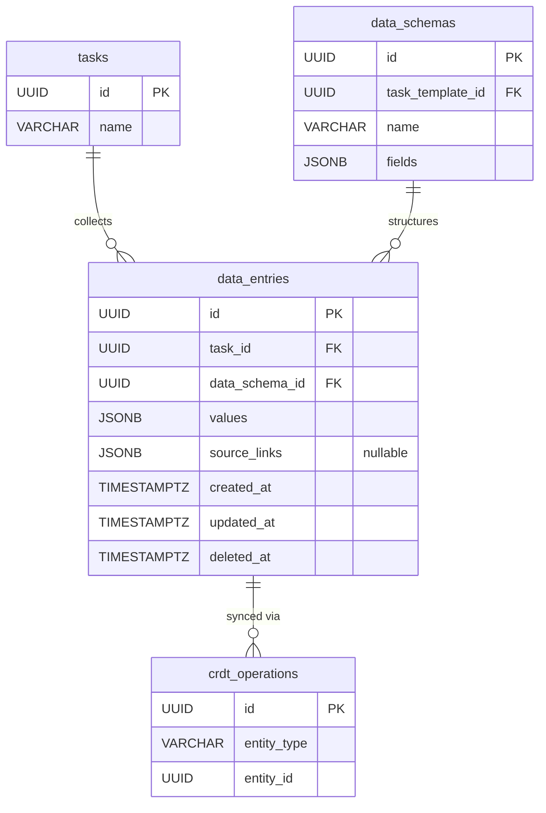

# 11 — DataSheet / DataEntry（資料表 / 資料列）

## 1. 實體總覽

**DataEntry（資料列）** 是任務中對應資料表定義（DataSchema）的結構化資料記錄。每個任務針對每個 DataSchema 有且僅有一筆 DataEntry，儲存該任務所蒐集的欄位值。

**DataSheet（資料表）** 是一個虛擬概念，不對應實際資料表。它代表同一 `data_schema_id` 下所有任務的 DataEntry 聚合視圖，以任務模板為單位彙整所有同類型任務的資料，方便總覽與統計（如所有贊助商的聯絡狀態一覽）。

### 資料流

```
DataSchema（定義欄位結構）
    │
    ├──→ Task A 的 DataEntry（填入 Task A 的資料值）
    ├──→ Task B 的 DataEntry（填入 Task B 的資料值）
    └──→ Task C 的 DataEntry（填入 Task C 的資料值）
         │
         └──→ DataSheet = 以上所有 DataEntry 的聚合視圖
```

### 隱私設計

- AI 僅接收 DataSchema（欄位結構定義），**不接收** DataEntry 的實際值。
- AI 透過佔位符語法引用欄位值，由系統在執行時帶入實際資料。
- 外部 API 提供唯讀存取 DataEntry，供外部系統串接使用。

### 關聯實體

- `tasks`：所屬任務
- `data_schemas`：資料表定義（欄位結構）
- `crdt_operations`：CRDT 操作日誌（`entity_type = 'data_entry'`）

---

## 2. Table 定義

### 2.1 `data_entries` 主表

```sql
CREATE TABLE data_entries (
    id             UUID        PRIMARY KEY,
    task_id        UUID        NOT NULL REFERENCES tasks(id),
    data_schema_id UUID        NOT NULL REFERENCES data_schemas(id),
    values         JSONB       NOT NULL DEFAULT '{}',
    source_links   JSONB,
    created_at     TIMESTAMPTZ NOT NULL DEFAULT NOW(),
    updated_at     TIMESTAMPTZ NOT NULL DEFAULT NOW(),
    deleted_at     TIMESTAMPTZ
);
```

**欄位說明：**

| 欄位 | 型別 | 說明 |
|------|------|------|
| `id` | UUID | 主鍵，UUID v7，應用層產生 |
| `task_id` | UUID | 所屬任務 ID，FK → `tasks(id)` |
| `data_schema_id` | UUID | 資料表定義 ID，FK → `data_schemas(id)` |
| `values` | JSONB | 欄位值，key 對應 DataSchema 的 field key，value 為實際資料 |
| `source_links` | JSONB | 跨任務資料分享的來源關聯，可為 NULL。結構見第 4 節 |
| `created_at` | TIMESTAMPTZ | 建立時間，UTC |
| `updated_at` | TIMESTAMPTZ | 最後更新時間，UTC |
| `deleted_at` | TIMESTAMPTZ | 軟刪除時間，NULL 表示有效 |

---

## 3. 索引定義

```sql
-- 依任務查詢資料列
CREATE INDEX idx_data_entries_task_id ON data_entries (task_id);

-- 依資料表定義查詢（用於 DataSheet 聚合）
CREATE INDEX idx_data_entries_data_schema_id ON data_entries (data_schema_id);

-- 唯一約束：每個任務對每個 schema 只有一筆資料列
CREATE UNIQUE INDEX uq_data_entries_task_schema
    ON data_entries (task_id, data_schema_id);

-- 軟刪除過濾
CREATE INDEX idx_data_entries_deleted_at ON data_entries (deleted_at);
```

---

## 4. JSONB 欄位結構

### 4.1 `values` — 欄位值

key-value 結構，key 對應 DataSchema 中 `fields[].key`，value 為實際資料：

```json
{
  "company_name": "範例科技股份有限公司",
  "contact_email": "sponsor@example.com",
  "sponsorship_level": "gold",
  "confirmed": true,
  "amount": 50000,
  "contract_date": "2025-03-15"
}
```

**驗證規則：**
- 應用層在寫入前，根據對應 DataSchema 的 `fields` 定義驗證：
  - key 必須存在於 DataSchema 的 `fields[].key` 中
  - value 的型別必須符合對應 field 的 `type`
  - `required = true` 的欄位在標記完成時必須有值
  - value 必須滿足對應 field 的 `constraints`（如 `maxLength`、`min`、`max` 等）
- 資料庫層不做結構驗證，完全依賴應用層。

### 4.2 `source_links` — 跨任務資料來源關聯

當透過 `shareDataToTask` 工具將資料從其他任務分享過來時，記錄來源關聯：

```json
[
  {
    "sourceTaskId": "UUID (來源任務 ID)",
    "sourceSchemaId": "UUID (來源 DataSchema ID)",
    "fieldKeys": ["string (被分享的欄位 key 列表)"],
    "sharedAt": "timestamp (分享時間)",
    "sharedBy": "UUID (執行分享的帳號 ID)"
  }
]
```

| 欄位 | 型別 | 說明 |
|------|------|------|
| `sourceTaskId` | UUID | 資料來源的任務 ID |
| `sourceSchemaId` | UUID | 資料來源的 DataSchema ID |
| `fieldKeys` | string[] | 被分享的欄位 key 列表 |
| `sharedAt` | timestamp | 分享操作的時間 |
| `sharedBy` | UUID | 執行分享操作的帳號 ID |

**來源資料變更通知：**
- 當 `sourceTaskId` 任務的對應欄位資料變更時，系統在目標任務對話中發送 `system` 類型訊息，通知資料已變更。
- 由目標任務的成員決定是否更新本地資料。

---

## 5. Rust 結構體定義

```rust
use chrono::{DateTime, Utc};
use serde::{Deserialize, Serialize};
use uuid::Uuid;

pub struct DataEntry {
    pub id: Uuid,
    pub task_id: Uuid,
    pub data_schema_id: Uuid,
    pub values: serde_json::Value,
    pub source_links: Option<Vec<SourceLink>>,
    pub created_at: DateTime<Utc>,
    pub updated_at: DateTime<Utc>,
    pub deleted_at: Option<DateTime<Utc>>,
}

#[derive(Serialize, Deserialize)]
pub struct SourceLink {
    pub source_task_id: Uuid,
    pub source_schema_id: Uuid,
    pub field_keys: Vec<String>,
    pub shared_at: DateTime<Utc>,
    pub shared_by: Uuid,
}
```

---

## 6. 關聯圖（Mermaid ER Diagram）



---

## 7. 業務規則

### 7.1 唯一約束

- 每個任務對每個 DataSchema 只能有一筆 DataEntry，由唯一索引 `uq_data_entries_task_schema` 保證。
- 當任務從模板建立時，系統自動為該模板的每個 DataSchema 建立空的 DataEntry（`values = '{}'`）。

### 7.2 AI 隱私限制

- AI 僅接收 DataSchema（欄位結構定義），不接收 DataEntry 的 `values` 實際值。
- AI 使用佔位符語法引用欄位值（如 `{{company_name}}`），系統在執行時替換為實際值。
- 此設計確保敏感資料（如聯絡資訊、金額等）不會傳送給 AI。

### 7.3 外部 API 存取

- 提供 REST API 端點，可依專案、任務模板、任務查詢與聚合 DataEntry 資料。
- API 為唯讀存取，供外部系統串接使用。

### 7.4 跨任務資料分享

- 透過 `shareDataToTask` 工具，可將當前任務 DataEntry 中指定欄位的值複製到目標任務的 DataEntry。
- 分享時建立 `source_links` 關聯，記錄資料來源。
- 來源資料變更時，系統通知目標任務，由目標任務成員決定是否同步更新。

### 7.5 DataSheet 聚合查詢

- DataSheet 是虛擬概念，不對應實際資料表。
- 聚合查詢方式：`SELECT * FROM data_entries WHERE data_schema_id = ? AND deleted_at IS NULL`，取得同一 DataSchema 下所有任務的資料列。
- 應用層負責將查詢結果組合為 DataSheet 視圖，並關聯各筆 DataEntry 的任務資訊。

### 7.6 軟刪除

- 使用 `deleted_at` 軟刪除，所有查詢預設加上 `WHERE deleted_at IS NULL`。

---

## 8. CRDT 標記

| 實體 | CRDT 管理 | 說明 |
|------|----------|------|
| `data_entries` | 是 | 多人同時編輯同一任務的資料列欄位值，透過 CRDT 保證一致性 |

**CRDT 管理欄位：**

| 欄位 | CRDT 類型 | 說明 |
|------|----------|------|
| `values` | Map CRDT | 以 field key 為單位的 map CRDT，各欄位可獨立合併，不同欄位的同時修改不會衝突 |

**CRDT 儲存模式：**
- **主表（物化狀態）**：`data_entries` 表儲存最新的 `values` 狀態，供一般查詢使用
- **操作日誌**：`crdt_operations` 表儲存所有 CRDT 操作（`entity_type = 'data_entry'`），用於衝突解決與狀態重建
- 當同一欄位發生衝突時，以最後寫入時間戳（LWW）解決；不同欄位的同時修改自動合併
