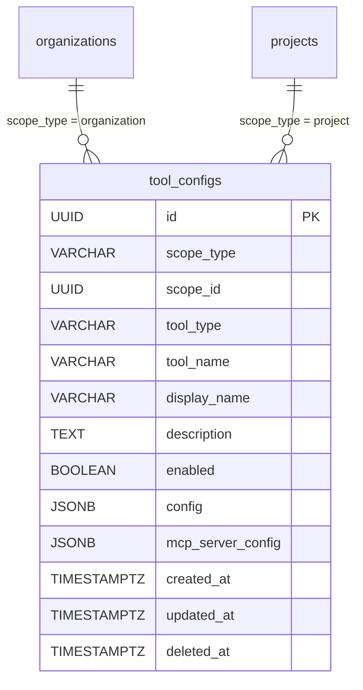

# 12. ToolConfig（工具設定）

## 1. Entity 總覽

`ToolConfig` 代表系統中可供 AI 建議執行的工具設定。工具分為**內建工具**（builtin）與**外部工具**（external，透過 MCP Server 接入）。工具設定支援**組織 → 專案**的繼承機制：組織層級設定為預設值，專案層級可覆寫同名工具的設定。

| 項目 | 說明 |
|------|------|
| 資料表名稱 | `tool_configs` |
| 主鍵 | `id` UUID v7 |
| 軟刪除 | `deleted_at` |
| CRDT | 不適用 |

---

## 2. SQL CREATE TABLE

```sql
CREATE TABLE tool_configs (
    id                UUID        PRIMARY KEY,                          -- UUID v7，應用層產生
    scope_type        VARCHAR(20) NOT NULL,                             -- 'organization' | 'project'
    scope_id          UUID        NOT NULL,                             -- 對應 organization 或 project 的 ID
    tool_type         VARCHAR(20) NOT NULL,                             -- 'builtin' | 'external'
    tool_name         VARCHAR(255) NOT NULL,                            -- 工具識別名稱，如 'smtp/sendEmail', 'hackmd/createDocument'
    display_name      VARCHAR(255),                                     -- 顯示名稱
    description       TEXT,                                             -- 工具說明
    enabled           BOOLEAN     NOT NULL DEFAULT false,               -- 是否啟用
    config            JSONB       NOT NULL DEFAULT '{}',                -- 工具設定（敏感欄位加密儲存）
    mcp_server_config JSONB,                                            -- 外部工具的 MCP Server 連線設定
    created_at        TIMESTAMPTZ NOT NULL DEFAULT NOW(),
    updated_at        TIMESTAMPTZ NOT NULL DEFAULT NOW(),
    deleted_at        TIMESTAMPTZ,

    CONSTRAINT uq_tool_configs_scope_tool_name
        UNIQUE (scope_type, scope_id, tool_name)
);
```

---

## 3. Indexes

```sql
-- 依 scope 查詢工具設定（繼承查詢用）
CREATE INDEX idx_tool_configs_scope ON tool_configs (scope_type, scope_id)
    WHERE deleted_at IS NULL;

-- 依 tool_name 查詢（跨 scope 查找同名工具）
CREATE INDEX idx_tool_configs_tool_name ON tool_configs (tool_name)
    WHERE deleted_at IS NULL;

-- config JSONB GIN 索引（搜尋設定內容）
CREATE INDEX idx_tool_configs_config ON tool_configs USING GIN (config jsonb_path_ops);
```

---

## 4. Rust Structs

```rust
use chrono::{DateTime, Utc};
use serde::{Deserialize, Serialize};
use uuid::Uuid;

/// 工具設定的作用域類型
#[derive(Debug, Clone, Serialize, Deserialize, PartialEq, Eq)]
#[serde(rename_all = "snake_case")]
pub enum ToolScopeType {
    Organization,
    Project,
}

/// 工具類型
#[derive(Debug, Clone, Serialize, Deserialize, PartialEq, Eq)]
#[serde(rename_all = "snake_case")]
pub enum ToolType {
    /// 系統內建工具
    Builtin,
    /// 外部 MCP Server 工具
    External,
}

/// MCP Server 傳輸方式
#[derive(Debug, Clone, Serialize, Deserialize, PartialEq, Eq)]
#[serde(rename_all = "snake_case")]
pub enum McpTransport {
    Stdio,
    Sse,
}

/// MCP Server 連線設定
#[derive(Debug, Clone, Serialize, Deserialize)]
pub struct McpServerConfig {
    /// 傳輸方式：stdio 或 sse
    pub transport: McpTransport,
    /// stdio 模式的啟動指令
    #[serde(skip_serializing_if = "Option::is_none")]
    pub command: Option<String>,
    /// sse 模式的伺服器 URL
    #[serde(skip_serializing_if = "Option::is_none")]
    pub url: Option<String>,
    /// 啟動參數
    #[serde(skip_serializing_if = "Option::is_none")]
    pub args: Option<Vec<String>>,
}

/// 工具設定實體
#[derive(Debug, Clone, Serialize, Deserialize)]
pub struct ToolConfig {
    pub id: Uuid,
    pub scope_type: ToolScopeType,
    pub scope_id: Uuid,
    pub tool_type: ToolType,
    pub tool_name: String,
    pub display_name: Option<String>,
    pub description: Option<String>,
    pub enabled: bool,
    /// 工具設定（敏感欄位於應用層加密後儲存）
    pub config: serde_json::Value,
    /// 外部工具的 MCP Server 連線設定（僅 tool_type = External 時有值）
    pub mcp_server_config: Option<McpServerConfig>,
    pub created_at: DateTime<Utc>,
    pub updated_at: DateTime<Utc>,
    pub deleted_at: Option<DateTime<Utc>>,
}
```

---

## 5. Relations



### 多型態外鍵（Polymorphic FK）

`tool_configs` 透過 `(scope_type, scope_id)` 實現多型態關聯：

| scope_type | scope_id 參照 |
|------------|--------------|
| `organization` | `organizations.id` |
| `project` | `projects.id` |

> 注意：由於多型態外鍵無法使用資料庫層級的 `FOREIGN KEY` 約束，參照完整性由**應用層**保證。

---

## 6. JSONB Schemas

### 6.1 `config` 欄位

工具設定的通用組態。敏感欄位（如 API Key、密碼）在寫入前由應用層加密，讀取時解密。

```json
{
  "$schema": "http://json-schema.org/draft-07/schema#",
  "title": "ToolConfigData",
  "description": "工具設定資料，結構依 tool_name 而異",
  "type": "object",
  "examples": [
    {
      "api_key": "encrypted:v1:...",
      "endpoint": "https://api.example.com",
      "timeout_ms": 5000
    },
    {
      "smtp_host": "smtp.gmail.com",
      "smtp_port": 587,
      "username": "noreply@example.com",
      "password": "encrypted:v1:..."
    }
  ],
  "additionalProperties": true
}
```

#### 加密策略

- 敏感欄位以 `encrypted:v1:<ciphertext>` 格式儲存
- 應用層負責加解密，資料庫僅儲存密文
- 加密金鑰由系統密鑰管理服務提供

### 6.2 `mcp_server_config` 欄位

外部工具的 MCP Server 連線設定，僅當 `tool_type = 'external'` 時有值。

```json
{
  "$schema": "http://json-schema.org/draft-07/schema#",
  "title": "McpServerConfig",
  "description": "MCP Server 連線設定",
  "type": "object",
  "required": ["transport"],
  "properties": {
    "transport": {
      "type": "string",
      "enum": ["stdio", "sse"],
      "description": "傳輸方式"
    },
    "command": {
      "type": "string",
      "description": "stdio 模式的啟動指令"
    },
    "url": {
      "type": "string",
      "format": "uri",
      "description": "sse 模式的伺服器 URL"
    },
    "args": {
      "type": "array",
      "items": { "type": "string" },
      "description": "啟動參數列表"
    }
  },
  "oneOf": [
    {
      "properties": { "transport": { "const": "stdio" } },
      "required": ["transport", "command"]
    },
    {
      "properties": { "transport": { "const": "sse" } },
      "required": ["transport", "url"]
    }
  ]
}
```

---

## 7. CRDT 標記

本資料表**不使用 CRDT**。工具設定為管理性操作，不涉及多人同時編輯，採用一般的 Last-Write-Wins 策略即可。

---

## 8. Business Rules

### 8.1 權限控管

| 操作 | 允許的角色 |
|------|-----------|
| 檢視組織層級工具設定 | `org_owner`、`org_admin` |
| 新增/修改/刪除組織層級工具設定 | `org_owner` |
| 檢視專案層級工具設定 | `owner`、`tag_admin` |
| 新增/修改/刪除專案層級工具設定 | `owner` |

### 8.2 繼承邏輯

工具設定支援組織 → 專案的兩層繼承：

1. **查詢時**：先查詢 `scope_type = 'project'` 且 `scope_id = <project_id>` 的設定
2. **回退**：若專案層級無該 `tool_name` 的設定，回退到 `scope_type = 'organization'` 且 `scope_id = <organization_id>`
3. **覆寫**：專案層級存在同名工具設定時，完全覆寫組織層級設定（不做欄位級合併）

```sql
-- 查詢某專案的有效工具設定（含繼承）
-- 先取專案層級，再補上組織層級中專案未覆寫的工具
SELECT DISTINCT ON (tool_name) *
FROM tool_configs
WHERE deleted_at IS NULL
  AND (
    (scope_type = 'project' AND scope_id = $1)       -- 專案層級
    OR
    (scope_type = 'organization' AND scope_id = $2)   -- 組織層級
  )
ORDER BY tool_name,
         CASE scope_type WHEN 'project' THEN 0 ELSE 1 END;
```

### 8.3 啟用控制

- 工具預設為 `enabled = false`，需手動啟用
- 僅 `enabled = true` 的工具會出現在 AI 可用工具清單中
- 停用工具不影響已儲存的設定，重新啟用後即恢復

### 8.4 敏感資料保護

- `config` 欄位中的敏感值（API Key、密碼、Token）必須在應用層加密後才寫入資料庫
- API 回應中敏感欄位以遮罩形式呈現（如 `sk-****1234`）
- 稽核日誌不記錄敏感欄位的明文值

### 8.5 外部工具驗證

- 當 `tool_type = 'external'` 時，`mcp_server_config` 為必填
- 當 `tool_type = 'builtin'` 時，`mcp_server_config` 應為 `NULL`
- 應用層在儲存前驗證 `mcp_server_config` 的結構完整性
