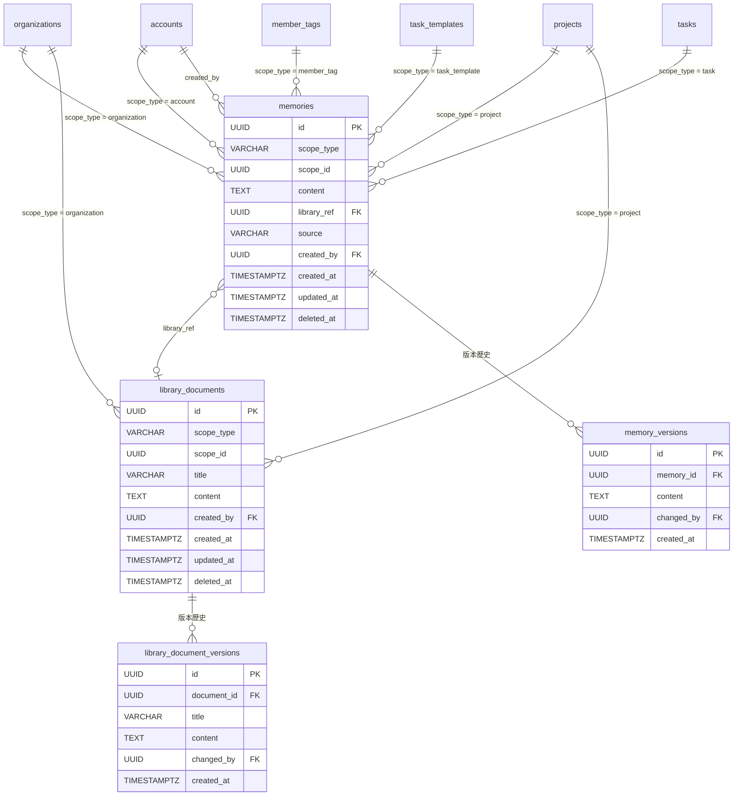

# 13. Memory（記憶）與 LibraryDocument（記憶庫文件）

## 1. Entity 總覽

`Memory` 代表系統中的經驗記憶，是 AI 建議品質持續提升的核心機制。記憶沿著**繼承鏈**（task → task_template → member_tag → project → organization → account）層層傳遞，讓通用經驗存在高層級、特定經驗留在低層級。

`LibraryDocument` 為記憶庫文件，提供更完整的知識內容。一份文件可被多筆記憶引用，記憶本身保持簡短摘要，詳細內容由文件承載。

| 項目 | 說明 |
|------|------|
| 資料表名稱 | `memories`、`library_documents`、`memory_versions`、`library_document_versions` |
| 主鍵 | `id` UUID v7 |
| 軟刪除 | `memories`、`library_documents` 使用 `deleted_at`；版本表不軟刪除 |
| CRDT | `memories.content`、`library_documents.content`（文字 CRDT，透過 yrs） |

---

## 2. SQL CREATE TABLE

### 2.1 `memories`

```sql
CREATE TABLE memories (
    id          UUID        PRIMARY KEY,                          -- UUID v7，應用層產生
    scope_type  VARCHAR(20) NOT NULL,                             -- 'account' | 'organization' | 'project' | 'member_tag' | 'task_template' | 'task'
    scope_id    UUID        NOT NULL,                             -- 對應作用域實體的 ID
    content     TEXT        NOT NULL,                             -- 記憶摘要（保持簡短扼要）
    library_ref UUID        REFERENCES library_documents(id),     -- 關聯的記憶庫文件（可為空）
    source      VARCHAR(20) NOT NULL,                             -- 'manual' | 'auto_extracted'
    created_by  UUID        NOT NULL REFERENCES accounts(id),     -- 建立者
    created_at  TIMESTAMPTZ NOT NULL DEFAULT NOW(),
    updated_at  TIMESTAMPTZ NOT NULL DEFAULT NOW(),
    deleted_at  TIMESTAMPTZ
);
```

### 2.2 `library_documents`

```sql
CREATE TABLE library_documents (
    id          UUID        PRIMARY KEY,                          -- UUID v7，應用層產生
    scope_type  VARCHAR(20) NOT NULL,                             -- 作用域類型
    scope_id    UUID        NOT NULL,                             -- 對應作用域實體的 ID
    title       VARCHAR(500) NOT NULL,                            -- 文件標題
    content     TEXT        NOT NULL,                             -- 文件內容
    created_by  UUID        NOT NULL REFERENCES accounts(id),     -- 建立者
    created_at  TIMESTAMPTZ NOT NULL DEFAULT NOW(),
    updated_at  TIMESTAMPTZ NOT NULL DEFAULT NOW(),
    deleted_at  TIMESTAMPTZ
);
```

### 2.3 `memory_versions`

```sql
CREATE TABLE memory_versions (
    id          UUID        PRIMARY KEY,                          -- UUID v7，應用層產生
    memory_id   UUID        NOT NULL REFERENCES memories(id),     -- 對應的記憶
    content     TEXT        NOT NULL,                             -- 該版本的記憶內容
    changed_by  UUID        NOT NULL REFERENCES accounts(id),     -- 修改者
    created_at  TIMESTAMPTZ NOT NULL DEFAULT NOW()
);
```

### 2.4 `library_document_versions`

```sql
CREATE TABLE library_document_versions (
    id          UUID        PRIMARY KEY,                          -- UUID v7，應用層產生
    document_id UUID        NOT NULL REFERENCES library_documents(id), -- 對應的文件
    title       VARCHAR(500),                                     -- 該版本的標題（可為空，表示未變更）
    content     TEXT        NOT NULL,                             -- 該版本的文件內容
    changed_by  UUID        NOT NULL REFERENCES accounts(id),     -- 修改者
    created_at  TIMESTAMPTZ NOT NULL DEFAULT NOW()
);
```

---

## 3. Indexes

```sql
-- memories: 依 scope 查詢（繼承鏈查詢的核心索引）
CREATE INDEX idx_memories_scope ON memories (scope_type, scope_id)
    WHERE deleted_at IS NULL;

-- memories: 依建立者查詢
CREATE INDEX idx_memories_created_by ON memories (created_by)
    WHERE deleted_at IS NULL;

-- memories: 依 library_ref 查詢（找出引用某文件的所有記憶）
CREATE INDEX idx_memories_library_ref ON memories (library_ref)
    WHERE library_ref IS NOT NULL AND deleted_at IS NULL;

-- library_documents: 依 scope 查詢
CREATE INDEX idx_library_documents_scope ON library_documents (scope_type, scope_id)
    WHERE deleted_at IS NULL;

-- memory_versions: 依 memory_id 查詢版本歷史
CREATE INDEX idx_memory_versions_memory_id ON memory_versions (memory_id, created_at DESC);

-- library_document_versions: 依 document_id 查詢版本歷史
CREATE INDEX idx_library_document_versions_document_id ON library_document_versions (document_id, created_at DESC);
```

---

## 4. Rust Structs

```rust
use chrono::{DateTime, Utc};
use serde::{Deserialize, Serialize};
use uuid::Uuid;

/// 記憶與文件的作用域類型
#[derive(Debug, Clone, Serialize, Deserialize, PartialEq, Eq)]
#[serde(rename_all = "snake_case")]
pub enum ScopeType {
    Account,
    Organization,
    Project,
    MemberTag,
    TaskTemplate,
    Task,
}

/// 記憶來源
#[derive(Debug, Clone, Serialize, Deserialize, PartialEq, Eq)]
#[serde(rename_all = "snake_case")]
pub enum MemorySource {
    /// 手動建立
    Manual,
    /// 系統自動擷取
    AutoExtracted,
}

/// 記憶實體
#[derive(Debug, Clone, Serialize, Deserialize)]
pub struct Memory {
    pub id: Uuid,
    pub scope_type: ScopeType,
    pub scope_id: Uuid,
    pub content: String,
    pub library_ref: Option<Uuid>,
    pub source: MemorySource,
    pub created_by: Uuid,
    pub created_at: DateTime<Utc>,
    pub updated_at: DateTime<Utc>,
    pub deleted_at: Option<DateTime<Utc>>,
}

/// 記憶庫文件實體
#[derive(Debug, Clone, Serialize, Deserialize)]
pub struct LibraryDocument {
    pub id: Uuid,
    pub scope_type: ScopeType,
    pub scope_id: Uuid,
    pub title: String,
    pub content: String,
    pub created_by: Uuid,
    pub created_at: DateTime<Utc>,
    pub updated_at: DateTime<Utc>,
    pub deleted_at: Option<DateTime<Utc>>,
}

/// 記憶版本歷史
#[derive(Debug, Clone, Serialize, Deserialize)]
pub struct MemoryVersion {
    pub id: Uuid,
    pub memory_id: Uuid,
    pub content: String,
    pub changed_by: Uuid,
    pub created_at: DateTime<Utc>,
}

/// 記憶庫文件版本歷史
#[derive(Debug, Clone, Serialize, Deserialize)]
pub struct LibraryDocumentVersion {
    pub id: Uuid,
    pub document_id: Uuid,
    pub title: Option<String>,
    pub content: String,
    pub changed_by: Uuid,
    pub created_at: DateTime<Utc>,
}
```

---

## 5. Relations



### 多型態外鍵（Polymorphic FK）

`memories` 與 `library_documents` 皆透過 `(scope_type, scope_id)` 實現多型態關聯：

| scope_type | scope_id 參照 |
|------------|--------------|
| `account` | `accounts.id` |
| `organization` | `organizations.id` |
| `project` | `projects.id` |
| `member_tag` | `member_tags.id` |
| `task_template` | `task_templates.id` |
| `task` | `tasks.id` |

> 注意：由於多型態外鍵無法使用資料庫層級的 `FOREIGN KEY` 約束，參照完整性由**應用層**保證。

---

## 6. JSONB Schemas

本資料表不使用 JSONB 欄位。所有內容以純文字（`TEXT`）儲存。

---

## 7. CRDT 標記

| 資料表 | CRDT 欄位 | CRDT 類型 | 說明 |
|--------|----------|-----------|------|
| `memories` | `content` | Text（yrs） | 記憶內容支援多人協同編輯 |
| `library_documents` | `content` | Text（yrs） | 文件內容支援多人協同編輯 |

### 儲存模式

採用 README 中定義的**雙寫模式**：

1. **主表**（`memories`、`library_documents`）儲存最新物化狀態
2. **`crdt_operations` 表**儲存操作日誌，`entity_type` 值為 `'memory'` 或 `'library_document'`

```sql
-- 記憶的 CRDT 操作記錄
SELECT * FROM crdt_operations
WHERE entity_type = 'memory' AND entity_id = $1
ORDER BY created_at;

-- 文件的 CRDT 操作記錄
SELECT * FROM crdt_operations
WHERE entity_type = 'library_document' AND entity_id = $1
ORDER BY created_at;
```

---

## 8. Business Rules

### 8.1 記憶繼承鏈

記憶沿著以下繼承鏈由低層級向高層級查詢，所有匹配的記憶合併為 AI 的可用知識：

```
task → task_template → member_tag（ownerTag）→ project → organization → account（當前使用者）
```

#### 查詢策略

繼承鏈查詢為**查詢時聚合**（query-time aggregation），不使用物化視圖。給定一個任務，系統先解析出繼承鏈中每個層級的 `(scope_type, scope_id)` 組合，再以單一查詢取得所有相關記憶：

```sql
-- 給定任務的記憶繼承鏈查詢
-- 應用層先解析出完整的 (scope_type, scope_id) 清單
SELECT *
FROM memories
WHERE deleted_at IS NULL
  AND (scope_type, scope_id) IN (
    ('task',          $task_id),
    ('task_template', $template_id),
    ('member_tag',    $owner_tag_id),
    ('project',       $project_id),
    ('organization',  $org_id),
    ('account',       $account_id)
  )
ORDER BY
    CASE scope_type
        WHEN 'task'          THEN 0
        WHEN 'task_template' THEN 1
        WHEN 'member_tag'    THEN 2
        WHEN 'project'       THEN 3
        WHEN 'organization'  THEN 4
        WHEN 'account'       THEN 5
    END,
    created_at DESC;
```

### 8.2 記憶來源

| source | 說明 |
|--------|------|
| `manual` | 使用者手動建立或編輯 |
| `auto_extracted` | 系統從任務對話中自動擷取（需人類確認後才正式寫入） |

### 8.3 記憶與文件的關係

- 一筆記憶可選擇性地引用一份 `library_document`（透過 `library_ref`）
- 一份文件可被**多筆記憶**引用
- 記憶的 `content` 應保持簡短摘要，詳細內容放在關聯文件中
- 刪除文件時，引用該文件的記憶不會被連帶刪除，但 `library_ref` 指向的文件將標記為已刪除

### 8.4 版本歷史

- 每次修改記憶或文件內容時，應用層須在對應的版本表中插入一筆版本記錄
- 版本表僅做新增（append-only），不支援修改或刪除
- 版本表不使用軟刪除，記錄永久保留

### 8.5 權限控管

| 操作 | 允許的角色 |
|------|-----------|
| 檢視帳號層級記憶 | 帳號本人 |
| 檢視組織層級記憶 | 組織成員以上 |
| 檢視專案層級記憶 | 專案成員以上 |
| 建立/修改/刪除記憶 | 視 scope 對應的擁有者或管理者角色 |
| 建立/修改/刪除文件 | 視 scope 對應的擁有者或管理者角色 |

### 8.6 API 回應中的 `scope_type`

API 回應的 `MemorySummary` 結構包含 `scope_type` 欄位。雖然 `scope_type` 已是資料庫欄位，但在 API 回應中明確包含此欄位是為了**前端顯示最佳化**：前端可直接根據 `scope_type` 決定記憶的層級標示（如圖示、顏色標籤），無需額外查詢記憶的作用域關聯。

### 8.7 自動擷取流程

1. AI 在任務對話中識別出值得記錄的經驗或知識
2. 系統建立 `source = 'auto_extracted'` 的記憶草稿
3. 人類確認後，記憶正式寫入（符合「AI 輔助，人類決策」原則）
4. 若人類拒絕，草稿被軟刪除
