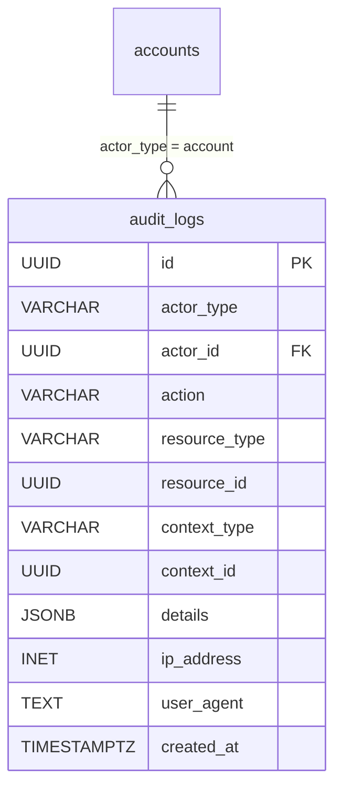

# 14. AuditLog（審計日誌）

## 1. Entity 總覽

`AuditLog` 記錄系統中所有重要操作的完整追蹤記錄，用於安全稽核、問題追蹤與合規需求。審計日誌為**不可變**（immutable）資料，寫入後不可修改或刪除。

| 項目 | 說明 |
|------|------|
| 資料表名稱 | `audit_logs` |
| 主鍵 | `id` UUID v7（利用 UUID v7 的時間排序特性） |
| 軟刪除 | 無 — 審計日誌不可刪除 |
| CRDT | 不適用 |
| 分區策略 | 按 `created_at` 月份範圍分區 |

**主要用途：**
- 記錄所有使用者、系統與 AI 的操作行為
- 提供操作前後的狀態變更記錄
- 支援依資源、操作者、操作類型等多維度查詢
- 作為安全事件調查與合規審計的依據

**關聯實體：**
- `accounts`：操作者為帳號時的關聯（`actor_type = 'account'`）
- 被操作資源：透過 `(resource_type, resource_id)` 多型態關聯至各資料表
- 操作上下文：透過 `(context_type, context_id)` 關聯至組織、專案或任務

---

## 2. SQL CREATE TABLE

```sql
CREATE TABLE audit_logs (
    id            UUID        PRIMARY KEY,                          -- UUID v7，應用層產生，自帶時間排序
    actor_type    VARCHAR(20) NOT NULL,                             -- 'account' | 'system' | 'ai' | 'api_key'
    actor_id      UUID,                                             -- actor_type = 'account' 時對應 accounts.id，其他類型為 NULL
    action        VARCHAR(100) NOT NULL,                            -- 操作類型，如 'task.create', 'todo.update', 'tool.execute'
    resource_type VARCHAR(50) NOT NULL,                             -- 被操作資源類型：'task' | 'todo' | 'message' | 'memory' | 'data_entry' | 'tool_config' | ...
    resource_id   UUID        NOT NULL,                             -- 被操作資源的 ID
    context_type  VARCHAR(20),                                      -- 操作上下文類型：'organization' | 'project' | 'task'
    context_id    UUID,                                             -- 操作上下文的 ID
    details       JSONB       NOT NULL DEFAULT '{}',                -- 操作細節（變更前後值、參數等）
    ip_address    INET,                                             -- 操作者 IP 位址
    user_agent    TEXT,                                             -- 操作者 User-Agent
    created_at    TIMESTAMPTZ NOT NULL DEFAULT NOW()                -- 操作時間，UTC
) PARTITION BY RANGE (created_at);
```

> **注意：** 此資料表**不包含** `updated_at` 與 `deleted_at` 欄位。審計日誌為 write-once 不可變資料，寫入後不可修改或刪除。

### 分區範例

```sql
-- 按月份建立分區
CREATE TABLE audit_logs_2025_01 PARTITION OF audit_logs
    FOR VALUES FROM ('2025-01-01') TO ('2025-02-01');

CREATE TABLE audit_logs_2025_02 PARTITION OF audit_logs
    FOR VALUES FROM ('2025-02-01') TO ('2025-03-01');

-- 依此類推，由排程任務自動建立未來月份的分區
```

---

## 3. Indexes

```sql
-- 依時間範圍查詢（分區鍵，自動套用分區裁剪）
CREATE INDEX idx_audit_logs_created_at
    ON audit_logs (created_at);

-- 依操作者查詢
CREATE INDEX idx_audit_logs_actor
    ON audit_logs (actor_type, actor_id);

-- 依被操作資源查詢
CREATE INDEX idx_audit_logs_resource
    ON audit_logs (resource_type, resource_id);

-- 依操作上下文查詢
CREATE INDEX idx_audit_logs_context
    ON audit_logs (context_type, context_id);

-- 依操作類型查詢
CREATE INDEX idx_audit_logs_action
    ON audit_logs (action);
```

---

## 4. Rust Structs

```rust
use chrono::{DateTime, Utc};
use serde::{Deserialize, Serialize};
use std::net::IpAddr;
use uuid::Uuid;

/// 操作者類型
#[derive(Debug, Clone, Serialize, Deserialize, PartialEq, Eq)]
#[serde(rename_all = "snake_case")]
pub enum ActorType {
    /// 一般使用者帳號
    Account,
    /// 系統自動操作（排程、觸發器等）
    System,
    /// AI 代理操作
    Ai,
    /// 透過 API Key 進行的外部系統操作
    ApiKey,
}

/// 操作類型（以「資源.動作」格式命名）
#[derive(Debug, Clone, Serialize, Deserialize, PartialEq, Eq)]
pub struct ActionType(pub String);

impl ActionType {
    // 任務相關操作
    pub const TASK_CREATE: &'static str = "task.create";
    pub const TASK_UPDATE: &'static str = "task.update";
    pub const TASK_DELETE: &'static str = "task.delete";
    pub const TASK_STATUS_CHANGE: &'static str = "task.status_change";

    // 待辦事項相關操作
    pub const TODO_CREATE: &'static str = "todo.create";
    pub const TODO_UPDATE: &'static str = "todo.update";
    pub const TODO_DELETE: &'static str = "todo.delete";
    pub const TODO_STATUS_CHANGE: &'static str = "todo.status_change";

    // 工具執行相關操作
    pub const TOOL_EXECUTE: &'static str = "tool.execute";
    pub const TOOL_CONFIG_UPDATE: &'static str = "tool.config_update";

    // AI 建議相關操作
    pub const SUGGESTION_ACCEPT: &'static str = "suggestion.accept";
    pub const SUGGESTION_REJECT: &'static str = "suggestion.reject";
    pub const SUGGESTION_MODIFY: &'static str = "suggestion.modify";

    // 資料表相關操作
    pub const DATA_ENTRY_CREATE: &'static str = "data_entry.create";
    pub const DATA_ENTRY_UPDATE: &'static str = "data_entry.update";
    pub const DATA_ENTRY_DELETE: &'static str = "data_entry.delete";

    // 成員相關操作
    pub const MEMBER_ADD: &'static str = "member.add";
    pub const MEMBER_REMOVE: &'static str = "member.remove";
    pub const MEMBER_ROLE_CHANGE: &'static str = "member.role_change";
}

/// 資源類型
#[derive(Debug, Clone, Serialize, Deserialize, PartialEq, Eq)]
#[serde(rename_all = "snake_case")]
pub enum ResourceType {
    Task,
    Todo,
    Message,
    Memory,
    DataEntry,
    ToolConfig,
    Member,
    Project,
    Organization,
    Webhook,
}

/// 操作上下文類型
#[derive(Debug, Clone, Serialize, Deserialize, PartialEq, Eq)]
#[serde(rename_all = "snake_case")]
pub enum AuditContextType {
    Organization,
    Project,
    Task,
}

/// 審計日誌實體
#[derive(Debug, Clone, Serialize, Deserialize)]
pub struct AuditLog {
    pub id: Uuid,
    pub actor_type: ActorType,
    pub actor_id: Option<Uuid>,
    pub action: ActionType,
    pub resource_type: ResourceType,
    pub resource_id: Uuid,
    pub context_type: Option<AuditContextType>,
    pub context_id: Option<Uuid>,
    pub details: serde_json::Value,
    pub ip_address: Option<IpAddr>,
    pub user_agent: Option<String>,
    pub created_at: DateTime<Utc>,
}
```

---

## 5. Relations



### 多型態外鍵（Polymorphic FK）

`audit_logs` 透過多組 `(type, id)` 實現多型態關聯：

| 欄位組 | 說明 |
|--------|------|
| `(actor_type, actor_id)` | 操作者 — `actor_type = 'account'` 時 `actor_id` 參照 `accounts.id`；`'system'` 或 `'ai'` 時 `actor_id` 為 NULL |
| `(resource_type, resource_id)` | 被操作資源 — 參照對應資料表的 `id`（如 `tasks.id`、`todos.id`） |
| `(context_type, context_id)` | 操作上下文 — 參照 `organizations.id`、`projects.id` 或 `tasks.id` |

> 注意：由於多型態外鍵無法使用資料庫層級的 `FOREIGN KEY` 約束，參照完整性由**應用層**保證。

---

## 6. JSONB Schemas

### 6.1 `details` 欄位

操作細節的結構隨 `action` 不同而異。以下為各類操作的 `details` 範例：

**狀態變更操作：**
```json
{
  "before": { "status": "open" },
  "after": { "status": "completed" }
}
```

**工具執行操作：**
```json
{
  "tool_name": "smtp/sendEmail",
  "parameters": {
    "to": "user@example.com",
    "subject": "會議通知"
  },
  "result": "success",
  "duration_ms": 1250
}
```

**AI 建議採納操作：**
```json
{
  "suggestion_type": "todo_create",
  "original_suggestion": { "title": "確認場地", "description": "..." },
  "modifications": null
}
```

**JSON Schema：**

```json
{
  "$schema": "http://json-schema.org/draft-07/schema#",
  "title": "AuditLogDetails",
  "description": "審計日誌操作細節，結構依 action 而異",
  "type": "object",
  "properties": {
    "before": {
      "type": "object",
      "description": "變更前的欄位值（僅 update 類操作）"
    },
    "after": {
      "type": "object",
      "description": "變更後的欄位值（僅 update 類操作）"
    },
    "tool_name": {
      "type": "string",
      "description": "工具名稱（僅 tool.execute 操作）"
    },
    "parameters": {
      "type": "object",
      "description": "操作參數"
    },
    "result": {
      "type": "string",
      "description": "操作結果"
    },
    "duration_ms": {
      "type": "integer",
      "description": "操作耗時（毫秒）"
    }
  },
  "additionalProperties": true
}
```

---

## 7. CRDT 標記

本資料表**不使用 CRDT**。審計日誌為 write-once 不可變資料，不涉及多人協作編輯。

---

## 8. Business Rules

### 8.1 不可變性

- 審計日誌**寫入後不可修改、不可刪除**
- 資料表不包含 `updated_at` 與 `deleted_at` 欄位
- 應用層不提供 UPDATE 或 DELETE 操作的 API

### 8.2 自動記錄

以下操作**必須**自動產生審計日誌：

| 操作類別 | 說明 |
|----------|------|
| 任務生命週期 | 建立、更新、刪除、狀態變更 |
| 待辦事項操作 | 建立、更新、刪除、指派、狀態變更 |
| 工具執行 | 所有工具執行（含成功與失敗） |
| AI 建議處理 | 採納、拒絕、修改後採納 |
| 資料表操作 | 資料列的建立、更新、刪除 |
| 成員管理 | 新增、移除、角色變更 |
| 工具設定變更 | 新增、修改、啟用/停用 |

### 8.3 操作者識別

| actor_type | actor_id | 說明 |
|------------|----------|------|
| `account` | 帳號的 UUID | 使用者透過 UI 或 API 執行的操作 |
| `system` | NULL | 系統排程、觸發器、自動化規則執行的操作 |
| `ai` | NULL | AI 代理自主執行的操作（如自動分類、自動回覆） |
| `api_key` | API Key 的 UUID | 外部系統透過 API Key 執行的操作（如資料表查詢與更新） |

### 8.4 敏感資料保護

- `details` 欄位**不記錄**敏感資料的明文值（如 API Key、密碼）
- 對於工具設定變更，僅記錄欄位名稱與遮罩值（如 `"api_key": "sk-****1234"`）
- IP 位址與 User-Agent 僅用於安全調查，不對一般使用者公開

### 8.5 分區管理

- 使用 PostgreSQL 範圍分區（Range Partitioning），按 `created_at` 月份分區
- 排程任務自動建立未來月份的分區（建議提前 3 個月建立）
- 歷史分區可依保留政策封存至冷儲存或刪除（需符合合規要求）

### 8.6 查詢模式

常見查詢模式與對應索引：

| 查詢場景 | 使用索引 |
|----------|----------|
| 查詢某使用者的所有操作 | `idx_audit_logs_actor` |
| 查詢某資源的變更歷史 | `idx_audit_logs_resource` |
| 查詢某專案內的所有操作 | `idx_audit_logs_context` |
| 查詢特定類型的操作 | `idx_audit_logs_action` |
| 查詢指定時間範圍內的操作 | `idx_audit_logs_created_at` + 分區裁剪 |
