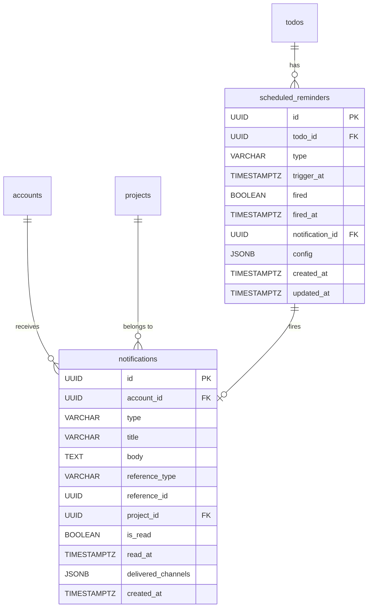

# 15. Notification & Reminder（通知與提醒）

## 1. Entity 總覽

`Notification` 與 `Reminder` 共同構成 Conf-Ops 的通知機制。`Notification` 記錄已發送給使用者的通知訊息，`Reminder` 則是基於待辦事項狀態的排程提醒，觸發後產生對應的 `Notification`。

| 項目 | 說明 |
|------|------|
| 資料表名稱 | `notifications`、`scheduled_reminders` |
| 主鍵 | `id` UUID v7 |
| 軟刪除 | 無 — 通知由保留政策清理；提醒隨待辦事項刪除 |
| CRDT | 不適用 |

**主要用途：**
- 將任務更新、待辦指派、成員提及等事件即時通知使用者
- 支援多頻道投遞（應用內、Web Push、Email）
- 提供到期日逼近、逾期、長期未處理等排程提醒
- 記錄通知的已讀狀態與投遞頻道

**關聯實體：**
- `accounts`：通知的接收者
- `projects`：通知所屬專案
- `todos`：提醒關聯的待辦事項
- 參照資源：透過 `(reference_type, reference_id)` 關聯至任務、待辦或訊息

---

## 2. SQL CREATE TABLE

### 2.1 `notifications` 表

```sql
CREATE TABLE notifications (
    id                 UUID        PRIMARY KEY,                       -- UUID v7，應用層產生
    account_id         UUID        NOT NULL REFERENCES accounts(id),  -- 接收者帳號
    type               VARCHAR(50) NOT NULL,                          -- 通知類型
    title              VARCHAR     NOT NULL,                          -- 通知標題
    body               TEXT,                                          -- 通知內文
    reference_type     VARCHAR(20),                                   -- 參照資源類型：'task' | 'todo' | 'message'
    reference_id       UUID,                                          -- 參照資源的 ID
    project_id         UUID        REFERENCES projects(id),           -- 所屬專案
    is_read            BOOLEAN     NOT NULL DEFAULT false,            -- 是否已讀
    read_at            TIMESTAMPTZ,                                   -- 已讀時間
    delivered_channels JSONB       DEFAULT '[]',                      -- 已投遞的頻道列表
    created_at         TIMESTAMPTZ NOT NULL DEFAULT NOW()             -- 建立時間，UTC
);
```

> **注意：** 此資料表**不包含** `updated_at` 與 `deleted_at` 欄位。通知僅支援標記已讀（更新 `is_read` 與 `read_at`），不支援修改其他內容，歷史通知由保留政策批次清理。

**欄位說明：**

| 欄位 | 型別 | 說明 |
|------|------|------|
| `id` | UUID | 主鍵，UUID v7，應用層產生 |
| `account_id` | UUID | 接收者帳號，FK → `accounts.id` |
| `type` | VARCHAR | 通知類型（見下方列舉） |
| `title` | VARCHAR | 通知標題，顯示於通知列表 |
| `body` | TEXT | 通知內文，可為 NULL（如簡短通知僅需標題） |
| `reference_type` | VARCHAR | 參照資源類型，可為 NULL |
| `reference_id` | UUID | 參照資源 ID，可為 NULL |
| `project_id` | UUID | 所屬專案，可為 NULL（系統級通知無專案） |
| `is_read` | BOOLEAN | 是否已讀，預設 `false` |
| `read_at` | TIMESTAMPTZ | 已讀時間，標記已讀時設定 |
| `delivered_channels` | JSONB | 已投遞的頻道列表，如 `['in_app', 'email']` |
| `created_at` | TIMESTAMPTZ | 建立時間，UTC |

**通知類型（`type`）列舉：**

| 值 | 說明 |
|----|------|
| `todo_assigned` | 待辦事項被指派給你 |
| `member_mentioned` | 你被成員 @ 提及 |
| `tag_mentioned` | 你所屬的標籤被 @ 提及 |
| `task_completed` | 你參與的任務已完成 |
| `linked_task_completed` | 關聯的子任務已完成 |
| `source_data_changed` | 來源資料表資料異動 |
| `reminder` | 排程提醒觸發的通知 |

### 2.2 `scheduled_reminders` 表

```sql
CREATE TABLE scheduled_reminders (
    id              UUID        PRIMARY KEY,                        -- UUID v7，應用層產生
    todo_id         UUID        NOT NULL REFERENCES todos(id),     -- 關聯的待辦事項
    type            VARCHAR(30) NOT NULL,                           -- 提醒類型
    trigger_at      TIMESTAMPTZ NOT NULL,                           -- 預定觸發時間
    fired           BOOLEAN     NOT NULL DEFAULT false,             -- 是否已觸發
    fired_at        TIMESTAMPTZ,                                    -- 實際觸發時間
    notification_id UUID        REFERENCES notifications(id),       -- 觸發後產生的通知 ID
    config          JSONB,                                          -- 提醒設定參數
    created_at      TIMESTAMPTZ NOT NULL DEFAULT NOW(),
    updated_at      TIMESTAMPTZ NOT NULL DEFAULT NOW()
);
```

**欄位說明：**

| 欄位 | 型別 | 說明 |
|------|------|------|
| `id` | UUID | 主鍵，UUID v7，應用層產生 |
| `todo_id` | UUID | 關聯的待辦事項，FK → `todos.id` |
| `type` | VARCHAR | 提醒類型（見下方列舉） |
| `trigger_at` | TIMESTAMPTZ | 預定觸發時間 |
| `fired` | BOOLEAN | 是否已觸發，預設 `false` |
| `fired_at` | TIMESTAMPTZ | 實際觸發時間 |
| `notification_id` | UUID | 觸發後產生的通知 ID，FK → `notifications.id` |
| `config` | JSONB | 提醒設定參數 |
| `created_at` | TIMESTAMPTZ | 建立時間，UTC |
| `updated_at` | TIMESTAMPTZ | 最後更新時間，UTC |

**提醒類型（`type`）列舉：**

| 值 | 說明 |
|----|------|
| `due_date_approaching` | 到期日即將到來 |
| `due_date_overdue` | 已超過到期日 |
| `todo_stale` | 待辦事項長期未處理 |

---

## 3. Indexes

```sql
-- === notifications 索引 ===

-- 使用者的未讀通知列表（主要查詢路徑）
CREATE INDEX idx_notifications_account_read_created
    ON notifications (account_id, is_read, created_at DESC);

-- 依專案查詢通知
CREATE INDEX idx_notifications_project_id
    ON notifications (project_id);

-- 依參照資源查詢通知
CREATE INDEX idx_notifications_reference
    ON notifications (reference_type, reference_id);

-- === scheduled_reminders 索引 ===

-- 排程器查詢：尚未觸發且已到觸發時間的提醒
CREATE INDEX idx_scheduled_reminders_trigger
    ON scheduled_reminders (trigger_at, fired)
    WHERE fired = false;

-- 依待辦事項查詢提醒
CREATE INDEX idx_scheduled_reminders_todo_id
    ON scheduled_reminders (todo_id);
```

---

## 4. Rust Structs

```rust
use chrono::{DateTime, Utc};
use serde::{Deserialize, Serialize};
use uuid::Uuid;

/// 通知類型
#[derive(Debug, Clone, Serialize, Deserialize, PartialEq, Eq)]
#[serde(rename_all = "snake_case")]
pub enum NotificationType {
    /// 待辦事項被指派
    TodoAssigned,
    /// 被成員 @ 提及
    MemberMentioned,
    /// 所屬標籤被 @ 提及
    TagMentioned,
    /// 參與的任務已完成
    TaskCompleted,
    /// 關聯的子任務已完成
    LinkedTaskCompleted,
    /// 來源資料表資料異動
    SourceDataChanged,
    /// 排程提醒
    Reminder,
}

/// 通知參照資源類型
#[derive(Debug, Clone, Serialize, Deserialize, PartialEq, Eq)]
#[serde(rename_all = "snake_case")]
pub enum NotificationReferenceType {
    Task,
    Todo,
    Message,
}

/// 投遞頻道
#[derive(Debug, Clone, Serialize, Deserialize, PartialEq, Eq)]
#[serde(rename_all = "snake_case")]
pub enum DeliveryChannel {
    InApp,
    WebPush,
    Email,
}

/// 通知實體
#[derive(Debug, Clone, Serialize, Deserialize)]
pub struct Notification {
    pub id: Uuid,
    pub account_id: Uuid,
    #[serde(rename = "type")]
    pub notification_type: NotificationType,
    pub title: String,
    pub body: Option<String>,
    pub reference_type: Option<NotificationReferenceType>,
    pub reference_id: Option<Uuid>,
    pub project_id: Option<Uuid>,
    pub is_read: bool,
    pub read_at: Option<DateTime<Utc>>,
    pub delivered_channels: Vec<DeliveryChannel>,
    pub created_at: DateTime<Utc>,
}

/// 提醒類型
#[derive(Debug, Clone, Serialize, Deserialize, PartialEq, Eq)]
#[serde(rename_all = "snake_case")]
pub enum ReminderType {
    /// 到期日即將到來
    DueDateApproaching,
    /// 已超過到期日
    DueDateOverdue,
    /// 待辦事項長期未處理
    TodoStale,
}

/// 提醒設定
#[derive(Debug, Clone, Serialize, Deserialize)]
#[serde(untagged)]
pub enum ReminderConfig {
    DueDateApproaching {
        /// 提前幾天提醒
        advance_days: u32,
    },
    DueDateOverdue,
    TodoStale {
        /// 超過幾天未處理視為 stale
        stale_days: u32,
    },
}

/// 排程提醒實體
#[derive(Debug, Clone, Serialize, Deserialize)]
pub struct ScheduledReminder {
    pub id: Uuid,
    pub todo_id: Uuid,
    #[serde(rename = "type")]
    pub reminder_type: ReminderType,
    pub trigger_at: DateTime<Utc>,
    pub fired: bool,
    pub fired_at: Option<DateTime<Utc>>,
    pub notification_id: Option<Uuid>,
    pub config: Option<ReminderConfig>,
    pub created_at: DateTime<Utc>,
    pub updated_at: DateTime<Utc>,
}
```

---

## 5. Relations



### 關聯說明

| 關聯 | 對應表 | 類型 | 說明 |
|------|--------|------|------|
| Notification → Account | `accounts` | 多對一 | 通知的接收者 |
| Notification → Project | `projects` | 多對一 | 通知所屬專案（可為 NULL） |
| ScheduledReminder → Todo | `todos` | 多對一 | 提醒關聯的待辦事項 |
| ScheduledReminder → Notification | `notifications` | 一對一 | 提醒觸發後產生的通知 |

### 多型態外鍵（Polymorphic FK）

`notifications` 透過 `(reference_type, reference_id)` 實現多型態關聯：

| reference_type | reference_id 參照 |
|---------------|------------------|
| `task` | `tasks.id` |
| `todo` | `todos.id` |
| `message` | `messages.id` |

> 注意：由於多型態外鍵無法使用資料庫層級的 `FOREIGN KEY` 約束，參照完整性由**應用層**保證。

---

## 6. JSONB Schemas

### 6.1 `delivered_channels` 欄位

記錄通知已透過哪些頻道投遞。

```json
["in_app", "web_push", "email"]
```

**JSON Schema：**

```json
{
  "$schema": "http://json-schema.org/draft-07/schema#",
  "title": "DeliveredChannels",
  "description": "已投遞的通知頻道列表",
  "type": "array",
  "items": {
    "type": "string",
    "enum": ["in_app", "web_push", "email"]
  },
  "uniqueItems": true
}
```

### 6.2 `config` 欄位（reminders）

提醒的設定參數，結構依 `type` 而異。

**`due_date_approaching` 類型：**
```json
{
  "advance_days": 3
}
```

**`todo_stale` 類型：**
```json
{
  "stale_days": 14
}
```

**`due_date_overdue` 類型：**
```json
{}
```

**JSON Schema：**

```json
{
  "$schema": "http://json-schema.org/draft-07/schema#",
  "title": "ReminderConfig",
  "description": "提醒設定參數，結構依提醒類型而異",
  "type": "object",
  "properties": {
    "advance_days": {
      "type": "integer",
      "minimum": 1,
      "description": "提前幾天提醒（僅 due_date_approaching 類型）"
    },
    "stale_days": {
      "type": "integer",
      "minimum": 1,
      "description": "超過幾天未處理視為 stale（僅 todo_stale 類型）"
    }
  },
  "additionalProperties": false
}
```

---

## 7. CRDT 標記

本資料表**不使用 CRDT**。通知與提醒為系統產生的記錄，不涉及多人協作編輯。

---

## 8. Business Rules

### 8.1 通知產生規則

以下事件**自動產生**通知：

| 事件 | 通知類型 | 接收者 |
|------|----------|--------|
| 待辦事項指派給成員 | `todo_assigned` | 被指派的成員 |
| 訊息中 @ 提及成員 | `member_mentioned` | 被提及的成員 |
| 訊息中 @ 提及標籤 | `tag_mentioned` | 標籤下所有成員 |
| 任務狀態變更為完成 | `task_completed` | 任務的所有參與者 |
| 子任務完成 | `linked_task_completed` | 父任務的待辦負責人 |
| 來源資料表資料異動 | `source_data_changed` | 引用該資料的任務負責人 |
| 提醒觸發 | `reminder` | 待辦事項的負責人 |

### 8.2 多頻道投遞

- 通知產生後依據接收者的 `notification_preferences`（定義於 Account）決定投遞頻道
- `in_app` 頻道為預設必投遞
- 投遞成功後將頻道名稱加入 `delivered_channels` 陣列
- 各頻道獨立投遞，部分失敗不影響其他頻道

### 8.3 已讀管理

- 標記已讀時同時設定 `is_read = true` 與 `read_at = NOW()`
- 支援批次標記已讀（依專案或全部）
- 已讀狀態不可逆（不支援標記未讀）

### 8.4 保留政策

- 已讀通知保留 **90 天**後由排程任務批次刪除
- 未讀通知保留 **180 天**後由排程任務批次刪除
- 刪除為實際 `DELETE`（非軟刪除），因通知不具長期保留價值

### 8.5 提醒排程

- 排程器定期（建議每分鐘）查詢 `trigger_at <= NOW() AND fired = false` 的提醒
- 觸發時：
  1. 產生對應的 `Notification`
  2. 將 `fired` 設為 `true`，`fired_at` 設為當前時間
  3. 將 `notification_id` 設為產生的通知 ID
- 若待辦事項已完成或已刪除，跳過觸發（不產生通知）

### 8.6 提醒自動建立

- 待辦事項設定 `due_date` 時，自動建立 `due_date_approaching` 提醒（預設提前 1 天）
- 待辦事項超過 `due_date` 未完成時，自動建立 `due_date_overdue` 提醒
- `todo_stale` 提醒依專案設定的 stale 天數自動建立
- 待辦事項完成或刪除時，清除所有未觸發的提醒
