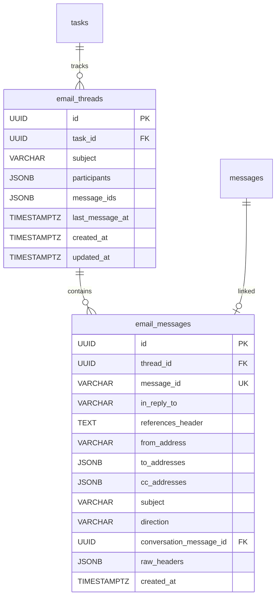

# 16. EmailThread（Email 對話串）

## 1. Entity 總覽

`EmailThread` 與 `EmailMessage` 負責追蹤任務與外部 Email 往返的對應關係。系統透過 Email 標頭（Message-ID、In-Reply-To、References）自動將收發的 Email 歸入對應的對話串，並與任務的對話訊息（`messages`）建立連結。

| 項目 | 說明 |
|------|------|
| 資料表名稱 | `email_threads`、`email_messages` |
| 主鍵 | `id` UUID v7 |
| 軟刪除 | 不適用 — Email 記錄為不可變原始資料 |
| CRDT | 不適用 |

**主要用途：**
- 追蹤任務與外部 Email 聯絡人的往返通訊
- 透過 Email 標頭自動配對收到的回信至正確的對話串
- 將 Email 訊息與任務對話中的訊息（`messages`）建立雙向連結
- 記錄 Email 原始標頭資訊供問題排查

**關聯實體：**
- `tasks`：對話串所屬的任務
- `messages`：Email 對應的任務對話訊息

---

## 2. SQL CREATE TABLE

### 2.1 `email_threads` 表

```sql
CREATE TABLE email_threads (
    id              UUID        PRIMARY KEY,                       -- UUID v7，應用層產生
    task_id         UUID        NOT NULL REFERENCES tasks(id),    -- 所屬任務
    subject         VARCHAR     NOT NULL,                          -- Email 主旨
    participants    JSONB       NOT NULL,                          -- 參與者 Email 地址列表
    message_ids     JSONB       NOT NULL DEFAULT '[]',             -- Email Message-ID 列表，用於標頭配對
    last_message_at TIMESTAMPTZ,                                   -- 最後一封 Email 的時間
    created_at      TIMESTAMPTZ NOT NULL DEFAULT NOW(),
    updated_at      TIMESTAMPTZ NOT NULL DEFAULT NOW()
);
```

**欄位說明：**

| 欄位 | 型別 | 說明 |
|------|------|------|
| `id` | UUID | 主鍵，UUID v7，應用層產生 |
| `task_id` | UUID | 所屬任務，FK → `tasks.id` |
| `subject` | VARCHAR | Email 主旨（以第一封 Email 的主旨為準） |
| `participants` | JSONB | 參與者 Email 地址陣列 |
| `message_ids` | JSONB | 此對話串中所有 Email 的 Message-ID 列表 |
| `last_message_at` | TIMESTAMPTZ | 最後一封 Email 的時間，用於排序 |
| `created_at` | TIMESTAMPTZ | 建立時間，UTC |
| `updated_at` | TIMESTAMPTZ | 最後更新時間，UTC |

### 2.2 `email_messages` 表

```sql
CREATE TABLE email_messages (
    id                     UUID        PRIMARY KEY,                              -- UUID v7，應用層產生
    thread_id              UUID        NOT NULL REFERENCES email_threads(id),    -- 所屬對話串
    message_id             VARCHAR     NOT NULL UNIQUE,                           -- Email Message-ID 標頭值
    in_reply_to            VARCHAR,                                               -- In-Reply-To 標頭值
    references_header      TEXT,                                                  -- References 標頭（空白分隔的 Message-ID 列表）
    from_address           VARCHAR     NOT NULL,                                  -- 寄件者 Email 地址
    to_addresses           JSONB       NOT NULL,                                  -- 收件者 Email 地址列表
    cc_addresses           JSONB       DEFAULT '[]',                              -- 副本收件者 Email 地址列表
    subject                VARCHAR     NOT NULL,                                  -- Email 主旨
    direction              VARCHAR(10) NOT NULL,                                  -- 方向：'inbound' | 'outbound'
    conversation_message_id UUID       REFERENCES messages(id),                   -- 對應的任務對話訊息
    raw_headers            JSONB,                                                 -- 原始 Email 標頭（供除錯用）
    created_at             TIMESTAMPTZ NOT NULL DEFAULT NOW()                     -- 建立時間，UTC
);
```

> **注意：** `email_messages` 為原始 Email 記錄，不包含 `updated_at` 與 `deleted_at`。Email 記錄為 write-once 不可變資料。

**欄位說明：**

| 欄位 | 型別 | 說明 |
|------|------|------|
| `id` | UUID | 主鍵，UUID v7，應用層產生 |
| `thread_id` | UUID | 所屬對話串，FK → `email_threads.id` |
| `message_id` | VARCHAR | Email Message-ID 標頭值，全域唯一 |
| `in_reply_to` | VARCHAR | In-Reply-To 標頭值，指向回覆的原始 Email |
| `references_header` | TEXT | References 標頭，空白分隔的 Message-ID 列表 |
| `from_address` | VARCHAR | 寄件者 Email 地址 |
| `to_addresses` | JSONB | 收件者 Email 地址陣列 |
| `cc_addresses` | JSONB | 副本收件者 Email 地址陣列 |
| `subject` | VARCHAR | Email 主旨 |
| `direction` | VARCHAR | 方向：`inbound`（收到）或 `outbound`（發出） |
| `conversation_message_id` | UUID | 對應的任務對話訊息，FK → `messages.id` |
| `raw_headers` | JSONB | 原始 Email 標頭鍵值對（供問題排查） |
| `created_at` | TIMESTAMPTZ | 建立時間，UTC |

---

## 3. Indexes

```sql
-- === email_threads 索引 ===

-- 依任務查詢對話串
CREATE INDEX idx_email_threads_task_id
    ON email_threads (task_id);

-- GIN 索引：搜尋 message_ids 陣列內容（用於對話串配對）
CREATE INDEX idx_email_threads_message_ids
    ON email_threads USING GIN (message_ids jsonb_path_ops);

-- === email_messages 索引 ===

-- 依對話串查詢 Email 訊息
CREATE INDEX idx_email_messages_thread_id
    ON email_messages (thread_id);

-- Message-ID 唯一索引（已在 UNIQUE 約束中隱含）
-- CREATE UNIQUE INDEX uq_email_messages_message_id ON email_messages (message_id);

-- 依寄件者查詢
CREATE INDEX idx_email_messages_from_address
    ON email_messages (from_address);

-- 依 In-Reply-To 查詢（用於對話串配對）
CREATE INDEX idx_email_messages_in_reply_to
    ON email_messages (in_reply_to)
    WHERE in_reply_to IS NOT NULL;
```

---

## 4. Rust Structs

```rust
use chrono::{DateTime, Utc};
use serde::{Deserialize, Serialize};
use uuid::Uuid;

/// Email 方向
#[derive(Debug, Clone, Serialize, Deserialize, PartialEq, Eq)]
#[serde(rename_all = "snake_case")]
pub enum EmailDirection {
    /// 收到的 Email
    Inbound,
    /// 發出的 Email
    Outbound,
}

/// Email 對話串
#[derive(Debug, Clone, Serialize, Deserialize)]
pub struct EmailThread {
    pub id: Uuid,
    pub task_id: Uuid,
    pub subject: String,
    pub participants: Vec<String>,
    pub message_ids: Vec<String>,
    pub last_message_at: Option<DateTime<Utc>>,
    pub created_at: DateTime<Utc>,
    pub updated_at: DateTime<Utc>,
}

/// Email 訊息記錄
#[derive(Debug, Clone, Serialize, Deserialize)]
pub struct EmailMessage {
    pub id: Uuid,
    pub thread_id: Uuid,
    /// Email Message-ID 標頭值
    pub message_id: String,
    /// In-Reply-To 標頭值
    pub in_reply_to: Option<String>,
    /// References 標頭（空白分隔的 Message-ID 列表）
    pub references_header: Option<String>,
    pub from_address: String,
    pub to_addresses: Vec<String>,
    pub cc_addresses: Vec<String>,
    pub subject: String,
    pub direction: EmailDirection,
    /// 對應的任務對話訊息 ID
    pub conversation_message_id: Option<Uuid>,
    /// 原始 Email 標頭
    pub raw_headers: Option<serde_json::Value>,
    pub created_at: DateTime<Utc>,
}
```

---

## 5. Relations



### 關聯說明

| 關聯 | 對應表 | 類型 | 說明 |
|------|--------|------|------|
| EmailThread → Task | `tasks` | 多對一 | 對話串所屬的任務 |
| EmailMessage → EmailThread | `email_threads` | 多對一 | Email 所屬的對話串 |
| EmailMessage → Message | `messages` | 一對一 | Email 對應的任務對話訊息 |

---

## 6. JSONB Schemas

### 6.1 `participants` 欄位

對話串中所有參與者的 Email 地址列表。每收發一封新 Email 時自動更新。

```json
["alice@example.com", "bob@example.com", "carol@example.com"]
```

**JSON Schema：**

```json
{
  "$schema": "http://json-schema.org/draft-07/schema#",
  "title": "EmailParticipants",
  "description": "對話串參與者的 Email 地址列表",
  "type": "array",
  "items": {
    "type": "string",
    "format": "email"
  },
  "uniqueItems": true
}
```

### 6.2 `message_ids` 欄位

對話串中所有 Email 的 Message-ID 列表。用於快速判斷某封 Email 是否屬於此對話串。

```json
[
  "<abc123@mail.example.com>",
  "<def456@mail.example.com>",
  "<ghi789@mail.example.com>"
]
```

**JSON Schema：**

```json
{
  "$schema": "http://json-schema.org/draft-07/schema#",
  "title": "EmailMessageIds",
  "description": "對話串中所有 Email 的 Message-ID 標頭值列表",
  "type": "array",
  "items": {
    "type": "string"
  }
}
```

### 6.3 `to_addresses` / `cc_addresses` 欄位

收件者與副本收件者的 Email 地址列表。

```json
["alice@example.com", "bob@example.com"]
```

**JSON Schema：**

```json
{
  "$schema": "http://json-schema.org/draft-07/schema#",
  "title": "EmailAddresses",
  "description": "Email 地址列表",
  "type": "array",
  "items": {
    "type": "string",
    "format": "email"
  }
}
```

### 6.4 `raw_headers` 欄位

原始 Email 標頭的鍵值對，供問題排查用。

```json
{
  "From": "alice@example.com",
  "To": "bob@example.com",
  "Subject": "Re: 場地確認",
  "Date": "Mon, 15 Jan 2025 10:30:00 +0800",
  "Message-ID": "<abc123@mail.example.com>",
  "In-Reply-To": "<def456@mail.example.com>",
  "References": "<ghi789@mail.example.com> <def456@mail.example.com>",
  "MIME-Version": "1.0",
  "Content-Type": "text/plain; charset=UTF-8"
}
```

**JSON Schema：**

```json
{
  "$schema": "http://json-schema.org/draft-07/schema#",
  "title": "RawEmailHeaders",
  "description": "原始 Email 標頭鍵值對",
  "type": "object",
  "additionalProperties": {
    "type": "string"
  }
}
```

---

## 7. CRDT 標記

本資料表**不使用 CRDT**。Email 記錄為外部系統輸入的原始資料，不涉及多人協作編輯。

---

## 8. Business Rules

### 8.1 對話串配對邏輯

收到 Inbound Email 時，系統依以下優先順序配對至對話串：

**第一優先：Email 標頭配對**

1. 檢查 `In-Reply-To` 標頭值是否存在於某個 `email_messages.message_id`
2. 檢查 `References` 標頭中的任一 Message-ID 是否存在於某個 `email_threads.message_ids`
3. 若配對成功，將 Email 加入該對話串

**第二優先：寄件者 + 主旨啟發式配對**

1. 若標頭配對失敗，以寄件者地址 + 正規化主旨（移除 `Re:`, `Fwd:` 等前綴）進行模糊配對
2. 在同一任務下尋找相符的對話串
3. 此方式為啟發式，可能有誤配對，系統應提供手動調整機制

**無法配對時：**

- 若以上兩種方式皆無法配對，建立新的 `email_thread`
- 新對話串需手動或由 AI 建議關聯至任務

### 8.2 Email 與任務對話同步

- 收到 Inbound Email 時，自動在對應任務中建立 `message`（`source_type = 'email'`）
- 發出 Outbound Email 時，同步記錄 `email_message` 並設定 `conversation_message_id`
- `conversation_message_id` 建立 Email 與任務對話的雙向連結

### 8.3 參與者維護

- 每收發一封 Email 時，自動將新出現的地址加入 `email_threads.participants`
- `participants` 為**累積式**更新，不會移除已加入的地址
- 用於在 UI 上顯示對話串的參與者清單

### 8.4 Message-ID 維護

- 每收發一封 Email 時，自動將其 `Message-ID` 加入 `email_threads.message_ids`
- `message_ids` 配合 GIN 索引實現快速的對話串配對查詢

### 8.5 不可變性

- `email_messages` 記錄為 write-once 不可變資料，寫入後不可修改
- `email_threads` 的 `participants`、`message_ids`、`last_message_at` 可隨新 Email 更新
- Email 內文不儲存在此資料表中，而是儲存在 `messages.content` 中
