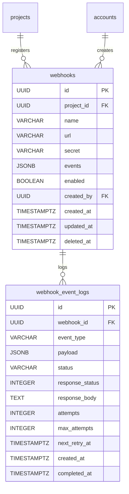

# 17. Webhook（Webhook 設定與事件日誌）

## 1. Entity 總覽

`Webhook` 與 `WebhookEventLog` 構成 Conf-Ops 的外部系統整合通知機制。`Webhook` 定義了專案層級的事件訂閱設定，當系統中發生指定事件時，自動透過 HTTP POST 將事件資料推送至目標 URL。`WebhookEventLog` 記錄每次推送的結果與重試狀態。

| 項目 | 說明 |
|------|------|
| 資料表名稱 | `webhooks`、`webhook_event_logs` |
| 主鍵 | `id` UUID v7 |
| 軟刪除 | `webhooks` 有軟刪除；`webhook_event_logs` 無 |
| CRDT | 不適用 |

**主要用途：**
- 將系統事件（任務建立、待辦完成、資料異動等）推送至外部系統
- 支援 HMAC 簽名驗證確保推送安全性
- 自動重試失敗的推送（指數退避策略）
- 記錄完整的推送歷史供問題排查

**關聯實體：**
- `projects`：Webhook 所屬的專案
- `accounts`：Webhook 的建立者

---

## 2. SQL CREATE TABLE

### 2.1 `webhooks` 表

```sql
CREATE TABLE webhooks (
    id          UUID        PRIMARY KEY,                          -- UUID v7，應用層產生
    project_id  UUID        NOT NULL REFERENCES projects(id),    -- 所屬專案
    name        VARCHAR     NOT NULL,                             -- Webhook 名稱（便於識別）
    url         VARCHAR     NOT NULL,                             -- 目標推送 URL
    secret      VARCHAR,                                          -- HMAC 簽名密鑰
    events      JSONB       NOT NULL,                             -- 訂閱的事件類型列表
    enabled     BOOLEAN     NOT NULL DEFAULT true,                -- 是否啟用
    created_by  UUID        NOT NULL REFERENCES accounts(id),    -- 建立者帳號
    created_at  TIMESTAMPTZ NOT NULL DEFAULT NOW(),
    updated_at  TIMESTAMPTZ NOT NULL DEFAULT NOW(),
    deleted_at  TIMESTAMPTZ                                       -- 軟刪除時間
);
```

**欄位說明：**

| 欄位 | 型別 | 說明 |
|------|------|------|
| `id` | UUID | 主鍵，UUID v7，應用層產生 |
| `project_id` | UUID | 所屬專案，FK → `projects.id` |
| `name` | VARCHAR | Webhook 名稱，方便管理者識別用途 |
| `url` | VARCHAR | 目標推送 URL，必須為 HTTPS（生產環境） |
| `secret` | VARCHAR | HMAC-SHA256 簽名密鑰，可為 NULL（不驗證簽名） |
| `events` | JSONB | 訂閱的事件類型列表 |
| `enabled` | BOOLEAN | 是否啟用，預設 `true` |
| `created_by` | UUID | 建立者帳號，FK → `accounts.id` |
| `created_at` | TIMESTAMPTZ | 建立時間，UTC |
| `updated_at` | TIMESTAMPTZ | 最後更新時間，UTC |
| `deleted_at` | TIMESTAMPTZ | 軟刪除時間，NULL 表示有效 |

### 2.2 `webhook_event_logs` 表

```sql
CREATE TABLE webhook_event_logs (
    id              UUID        PRIMARY KEY,                          -- UUID v7，應用層產生
    webhook_id      UUID        NOT NULL REFERENCES webhooks(id),    -- 所屬 Webhook
    event_type      VARCHAR     NOT NULL,                             -- 事件類型
    payload         JSONB       NOT NULL,                             -- 推送的 JSON 資料
    status          VARCHAR(20) NOT NULL,                             -- 推送狀態：'pending' | 'success' | 'failed'
    response_status INTEGER,                                          -- HTTP 回應狀態碼
    response_body   TEXT,                                             -- HTTP 回應內容（截斷至合理長度）
    attempts        INTEGER     NOT NULL DEFAULT 0,                   -- 已嘗試推送次數
    max_attempts    INTEGER     NOT NULL DEFAULT 3,                   -- 最大嘗試次數
    next_retry_at   TIMESTAMPTZ,                                      -- 下次重試時間
    created_at      TIMESTAMPTZ NOT NULL DEFAULT NOW(),               -- 建立時間，UTC
    completed_at    TIMESTAMPTZ                                       -- 最終完成時間（成功或放棄）
);
```

> **注意：** `webhook_event_logs` 不包含 `updated_at` 與 `deleted_at`。事件日誌的狀態更新透過直接修改 `status`、`attempts`、`next_retry_at` 等欄位實現，歷史日誌依保留政策清理。

**欄位說明：**

| 欄位 | 型別 | 說明 |
|------|------|------|
| `id` | UUID | 主鍵，UUID v7，應用層產生 |
| `webhook_id` | UUID | 所屬 Webhook，FK → `webhooks.id` |
| `event_type` | VARCHAR | 事件類型，如 `task.created` |
| `payload` | JSONB | 推送的完整 JSON 資料 |
| `status` | VARCHAR | 推送狀態 |
| `response_status` | INTEGER | HTTP 回應狀態碼（2xx 為成功） |
| `response_body` | TEXT | HTTP 回應內容，截斷至 10KB |
| `attempts` | INTEGER | 已嘗試推送次數 |
| `max_attempts` | INTEGER | 最大嘗試次數，預設 3 |
| `next_retry_at` | TIMESTAMPTZ | 下次重試時間 |
| `created_at` | TIMESTAMPTZ | 建立時間，UTC |
| `completed_at` | TIMESTAMPTZ | 最終完成時間 |

---

## 3. Indexes

```sql
-- === webhooks 索引 ===

-- 依專案查詢啟用的 Webhook（排除已刪除）
CREATE INDEX idx_webhooks_project_enabled
    ON webhooks (project_id, enabled)
    WHERE deleted_at IS NULL;

-- 依 URL 查詢（用於重複檢查）
CREATE INDEX idx_webhooks_url
    ON webhooks (url)
    WHERE deleted_at IS NULL;

-- === webhook_event_logs 索引 ===

-- 依 Webhook 查詢事件日誌（時間排序）
CREATE INDEX idx_webhook_event_logs_webhook_created
    ON webhook_event_logs (webhook_id, created_at DESC);

-- 重試佇列查詢：待重試的事件
CREATE INDEX idx_webhook_event_logs_retry_queue
    ON webhook_event_logs (status, next_retry_at)
    WHERE status = 'pending' AND next_retry_at IS NOT NULL;
```

---

## 4. Rust Structs

```rust
use chrono::{DateTime, Utc};
use serde::{Deserialize, Serialize};
use uuid::Uuid;

/// Webhook 事件類型
#[derive(Debug, Clone, Serialize, Deserialize, PartialEq, Eq)]
pub struct WebhookEventType(pub String);

impl WebhookEventType {
    pub const TASK_CREATED: &'static str = "task.created";
    pub const TASK_UPDATED: &'static str = "task.updated";
    pub const TASK_COMPLETED: &'static str = "task.completed";
    pub const TASK_DELETED: &'static str = "task.deleted";

    pub const TODO_CREATED: &'static str = "todo.created";
    pub const TODO_COMPLETED: &'static str = "todo.completed";
    pub const TODO_UPDATED: &'static str = "todo.updated";

    pub const DATA_ENTRY_CREATED: &'static str = "data_entry.created";
    pub const DATA_ENTRY_UPDATED: &'static str = "data_entry.updated";
    pub const DATA_ENTRY_DELETED: &'static str = "data_entry.deleted";

    pub const MESSAGE_CREATED: &'static str = "message.created";
    pub const MEMBER_ADDED: &'static str = "member.added";
    pub const MEMBER_REMOVED: &'static str = "member.removed";

    pub const TEST: &'static str = "test";
}

/// Webhook 推送狀態
#[derive(Debug, Clone, Serialize, Deserialize, PartialEq, Eq)]
#[serde(rename_all = "snake_case")]
pub enum WebhookEventStatus {
    /// 等待推送或等待重試
    Pending,
    /// 推送成功
    Success,
    /// 推送失敗（已達最大重試次數）
    Failed,
}

/// Webhook 設定
#[derive(Debug, Clone, Serialize, Deserialize)]
pub struct Webhook {
    pub id: Uuid,
    pub project_id: Uuid,
    pub name: String,
    pub url: String,
    /// HMAC-SHA256 簽名密鑰（讀取時不回傳明文）
    pub secret: Option<String>,
    pub events: Vec<WebhookEventType>,
    pub enabled: bool,
    pub created_by: Uuid,
    pub created_at: DateTime<Utc>,
    pub updated_at: DateTime<Utc>,
    pub deleted_at: Option<DateTime<Utc>>,
}

/// Webhook 事件日誌
#[derive(Debug, Clone, Serialize, Deserialize)]
pub struct WebhookEventLog {
    pub id: Uuid,
    pub webhook_id: Uuid,
    pub event_type: WebhookEventType,
    pub payload: serde_json::Value,
    pub status: WebhookEventStatus,
    pub response_status: Option<i32>,
    pub response_body: Option<String>,
    pub attempts: i32,
    pub max_attempts: i32,
    pub next_retry_at: Option<DateTime<Utc>>,
    pub created_at: DateTime<Utc>,
    pub completed_at: Option<DateTime<Utc>>,
}
```

---

## 5. Relations



### 關聯說明

| 關聯 | 對應表 | 類型 | 說明 |
|------|--------|------|------|
| Webhook → Project | `projects` | 多對一 | Webhook 所屬的專案 |
| Webhook → Account | `accounts` | 多對一 | Webhook 的建立者 |
| WebhookEventLog → Webhook | `webhooks` | 多對一 | 事件日誌所屬的 Webhook |

---

## 6. JSONB Schemas

### 6.1 `events` 欄位

Webhook 訂閱的事件類型列表。僅當事件類型在此列表中時才會觸發推送。

```json
["task.created", "todo.completed", "data_entry.updated", "message.created"]
```

**JSON Schema：**

```json
{
  "$schema": "http://json-schema.org/draft-07/schema#",
  "title": "WebhookEvents",
  "description": "Webhook 訂閱的事件類型列表",
  "type": "array",
  "items": {
    "type": "string",
    "pattern": "^[a-z_]+\\.[a-z_]+$",
    "description": "事件類型，格式為「資源.動作」"
  },
  "minItems": 1,
  "uniqueItems": true
}
```

**支援的事件類型：**

| 事件類型 | 說明 |
|----------|------|
| `task.created` | 任務建立 |
| `task.updated` | 任務更新 |
| `task.completed` | 任務完成 |
| `task.deleted` | 任務刪除 |
| `todo.created` | 待辦事項建立 |
| `todo.completed` | 待辦事項完成 |
| `todo.updated` | 待辦事項更新 |
| `data_entry.created` | 資料列建立 |
| `data_entry.updated` | 資料列更新 |
| `data_entry.deleted` | 資料列刪除 |
| `message.created` | 訊息建立 |
| `member.added` | 成員加入 |
| `member.removed` | 成員移除 |
| `test` | 測試事件（用於驗證 Webhook 設定） |

### 6.2 `payload` 欄位

推送至目標 URL 的 JSON 資料，結構依事件類型而異。

**範例（`task.created`）：**

```json
{
  "event": "task.created",
  "timestamp": "2025-01-15T10:30:00Z",
  "project_id": "018d5f2a-...",
  "data": {
    "id": "018d5f2a-...",
    "name": "場地確認",
    "status": "open",
    "created_by": "018d5f2a-...",
    "created_at": "2025-01-15T10:30:00Z"
  }
}
```

**JSON Schema：**

```json
{
  "$schema": "http://json-schema.org/draft-07/schema#",
  "title": "WebhookPayload",
  "description": "Webhook 推送資料",
  "type": "object",
  "required": ["event", "timestamp", "project_id", "data"],
  "properties": {
    "event": {
      "type": "string",
      "description": "事件類型"
    },
    "timestamp": {
      "type": "string",
      "format": "date-time",
      "description": "事件發生時間（ISO 8601）"
    },
    "project_id": {
      "type": "string",
      "format": "uuid",
      "description": "事件所屬專案 ID"
    },
    "data": {
      "type": "object",
      "description": "事件資料，結構依事件類型而異"
    }
  }
}
```

---

## 7. CRDT 標記

本資料表**不使用 CRDT**。Webhook 設定為管理性操作，不涉及多人同時編輯。

---

## 8. Business Rules

### 8.1 權限控管

| 操作 | 允許的角色 |
|------|-----------|
| 檢視 Webhook 設定 | `owner`、`tag_admin` |
| 新增/修改/刪除 Webhook | `owner` |
| 檢視事件日誌 | `owner`、`tag_admin` |

### 8.2 推送流程

1. 系統事件發生時，查詢該專案下所有 `enabled = true` 且訂閱該事件類型的 Webhook
2. 為每個匹配的 Webhook 建立 `webhook_event_log`（`status = 'pending'`）
3. 非同步發送 HTTP POST 請求至 `webhook.url`
4. 若 `secret` 不為 NULL，在請求標頭中附加 HMAC-SHA256 簽名
5. 依回應結果更新 `webhook_event_log` 狀態

### 8.3 HMAC 簽名

當 Webhook 設定了 `secret` 時，推送請求包含以下簽名標頭：

```
X-Webhook-Signature: sha256=<HMAC-SHA256(secret, request_body)>
X-Webhook-Timestamp: <unix_timestamp>
```

接收方可透過重新計算簽名驗證請求的真實性與完整性。

### 8.4 重試策略

推送失敗（HTTP 狀態碼非 2xx 或連線逾時）時的重試機制：

| 嘗試次數 | 等待時間 | 說明 |
|----------|----------|------|
| 第 1 次重試 | 1 分鐘 | 首次失敗後 |
| 第 2 次重試 | 5 分鐘 | 第二次失敗後 |
| 第 3 次重試 | 30 分鐘 | 第三次失敗後 |

- 指數退避（Exponential Backoff）策略
- 達到 `max_attempts` 後將 `status` 設為 `failed`，`completed_at` 設為當前時間
- 推送成功（HTTP 2xx）時將 `status` 設為 `success`，`completed_at` 設為當前時間
- 重試排程器定期查詢 `status = 'pending' AND next_retry_at <= NOW()` 的記錄

### 8.5 安全性

- 生產環境中 `url` 必須為 HTTPS
- `secret` 欄位在資料庫中以加密形式儲存
- API 回應中 `secret` 不回傳明文，僅顯示是否已設定
- `response_body` 截斷至 10KB，避免儲存過大的回應內容
- 推送請求設定合理的逾時時間（建議 10 秒）

### 8.6 事件日誌保留

- 成功的事件日誌保留 **30 天**後由排程任務批次刪除
- 失敗的事件日誌保留 **90 天**後由排程任務批次刪除
- 刪除為實際 `DELETE`（非軟刪除）

### 8.7 自動停用

- 若 Webhook 連續失敗超過 **50 次**（跨不同事件），系統自動將 `enabled` 設為 `false`
- 自動停用時產生通知（通知 Webhook 建立者）
- 管理者可手動重新啟用
