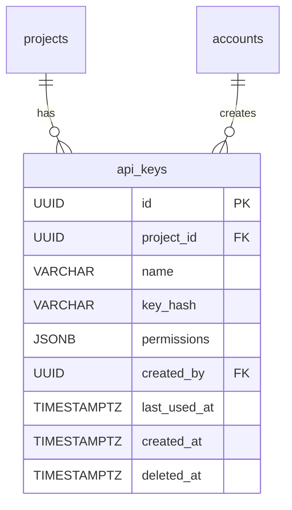

# 18. ApiKey（API 金鑰）

## 1. Entity 總覽

`ApiKey` 為專案層級的 API 金鑰，用於外部資料 API（`/external/v1/`）的認證。每個專案可建立多組 API Key，各自擁有獨立的權限範圍與生命週期。

| 項目 | 說明 |
|------|------|
| 資料表名稱 | `api_keys` |
| 主鍵 | `id` UUID v7 |
| 軟刪除 | 有 — 撤銷時設定 `deleted_at` |
| CRDT | 不適用 |

**主要用途：**
- 為外部系統提供專案層級的 API 存取認證
- 支援多組金鑰，各自可設定不同的權限範圍
- 追蹤金鑰的最後使用時間，方便管理未使用的金鑰

**關聯實體：**
- `projects`：金鑰所屬專案
- `accounts`：金鑰建立者

---

## 2. SQL CREATE TABLE

```sql
CREATE TABLE api_keys (
    id           UUID        PRIMARY KEY,                        -- UUID v7，應用層產生
    project_id   UUID        NOT NULL REFERENCES projects(id),   -- 所屬專案
    name         VARCHAR     NOT NULL,                           -- 金鑰名稱（人類可識別）
    key_hash     VARCHAR     NOT NULL,                           -- API Key 的 SHA-256 雜湊值
    permissions  JSONB       NOT NULL DEFAULT '{}',              -- 允許的操作權限（含 scopes 與 dataAccess）
    created_by   UUID        NOT NULL REFERENCES accounts(id),   -- 建立者帳號
    last_used_at TIMESTAMPTZ,                                    -- 最後使用時間
    created_at   TIMESTAMPTZ NOT NULL DEFAULT NOW(),
    deleted_at   TIMESTAMPTZ                                     -- 軟刪除（撤銷時間）
);
```

> **注意：** 此資料表不包含 `updated_at` 欄位。API Key 建立後不可修改，僅可撤銷（軟刪除）。`key_hash` 儲存 API Key 的雜湊值，原始金鑰僅在建立時回傳一次。

**欄位說明：**

| 欄位 | 型別 | 說明 |
|------|------|------|
| `id` | UUID | 主鍵，UUID v7，應用層產生 |
| `project_id` | UUID | 所屬專案，FK → `projects.id` |
| `name` | VARCHAR | 金鑰名稱，方便人類識別用途（如「官網串接」「CI/CD」） |
| `key_hash` | VARCHAR | API Key 的 SHA-256 雜湊值，用於驗證 |
| `permissions` | JSONB | 允許的操作權限列表 |
| `created_by` | UUID | 建立者帳號，FK → `accounts.id` |
| `last_used_at` | TIMESTAMPTZ | 最後一次使用此金鑰的時間 |
| `created_at` | TIMESTAMPTZ | 建立時間，UTC |
| `deleted_at` | TIMESTAMPTZ | 撤銷時間，NULL 表示有效 |

---

## 3. Indexes

```sql
-- 依專案查詢有效的 API Key
CREATE INDEX idx_api_keys_project_id
    ON api_keys (project_id)
    WHERE deleted_at IS NULL;

-- 依 key_hash 查詢（驗證用，需快速查找）
CREATE UNIQUE INDEX idx_api_keys_key_hash
    ON api_keys (key_hash)
    WHERE deleted_at IS NULL;
```

---

## 4. Rust Structs

```rust
use chrono::{DateTime, Utc};
use serde::{Deserialize, Serialize};
use uuid::Uuid;

/// API Key 實體
#[derive(Debug, Clone, Serialize, Deserialize)]
pub struct ApiKey {
    pub id: Uuid,
    pub project_id: Uuid,
    pub name: String,
    pub key_hash: String,
    pub permissions: ApiKeyPermissions,
    pub created_by: Uuid,
    pub last_used_at: Option<DateTime<Utc>>,
    pub created_at: DateTime<Utc>,
    pub deleted_at: Option<DateTime<Utc>>,
}

/// API Key 權限結構
#[derive(Debug, Clone, Serialize, Deserialize)]
pub struct ApiKeyPermissions {
    pub scopes: Vec<String>,
    pub data_access: Option<DataAccessFilter>,
}

/// 資料存取過濾器
#[derive(Debug, Clone, Serialize, Deserialize)]
pub struct DataAccessFilter {
    pub template_ids: Vec<Uuid>,
    pub schema_ids: Vec<Uuid>,
}

/// API Key 建立回應（僅建立時回傳原始金鑰）
#[derive(Debug, Clone, Serialize, Deserialize)]
pub struct ApiKeyCreated {
    pub id: Uuid,
    pub name: String,
    /// 原始 API Key（僅建立時回傳一次，之後無法取得）
    pub api_key: String,
    pub permissions: ApiKeyPermissions,
    pub created_at: DateTime<Utc>,
}
```

---

## 5. Relations



### 關聯說明

| 關聯 | 對應表 | 類型 | 說明 |
|------|--------|------|------|
| ApiKey → Project | `projects` | 多對一 | 金鑰所屬專案 |
| ApiKey → Account | `accounts` | 多對一 | 金鑰建立者 |

---

## 6. JSONB Schemas

### 6.1 `permissions` 欄位

定義此 API Key 可執行的操作權限，包含 scopes（操作範圍）與 dataAccess（資料存取限制）。

```json
{
  "scopes": ["read:task_templates", "read:tasks", "read:data", "write:data"],
  "dataAccess": {
    "templateIds": ["uuid-1", "uuid-2"],
    "schemaIds": ["uuid-3"]
  }
}
```

**JSON Schema：**

```json
{
  "$schema": "http://json-schema.org/draft-07/schema#",
  "title": "ApiKeyPermissions",
  "description": "API Key 的操作權限結構",
  "type": "object",
  "required": ["scopes"],
  "properties": {
    "scopes": {
      "type": "array",
      "description": "允許的操作範圍",
      "items": {
        "type": "string",
        "enum": [
          "read:task_templates",
          "read:tasks",
          "read:data",
          "write:data"
        ]
      },
      "uniqueItems": true
    },
    "dataAccess": {
      "type": "object",
      "description": "資料存取過濾器，限制可存取的模板與資料表",
      "properties": {
        "templateIds": {
          "type": "array",
          "items": { "type": "string", "format": "uuid" },
          "description": "允許存取的任務模板 ID 列表"
        },
        "schemaIds": {
          "type": "array",
          "items": { "type": "string", "format": "uuid" },
          "description": "允許存取的資料表 ID 列表"
        }
      }
    }
  }
}
```

---

## 7. CRDT 標記

本資料表**不使用 CRDT**。API Key 為系統管理資源，不涉及多人協作編輯。

---

## 8. Business Rules

### 8.1 金鑰建立

- 僅專案擁有者（`owner`）可建立 API Key
- 建立時系統產生隨機金鑰，回傳原始金鑰（僅此一次）
- 系統僅儲存金鑰的 SHA-256 雜湊值，無法還原原始金鑰

### 8.2 金鑰驗證

- 外部請求透過 `X-API-Key` header 傳送金鑰
- 系統計算雜湊值後比對 `key_hash` 欄位
- 驗證成功時更新 `last_used_at`

### 8.3 金鑰撤銷

- 撤銷為軟刪除（設定 `deleted_at`）
- 撤銷後的金鑰立即失效，無法再用於 API 認證
- 撤銷操作記錄至審計日誌

### 8.4 安全規範

- 每個專案最多建立 10 組有效的 API Key
- 金鑰至少 32 bytes，使用密碼學安全隨機數產生
- 支援依 `last_used_at` 查詢並清理長期未使用的金鑰
