# Conf-Ops 資料模型總覽

## 1. 總覽

本文件定義 Conf-Ops 系統的資料模型層規範。Conf-Ops 是一套以 AI 輔助的研討會/活動專案管理系統，資料模型層負責定義所有持久化實體的結構、關聯、儲存策略與約束條件。

資料庫採用 **PostgreSQL**，搭配 JSONB 欄位處理彈性資料、CRDT 操作日誌處理多人協作同步，並以 UUID v7 作為全域主鍵策略。

---

## 2. 命名慣例

| 類型 | 規則 | 範例 |
|------|------|------|
| 資料表名稱 | snake_case，複數 | `accounts`、`organizations`、`task_templates` |
| 欄位名稱 | snake_case | `created_at`、`organization_id`、`profile_data` |
| 索引名稱 | `idx_{table}_{columns}` | `idx_members_project_id`、`idx_tasks_status_created_at` |
| 外鍵約束名稱 | `fk_{table}_{ref_table}` | `fk_members_accounts`、`fk_tasks_projects` |
| 唯一約束名稱 | `uq_{table}_{columns}` | `uq_accounts_email`、`uq_members_account_project` |

---

## 3. 主鍵策略

所有資料表統一使用 **UUID v7** 作為主鍵。

```sql
id UUID PRIMARY KEY DEFAULT gen_random_uuid()
```

> 注意：`gen_random_uuid()` 為 PostgreSQL 預設函式（產生 v4），實際的 UUID v7 由**應用層**（Rust）產生後寫入。DDL 中的 `DEFAULT` 僅作為防禦性預設值。

**UUID v7 的優勢：**

- **時間可排序**：前 48 位元為毫秒級時間戳，自然按照建立時間排序，對 B-tree 索引友善
- **分散式生成**：無需中央協調即可在多個節點產生唯一 ID
- **無列舉攻擊風險**：不可預測，無法透過遞增猜測其他資源的 ID

---

## 4. 時間戳慣例

所有時間戳欄位使用 `TIMESTAMPTZ`，儲存時一律為 **UTC**。

### 標準時間戳欄位

```sql
created_at TIMESTAMPTZ NOT NULL DEFAULT NOW(),
updated_at TIMESTAMPTZ NOT NULL DEFAULT NOW(),
deleted_at TIMESTAMPTZ           -- 軟刪除標記，NULL 表示未刪除
```

### 規則

- **`created_at`**：由資料庫 `DEFAULT NOW()` 自動填入，建立後不可修改
- **`updated_at`**：應用層在每次修改時必須更新此欄位
- **`deleted_at`**：軟刪除機制 — 刪除時設定為當前時間，而非實際 `DELETE`
- 所有查詢預設加上 `WHERE deleted_at IS NULL` 過濾已刪除資料

### 軟刪除例外

以下資料表**不使用**軟刪除機制：

| 資料表 | 原因 |
|--------|------|
| `messages` | append-only，無 `deleted_at` |
| `notifications` | 定期硬刪除清理 |
| `audit_logs` | write-once 不可刪除 |
| `todo_assignees` | 取消指派時硬刪除 |
| `member_tag_assignments` | 取消時硬刪除 |

---

## 5. JSONB 欄位驗證規範

系統中多處使用 JSONB 欄位儲存彈性結構化資料：

| 欄位 | 所屬資料表 | 用途 |
|------|-----------|------|
| `profile_data` | `accounts` | 個人私有結構化資料（電話、地址、銀行帳號等） |
| `profile_schema` | `accounts` | 個人欄位結構描述，系統自動維護，AI 僅接收此結構 |
| `tool_configs` | `tool_configs` | MCP 工具連線設定（API Key、端點等） |
| `permission_settings` | `organizations`、`projects` | 權限設定 |
| `data_schema` | `data_schemas` | 資料表欄位結構定義 |
| `constraints` | `data_schemas` | 欄位約束條件 |
| `notification_preferences` | `accounts` | 通知偏好設定 |
| `content` | `messages` | 訊息內容（含附件資訊、動作結果等） |

### 驗證策略

- **應用層驗證**：透過 Rust 結構體搭配 `serde` 進行序列化/反序列化驗證，不在資料庫層使用 `CHECK` 約束
- **JSON Schema 文件化**：每個 JSONB 欄位在對應的資料模型文件中提供完整的 JSON Schema 定義
- **型別安全**：Rust 編譯期保證寫入的 JSON 結構符合預期

```rust
#[derive(Serialize, Deserialize)]
pub struct ProfileData {
    #[serde(flatten)]
    pub fields: HashMap<String, serde_json::Value>,
}

#[derive(Serialize, Deserialize)]
pub struct DataSchemaField {
    pub key: String,
    pub label: String,
    pub description: String,
    pub field_type: FieldType,
    pub required: bool,
    pub constraints: Option<FieldConstraints>,
}
```

### 索引策略

- **GIN 索引**：用於需要搜尋 JSONB 內容的欄位
- **`jsonb_path_ops`**：對已知查詢模式使用更高效的運算子類別

```sql
CREATE INDEX idx_accounts_profile_data ON accounts USING GIN (profile_data jsonb_path_ops);
```

---

## 6. CRDT 儲存模式

系統使用 CRDT（Conflict-free Replicated Data Types）處理多人同時協作的資料同步。儲存採用**雙寫模式**：

### 儲存架構

1. **主表（物化狀態）**：儲存實體的最新狀態，供一般查詢使用
2. **`crdt_operations` 表（操作日誌）**：儲存所有 CRDT 操作記錄，用於衝突解決與狀態重建

### `crdt_operations` 表結構

```sql
CREATE TABLE crdt_operations (
    id          UUID PRIMARY KEY,
    entity_type VARCHAR(50) NOT NULL,   -- 實體類型：'message', 'todo', 'data_entry', 'memory', 'library_document'
    entity_id   UUID        NOT NULL,   -- 對應實體的 ID
    operation   BYTEA       NOT NULL,   -- yrs 二進位編碼的 CRDT 操作
    created_by  UUID        NOT NULL REFERENCES accounts(id),
    created_at  TIMESTAMPTZ NOT NULL DEFAULT NOW()
);

CREATE INDEX idx_crdt_operations_entity ON crdt_operations (entity_type, entity_id);
CREATE INDEX idx_crdt_operations_created_at ON crdt_operations (created_at);
```

### 適用範圍

| 實體 | 說明 |
|------|------|
| `messages` | 任務對話訊息，多人同時留言時保證順序一致 |
| `todos` | 待辦事項，多人同時修改狀態與指派 |
| `data_entries` | 資料表資料列，多人同時編輯欄位值 |
| `memories` | 記憶內容，多人同時編輯 |
| `library_documents` | 記憶庫文件內容，多人同時編輯 |

### 衝突解決

當發生衝突時，從 `crdt_operations` 重新播放操作日誌以重建物化狀態，CRDT 演算法保證最終一致性。

---

## 7. 共用欄位模式

所有資料表皆包含以下標準欄位：

```sql
CREATE TABLE example_table (
    id          UUID        PRIMARY KEY,             -- UUID v7，應用層產生
    -- ... 業務欄位 ...
    created_at  TIMESTAMPTZ NOT NULL DEFAULT NOW(),  -- 建立時間
    updated_at  TIMESTAMPTZ NOT NULL DEFAULT NOW(),  -- 最後更新時間
    deleted_at  TIMESTAMPTZ                          -- 軟刪除時間，NULL 表示有效
);
```

對應 Rust 結構體中的共用 trait：

```rust
pub trait HasTimestamps {
    fn created_at(&self) -> DateTime<Utc>;
    fn updated_at(&self) -> DateTime<Utc>;
    fn deleted_at(&self) -> Option<DateTime<Utc>>;
    fn is_deleted(&self) -> bool {
        self.deleted_at().is_some()
    }
}
```

---

## 8. ER 圖

```mermaid
erDiagram
    accounts {
        UUID id PK
        VARCHAR name
        VARCHAR email
        VARCHAR avatar
        TEXT bio
        JSONB profile_data
        JSONB notification_preferences
        TIMESTAMPTZ created_at
        TIMESTAMPTZ updated_at
        TIMESTAMPTZ deleted_at
    }

    organizations {
        UUID id PK
        VARCHAR name
        TEXT description
        VARCHAR logo
        JSONB permission_settings
        TIMESTAMPTZ created_at
        TIMESTAMPTZ updated_at
        TIMESTAMPTZ deleted_at
    }

    projects {
        UUID id PK
        UUID organization_id FK
        VARCHAR name
        TEXT description
        VARCHAR status
        UUID source_project_id FK
        JSONB permission_settings
        TIMESTAMPTZ created_at
        TIMESTAMPTZ updated_at
        TIMESTAMPTZ deleted_at
    }

    members {
        UUID id PK
        UUID account_id FK
        UUID project_id FK
        VARCHAR role
        TIMESTAMPTZ created_at
        TIMESTAMPTZ updated_at
        TIMESTAMPTZ deleted_at
    }

    contacts {
        UUID id PK
        UUID organization_id FK
        VARCHAR name
        VARCHAR email
        TIMESTAMPTZ created_at
        TIMESTAMPTZ updated_at
        TIMESTAMPTZ deleted_at
    }

    member_tags {
        UUID id PK
        UUID project_id FK
        VARCHAR name
        TEXT description
        JSONB external_task_creation
        TIMESTAMPTZ created_at
        TIMESTAMPTZ updated_at
        TIMESTAMPTZ deleted_at
    }

    member_tag_assignments {
        UUID id PK
        UUID member_tag_id FK
        UUID member_id FK "nullable"
        UUID contact_id FK "nullable"
        UUID project_id FK
        TIMESTAMPTZ created_at
    }

    task_templates {
        UUID id PK
        UUID project_id FK
        VARCHAR name
        TEXT description
        TIMESTAMPTZ created_at
        TIMESTAMPTZ updated_at
        TIMESTAMPTZ deleted_at
    }

    task_template_tags {
        UUID id PK
        UUID task_template_id FK
        UUID member_tag_id FK
        TIMESTAMPTZ created_at
    }

    todo_templates {
        UUID id PK
        UUID task_template_id FK
        UUID parent_id FK "nullable"
        VARCHAR name
        TEXT description
        INT sort_order
        TIMESTAMPTZ created_at
        TIMESTAMPTZ updated_at
        TIMESTAMPTZ deleted_at
    }

    data_schemas {
        UUID id PK
        UUID task_template_id FK
        VARCHAR name
        JSONB fields
        TIMESTAMPTZ created_at
        TIMESTAMPTZ updated_at
        TIMESTAMPTZ deleted_at
    }

    tasks {
        UUID id PK
        UUID project_id FK
        UUID source_template_id FK
        UUID owner_tag_id FK
        UUID created_by FK
        VARCHAR name
        VARCHAR status
        TIMESTAMPTZ created_at
        TIMESTAMPTZ updated_at
        TIMESTAMPTZ deleted_at
    }

    messages {
        UUID id PK
        UUID task_id FK
        VARCHAR source_type
        UUID source_id FK
        JSONB content
        JSONB attachments
        JSONB action_result
        TIMESTAMPTZ created_at
    }

    todos {
        UUID id PK
        UUID task_id FK
        UUID parent_id FK "nullable"
        VARCHAR title
        TEXT description
        VARCHAR status
        VARCHAR type
        TIMESTAMPTZ due_date
        UUID linked_task_id FK "nullable"
        TIMESTAMPTZ created_at
        TIMESTAMPTZ updated_at
        TIMESTAMPTZ deleted_at
    }

    todo_assignees {
        UUID id PK
        UUID todo_id FK
        UUID member_id FK
        TIMESTAMPTZ created_at
    }

    data_entries {
        UUID id PK
        UUID data_schema_id FK
        UUID task_id FK
        JSONB values
        TIMESTAMPTZ created_at
        TIMESTAMPTZ updated_at
        TIMESTAMPTZ deleted_at
    }

    tool_configs {
        UUID id PK
        VARCHAR scope_type "organization | project"
        UUID scope_id FK
        VARCHAR tool_type "builtin | external"
        VARCHAR tool_name
        VARCHAR display_name "nullable"
        TEXT description "nullable"
        BOOLEAN enabled
        JSONB config
        JSONB mcp_server_config "nullable"
        TIMESTAMPTZ created_at
        TIMESTAMPTZ updated_at
        TIMESTAMPTZ deleted_at
    }

    memories {
        UUID id PK
        VARCHAR scope_type
        UUID scope_id FK
        TEXT content
        TIMESTAMPTZ created_at
        TIMESTAMPTZ updated_at
        TIMESTAMPTZ deleted_at
    }

    library_documents {
        UUID id PK
        VARCHAR scope_type
        UUID scope_id FK
        VARCHAR title
        TEXT content
        UUID created_by FK
        TIMESTAMPTZ created_at
        TIMESTAMPTZ updated_at
        TIMESTAMPTZ deleted_at
    }

    audit_logs {
        UUID id PK
        UUID account_id FK
        VARCHAR action
        VARCHAR entity_type
        UUID entity_id
        JSONB details
        TIMESTAMPTZ created_at
    }

    notifications {
        UUID id PK
        UUID account_id FK
        VARCHAR type
        VARCHAR title
        TEXT body
        BOOLEAN read
        JSONB metadata
        TIMESTAMPTZ created_at
        TIMESTAMPTZ read_at
    }

    scheduled_reminders {
        UUID id PK
        UUID todo_id FK
        VARCHAR type
        TIMESTAMPTZ trigger_at
        BOOLEAN fired
        TIMESTAMPTZ fired_at
        UUID notification_id FK
        JSONB config
        TIMESTAMPTZ created_at
        TIMESTAMPTZ updated_at
    }

    email_threads {
        UUID id PK
        UUID task_id FK
        VARCHAR message_id
        VARCHAR in_reply_to
        VARCHAR subject
        TIMESTAMPTZ created_at
    }

    webhooks {
        UUID id PK
        UUID project_id FK
        VARCHAR url
        VARCHAR secret
        BOOLEAN enabled
        JSONB event_types
        TIMESTAMPTZ created_at
        TIMESTAMPTZ updated_at
        TIMESTAMPTZ deleted_at
    }

    webhook_event_logs {
        UUID id PK
        UUID webhook_id FK
        VARCHAR event_type
        JSONB payload
        INT response_status
        TIMESTAMPTZ created_at
    }

    crdt_operations {
        UUID id PK
        VARCHAR entity_type
        UUID entity_id
        BYTEA operation
        UUID created_by FK
        TIMESTAMPTZ created_at
    }

    api_keys {
        UUID id PK
        UUID project_id FK
        VARCHAR name
        VARCHAR key_hash
        JSONB permissions
        UUID created_by FK
        TIMESTAMPTZ last_used_at
        TIMESTAMPTZ created_at
        TIMESTAMPTZ deleted_at
    }

    files {
        UUID id PK
        VARCHAR filename
        VARCHAR mime_type
        BIGINT file_size
        TEXT storage_path
        VARCHAR scope_type
        UUID scope_id
        VARCHAR status
        UUID uploaded_by FK
        TIMESTAMPTZ created_at
        TIMESTAMPTZ updated_at
        TIMESTAMPTZ deleted_at
    }

    ai_pipeline_events {
        UUID id PK
        UUID task_id FK
        VARCHAR trigger_type
        JSONB payload
        VARCHAR status
        INT attempts
        INT max_attempts
        TIMESTAMPTZ scheduled_at
        TIMESTAMPTZ started_at
        TIMESTAMPTZ completed_at
        TEXT error_message
        TIMESTAMPTZ created_at
    }

    %% === 關聯 ===

    accounts ||--o{ members : "has"
    accounts ||--o{ audit_logs : "performs"
    accounts ||--o{ notifications : "receives"

    organizations ||--o{ projects : "contains"
    organizations ||--o{ contacts : "manages"
    organizations ||--o{ tool_configs : "configures (scope)"
    organizations ||--o{ library_documents : "owns (scope)"

    projects ||--o{ members : "has"
    projects ||--o{ member_tags : "defines"
    projects ||--o{ tasks : "contains"
    projects ||--o{ tool_configs : "configures (scope)"
    projects ||--o{ webhooks : "registers"
    projects ||--o{ api_keys : "has"

    members ||--o{ member_tag_assignments : "assigned"
    contacts ||--o{ member_tag_assignments : "assigned"
    member_tags ||--o{ member_tag_assignments : "groups"
    member_tags ||--o{ task_template_tags : "linked"

    task_templates ||--o{ task_template_tags : "tagged"
    task_templates ||--o{ todo_templates : "defines"
    task_templates ||--o{ data_schemas : "defines"
    task_templates ||--o{ tasks : "instantiates"

    tasks ||--o{ messages : "contains"
    tasks ||--o{ todos : "has"
    tasks ||--o{ data_entries : "collects"
    todos ||--o{ scheduled_reminders : "has"
    scheduled_reminders ||--o| notifications : "fires"
    tasks ||--o{ email_threads : "tracks"

    todos ||--o{ todo_assignees : "assigned to"
    members ||--o{ todo_assignees : "works on"
    todos ||--o{ todos : "sub-todos"
    todos ||--o| tasks : "linked task"

    data_schemas ||--o{ data_entries : "structures"

    webhooks ||--o{ webhook_event_logs : "logs"

    memories }o--|| accounts : "account scope"
    memories }o--|| organizations : "org scope"
    memories }o--|| projects : "project scope"
    memories }o--|| member_tags : "tag scope"
    memories }o--|| task_templates : "template scope"
    memories }o--|| tasks : "task scope"

    crdt_operations }o--|| accounts : "created by"

    accounts ||--o{ files : "uploaded by"
    tasks ||--o{ ai_pipeline_events : "triggers"
```



---

## 9. 文件索引

| 編號 | 文件 | 說明 |
|------|------|------|
| 01 | [Account](./01-account.md) | 帳號 — 使用者身份、登入方式、個人資料與偏好設定 |
| 02 | [Organization](./02-organization.md) | 組織 — 團體容器，管理成員、聯絡人與跨專案共用設定 |
| 03 | [Project](./03-project.md) | 專案 — 活動單位，包含成員、任務與專案層級設定 |
| 04 | [Member](./04-member.md) | 成員 — 帳號在專案中的身份與角色 |
| 05 | [Contact](./05-contact.md) | 外部聯絡人 — 無帳號的外部參與者，僅透過 Email 互動 |
| 06 | [MemberTag](./06-member-tag.md) | 成員標籤 — 角色或組別定義，可指派給成員與聯絡人 |
| 07 | [TaskTemplate](./07-task-template.md) | 任務模板 — 標準工作流程定義，含待辦模板與資料表定義 |
| 08 | [Task](./08-task.md) | 任務 — 從模板實例化的具體工作單位 |
| 09 | [Message](./09-task-conversation.md) | 訊息 — 任務對話中的單則訊息記錄 |
| 10 | [Todo](./10-todo.md) | 待辦事項 — 任務中的可追蹤工作項目 |
| 11 | [DataSchema & DataEntry](./11-data-sheet.md) | 資料表定義與資料列 — 結構化資料蒐集機制 |
| 12 | [ToolConfig](./12-execution-tool.md) | 工具設定 — MCP 工具連線與啟用設定 |
| 13 | [Memory & LibraryDocument](./13-memory.md) | 記憶與記憶庫文件 — 多層級經驗累積與知識管理 |
| 14 | [AuditLog](./14-audit-log.md) | 稽核日誌 — 系統操作的完整追蹤記錄 |
| 15 | [Notification & Reminder](./15-notification.md) | 通知與提醒 — 使用者通知與排程提醒 |
| 16 | [EmailThread](./16-email-thread.md) | Email 執行緒 — Email 往返與任務對話的對應追蹤 |
| 17 | [Webhook & WebhookEventLog](./17-webhook.md) | Webhook — 外部系統整合與事件通知 |
| 18 | [ApiKey](./18-api-key.md) | API Key — 專案層級 API 金鑰，用於外部資料 API 認證 |
| 19 | [Files](./files.md) | 檔案 — 檔案儲存後設資料記錄（Email 附件、對話附件、資料表檔案欄位） |

> **認證相關資料表：** `passkey_credentials`、`magic_link_tokens`、`refresh_tokens` 等認證持久化模型定義於 [`docs/system/08-authentication.md`](../system/08-authentication.md) §6，由 auth 模組管理，不列入本索引（屬系統基礎設施層級）。

### 基礎設施表

以下資料表為系統內部基礎設施，不設獨立的 entity 定義檔案，也不需要專屬的 API response schema：

| 資料表 | 說明 | 定義位置 |
|--------|------|----------|
| `crdt_operations` | CRDT 同步操作日誌 | Phase 4 Plan |
| `ai_pipeline_events` | AI Pipeline 事件佇列 | [ai-pipeline-events.md](./ai-pipeline-events.md) |
| `conversation_states` | 使用者已讀狀態追蹤 | [09-task-conversation.md](./09-task-conversation.md) |
| `last_seen_positions` | 使用者最後閱讀位置 | [09-task-conversation.md](./09-task-conversation.md) |
| `scheduled_reminders` | 排程提醒 | [15-notification.md](./15-notification.md) |
