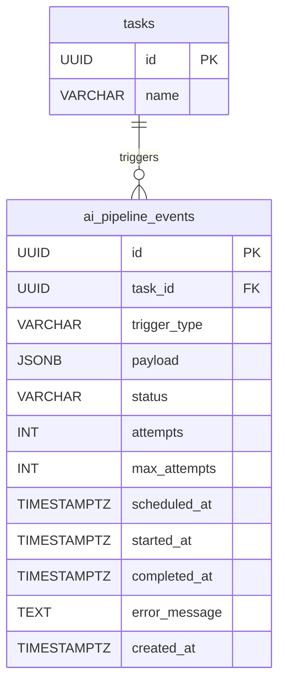

# AI Pipeline Events（AI 事件佇列）

## 1. 實體總覽

**AI Pipeline Events（AI 事件佇列）** 是 AI Pipeline 的持久化事件佇列。當系統偵測到需要 AI 建議生成的觸發事件時（如任務建立、訊息發送等），事件先寫入此表，再由 Tokio Worker 非同步消費處理。

此設計解決了 Tokio in-memory channel（`mpsc`）在服務重啟時丟失排隊事件的問題，確保 AI 建議生成不會因為程序重啟而遺失。

| 項目 | 說明 |
|------|------|
| 資料表名稱 | `ai_pipeline_events` |
| 主鍵 | `id` UUID（`gen_random_uuid()`，非 UUID v7） |
| 軟刪除 | 不使用（事件完成後保留記錄，不刪除） |
| CRDT | 不適用 |

### 關聯實體

- `tasks`：觸發事件所屬的任務（`task_id`）

---

## 2. Table 定義

### 2.1 `ai_pipeline_events` 主表

```sql
CREATE TABLE ai_pipeline_events (
    id UUID PRIMARY KEY DEFAULT gen_random_uuid(),
    task_id UUID NOT NULL REFERENCES tasks(id),
    trigger_type VARCHAR(50) NOT NULL,  -- task_created, message_sent, etc.
    payload JSONB NOT NULL DEFAULT '{}',
    status VARCHAR(20) NOT NULL DEFAULT 'pending',  -- pending, processing, completed, failed
    attempts INT NOT NULL DEFAULT 0,
    max_attempts INT NOT NULL DEFAULT 3,
    scheduled_at TIMESTAMPTZ NOT NULL DEFAULT NOW(),
    started_at TIMESTAMPTZ,
    completed_at TIMESTAMPTZ,
    error_message TEXT,
    created_at TIMESTAMPTZ NOT NULL DEFAULT NOW()
);
```

**欄位說明：**

| 欄位 | 型別 | 說明 |
|------|------|------|
| `id` | UUID | 主鍵，使用 `gen_random_uuid()` 產生（非 UUID v7，因事件佇列不需要時間排序的主鍵） |
| `task_id` | UUID | 觸發事件所屬的任務 ID，FK → `tasks(id)` |
| `trigger_type` | VARCHAR(50) | 觸發事件類型，可選值見下方 |
| `payload` | JSONB | 事件的附帶資料，結構依 `trigger_type` 而異 |
| `status` | VARCHAR(20) | 事件處理狀態，可選值見下方 |
| `attempts` | INT | 已嘗試處理次數，每次 worker 取得事件時 +1 |
| `max_attempts` | INT | 最大嘗試次數，預設 3 |
| `scheduled_at` | TIMESTAMPTZ | 排程執行時間，失敗重試時設為未來時間（指數退避） |
| `started_at` | TIMESTAMPTZ | 開始處理時間，worker 取得事件時設定 |
| `completed_at` | TIMESTAMPTZ | 完成時間，處理成功或最終失敗時設定 |
| `error_message` | TEXT | 錯誤訊息，處理失敗時記錄 |
| `created_at` | TIMESTAMPTZ | 事件建立時間，UTC |

**`trigger_type` 可選值：**

| 觸發類型 | 說明 |
|----------|------|
| `task_created` | 任務剛建立 |
| `message_sent` | 成員發送訊息 |
| `todo_completed` | 待辦事項完成 |
| `tool_error` | 工具執行失敗 |
| `source_data_changed` | 來源資料變更（跨任務資料分享） |
| `manual_request` | 使用者手動觸發建議 |

**`status` 可選值：**

| 狀態 | 說明 |
|------|------|
| `pending` | 待處理 — 事件已建立，等待 worker 取得 |
| `processing` | 處理中 — worker 已取得事件，正在處理 |
| `completed` | 已完成 — 處理成功 |
| `failed` | 已失敗 — 超過最大嘗試次數，最終失敗 |

---

## 3. 索引定義

```sql
-- 依狀態與排程時間查詢待處理事件（Worker 核心查詢索引）
CREATE INDEX idx_ai_pipeline_events_status ON ai_pipeline_events(status, scheduled_at)
    WHERE status IN ('pending', 'failed');
```

---

## 4. Rust 結構體定義

```rust
use chrono::{DateTime, Utc};
use uuid::Uuid;

pub struct AiPipelineEvent {
    pub id: Uuid,
    pub task_id: Uuid,
    pub trigger_type: String,
    pub payload: serde_json::Value,
    pub status: AiPipelineEventStatus,
    pub attempts: i32,
    pub max_attempts: i32,
    pub scheduled_at: DateTime<Utc>,
    pub started_at: Option<DateTime<Utc>>,
    pub completed_at: Option<DateTime<Utc>>,
    pub error_message: Option<String>,
    pub created_at: DateTime<Utc>,
}

#[derive(Debug, Clone, PartialEq, Eq)]
pub enum AiPipelineEventStatus {
    Pending,
    Processing,
    Completed,
    Failed,
}
```

---

## 5. 關聯圖（Mermaid ER Diagram）



---

## 6. JSONB Schemas

### `payload` — 事件附帶資料

結構依 `trigger_type` 而異，以下為各類型的典型結構：

#### `trigger_type = 'message_sent'`

```json
{
  "message_id": "UUID",
  "source_type": "member | email_inbound"
}
```

#### `trigger_type = 'todo_completed'`

```json
{
  "todo_id": "UUID"
}
```

#### `trigger_type = 'tool_error'`

```json
{
  "tool_name": "string",
  "error": "string"
}
```

#### 其他 `trigger_type`

```json
{}
```

---

## 7. 業務規則

### 7.1 事件寫入

- 觸發事件時先寫入 `ai_pipeline_events` 表，`PipelineWorker` 透過訂閱 `EventBus`（in-process `tokio::broadcast`）接收通知後喚醒處理（不使用 PostgreSQL `NOTIFY`/`LISTEN`）。
- 事件寫入後 `status` 為 `pending`，`attempts` 為 0。

### 7.2 事件消費

- Tokio worker 使用 `SELECT ... FOR UPDATE SKIP LOCKED` 取得待處理事件，避免多 worker 競爭。
- Worker 取得事件時更新 `status = 'processing'`、`started_at = NOW()`、`attempts = attempts + 1`。

### 7.3 背壓控制

- 限制同時處理的事件數（如 `max_concurrent = 10`），超過時新事件排隊等待。

### 7.4 重試策略

- 失敗事件使用指數退避重試（30s, 2m, 10m）。
- 重試時更新 `scheduled_at` 為未來時間，`status` 重設為 `pending`。
- 超過 `max_attempts` 的事件標記為 `failed`，記錄 `error_message`。

### 7.5 超時處理

- `processing` 超過 5 分鐘的事件自動重置為 `pending`（防止 worker crash 導致事件卡住）。

### 7.6 服務啟動

- 服務啟動時掃描 `pending` 和超時的 `processing` 事件，重新排入處理佇列。

---

## 8. CRDT 標記

| 實體 | CRDT 管理 | 說明 |
|------|----------|------|
| `ai_pipeline_events` | 否 | 事件佇列為系統內部基礎設施，單一 worker 處理，不需多人協作同步 |
