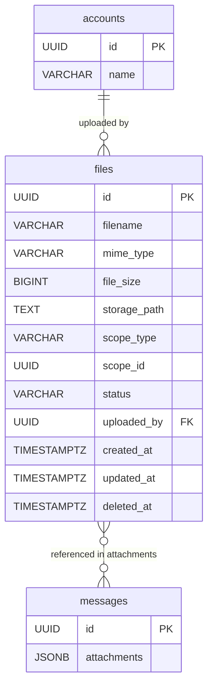

# Files（檔案）

## 1. 實體總覽

**Files（檔案）** 是系統中檔案儲存的後設資料記錄。系統中多個功能需要檔案儲存：Email 附件、對話附件、資料表檔案欄位。所有上傳的檔案在 `files` 表中建立後設資料記錄，實際檔案內容儲存於本地檔案系統或 S3 相容物件儲存。

| 項目 | 說明 |
|------|------|
| 資料表名稱 | `files` |
| 主鍵 | `id` UUID v7 |
| 軟刪除 | 使用 `deleted_at` |
| CRDT | 不適用 |

### 關聯實體

- `accounts`：上傳者（`uploaded_by`）
- `messages`：訊息附件透過 `messages.attachments` JSONB 中的 `fileId` 引用
- `data_entries`：資料表中 `image` 與 `file` 類型欄位透過值引用

---

## 2. Table 定義

### 2.1 `files` 主表

```sql
CREATE TYPE file_status AS ENUM ('pending', 'confirmed', 'rejected');

CREATE TABLE files (
    id            UUID         PRIMARY KEY,                          -- UUID v7，應用層產生
    filename      VARCHAR(500) NOT NULL,                             -- 原始檔案名稱
    mime_type     VARCHAR(255) NOT NULL,                             -- MIME 類型（如 image/png, application/pdf）
    file_size     BIGINT       NOT NULL,                             -- 檔案大小（bytes）
    storage_path  TEXT         NOT NULL,                             -- 儲存路徑（本地後端為檔案系統路徑，S3 後端為 object key）
    scope_type    VARCHAR(50)  NOT NULL,                             -- 作用域類型（如 task, email）
    scope_id      UUID         NOT NULL,                             -- 對應作用域實體的 ID
    status        file_status  NOT NULL DEFAULT 'confirmed',         -- 檔案狀態
    uploaded_by   UUID         NOT NULL REFERENCES accounts(id),     -- 上傳者帳號 ID
    created_at    TIMESTAMPTZ  NOT NULL DEFAULT NOW(),
    updated_at    TIMESTAMPTZ  NOT NULL DEFAULT NOW(),
    deleted_at    TIMESTAMPTZ
);
```

**欄位說明：**

| 欄位 | 型別 | 說明 |
|------|------|------|
| `id` | UUID | 主鍵，UUID v7，應用層產生 |
| `filename` | VARCHAR(500) | 原始檔案名稱（使用者上傳時的檔名） |
| `mime_type` | VARCHAR(255) | 檔案的 MIME 類型 |
| `file_size` | BIGINT | 檔案大小（bytes） |
| `storage_path` | TEXT | 儲存路徑，格式為 `{scope_type}/{scope_id}/{year}/{month}/{uuid}/{filename}` |
| `scope_type` | VARCHAR(50) | 作用域類型，用於組織檔案的儲存路徑與存取控制 |
| `scope_id` | UUID | 對應作用域實體的 ID |
| `status` | file_status | 檔案狀態（PostgreSQL ENUM），可選值見下方 |
| `uploaded_by` | UUID | 上傳者帳號 ID，FK → `accounts(id)` |
| `created_at` | TIMESTAMPTZ | 建立時間，UTC |
| `updated_at` | TIMESTAMPTZ | 最後更新時間，UTC |
| `deleted_at` | TIMESTAMPTZ | 軟刪除時間，NULL 表示有效 |

**`status` 可選值：**

| 狀態 | 說明 |
|------|------|
| `pending` | 等待上傳中 — 僅 S3 後端使用，已產生 Presigned URL 但客戶端尚未確認上傳完成 |
| `confirmed` | 已確認 — 檔案上傳完成且驗證通過。本地後端上傳成功後直接設為此狀態 |
| `rejected` | 已拒絕 — 僅 S3 後端使用，客戶端上傳後驗證失敗（檔案大小或類型不符） |

---

## 3. 索引定義

```sql
-- 依作用域查詢檔案
CREATE INDEX idx_files_scope ON files (scope_type, scope_id)
    WHERE deleted_at IS NULL;

-- 依上傳者查詢檔案
CREATE INDEX idx_files_uploaded_by ON files (uploaded_by)
    WHERE deleted_at IS NULL;

-- 依狀態查詢（用於清理 pending / rejected 狀態的孤立檔案）
CREATE INDEX idx_files_status ON files (status, created_at)
    WHERE status IN ('pending', 'rejected');

-- 軟刪除過濾
CREATE INDEX idx_files_deleted_at ON files (deleted_at);
```

---

## 4. Rust 結構體定義

```rust
use chrono::{DateTime, Utc};
use uuid::Uuid;

pub struct File {
    pub id: Uuid,
    pub filename: String,
    pub mime_type: String,
    pub file_size: i64,
    pub storage_path: String,
    pub scope_type: String,
    pub scope_id: Uuid,
    pub status: FileStatus,
    pub uploaded_by: Uuid,
    pub created_at: DateTime<Utc>,
    pub updated_at: DateTime<Utc>,
    pub deleted_at: Option<DateTime<Utc>>,
}

#[derive(Debug, Clone, PartialEq, Eq)]
pub enum FileStatus {
    /// 等待上傳中（僅 S3 後端使用）
    Pending,
    /// 上傳完成，驗證通過
    Confirmed,
    /// 驗證失敗（僅 S3 後端使用）
    Rejected,
}
```

---

## 5. 關聯圖（Mermaid ER Diagram）



---

## 6. 業務規則

### 6.1 上傳流程（本地後端）

1. 客戶端透過 `POST /api/v1/files/upload`（multipart）上傳檔案
2. 伺服器驗證檔案類型與大小限制
3. 產生儲存路徑：`{scope_type}/{scope_id}/{year}/{month}/{uuid}/{filename}`
4. 寫入檔案至磁碟
5. 建立 `files` 記錄，`status = 'confirmed'`
6. 回傳 `fileId` 與檔案後設資料

### 6.2 上傳流程（S3 後端）

1. 客戶端請求 Presigned PUT URL
2. 建立 `files` 記錄，`status = 'pending'`
3. 客戶端直接上傳至 S3
4. 客戶端通知上傳完成，伺服器驗證檔案
5. 驗證通過：`status = 'confirmed'`；驗證失敗：`status = 'rejected'`

### 6.3 存取控制

- 下載檔案時，伺服器檢查使用者是否有權存取該 `scope_type` / `scope_id` 對應的實體
- 權限檢查由應用層實現，依據使用者在專案中的角色決定

### 6.4 大小限制

| 檔案類型 | 預設最大大小 |
|----------|-------------|
| 圖片（image/*） | 10 MB |
| 文件（pdf, doc, xlsx 等） | 50 MB |
| 其他 | 20 MB |

### 6.5 孤立檔案清理

- 排程任務定期掃描未被任何 `messages.attachments` 或 `data_entries` 引用的已確認檔案
- S3 後端另外掃描 `status = 'pending'` 且超過 1 小時的記錄
- 清理策略為先標記後刪除（標記 7 天後再從儲存系統刪除），避免誤刪

### 6.6 軟刪除

- 使用 `deleted_at` 軟刪除，所有查詢預設加上 `WHERE deleted_at IS NULL`
- 軟刪除後檔案仍保留在儲存系統中，由清理任務在寬限期後實際刪除

---

## 7. CRDT 標記

| 實體 | CRDT 管理 | 說明 |
|------|----------|------|
| `files` | 否 | 檔案後設資料由單一操作建立與更新，不需多人即時協作同步 |
