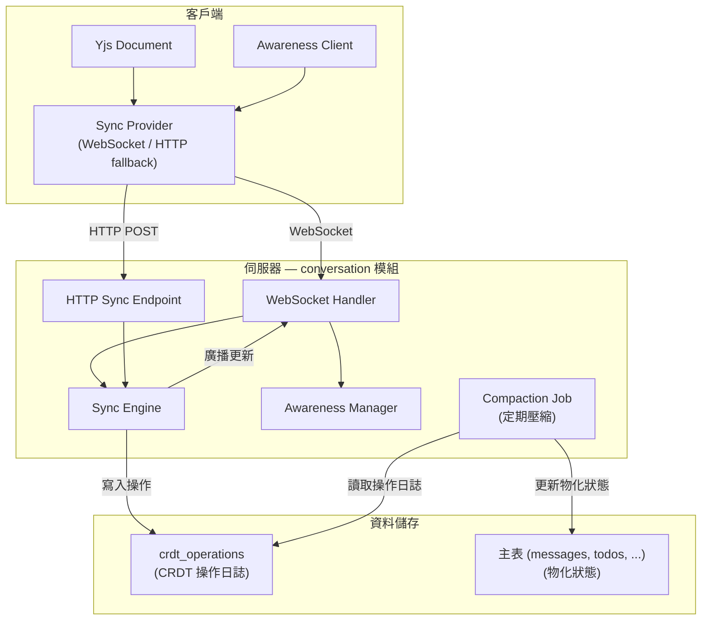
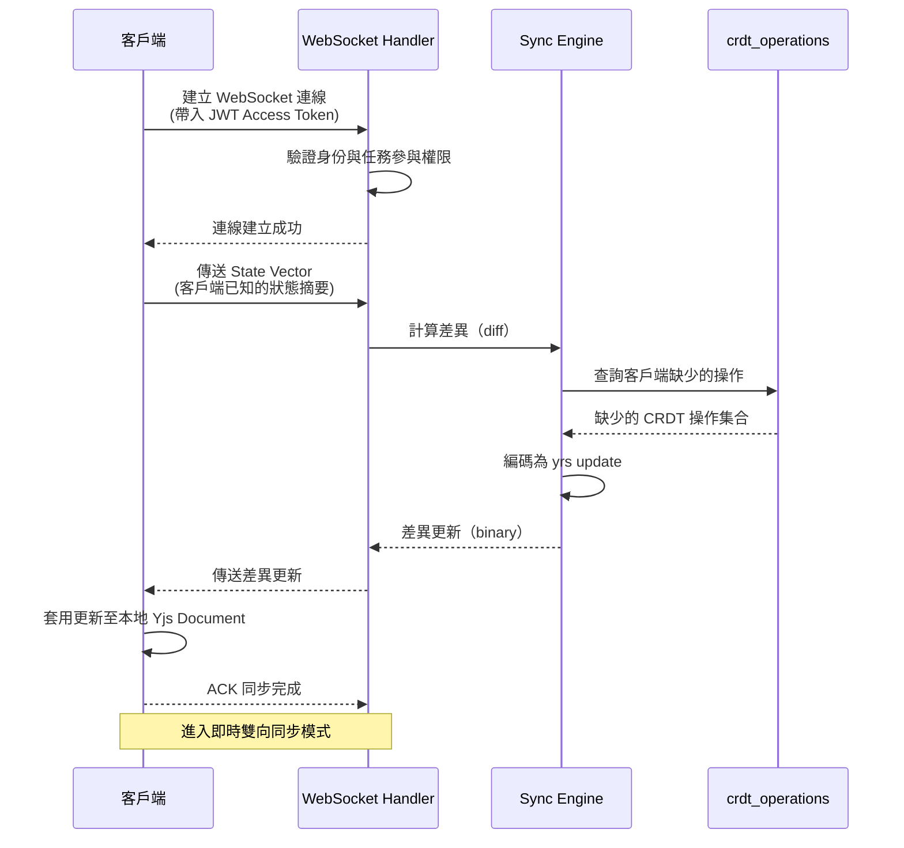
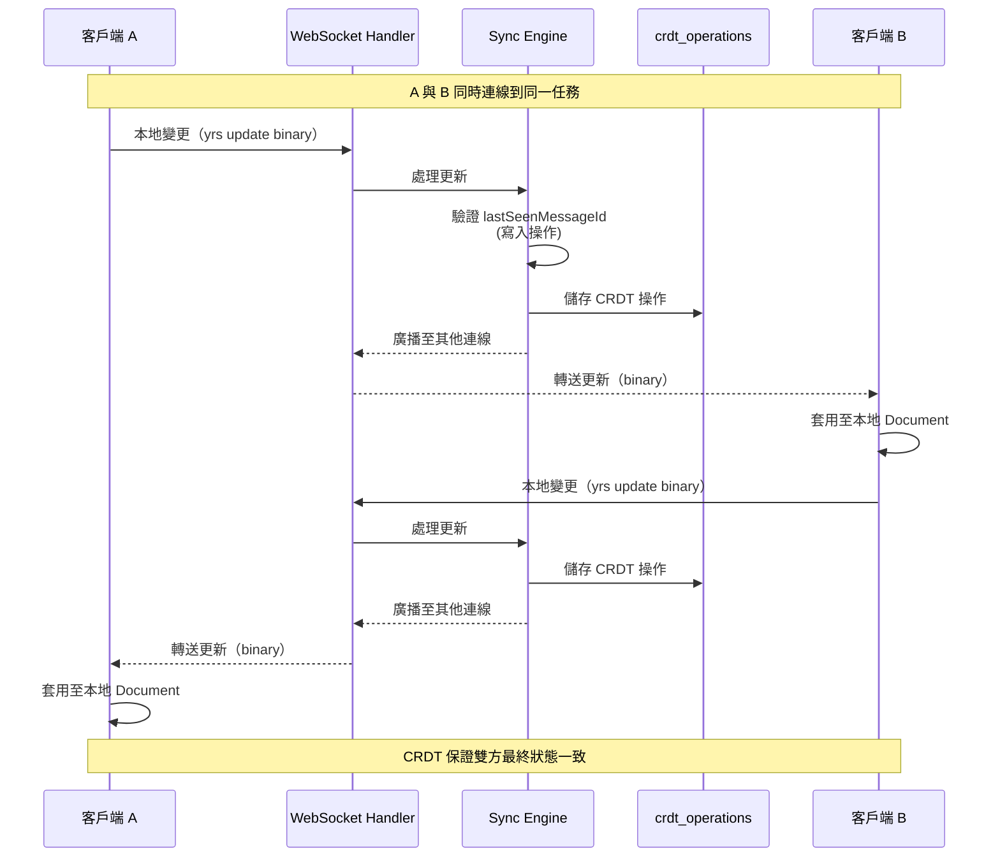
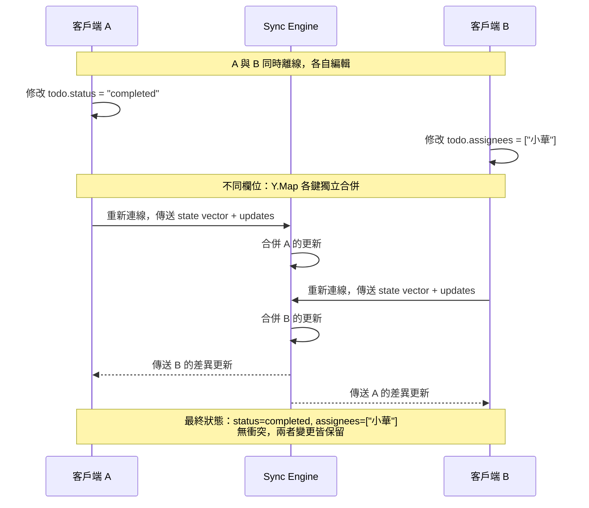
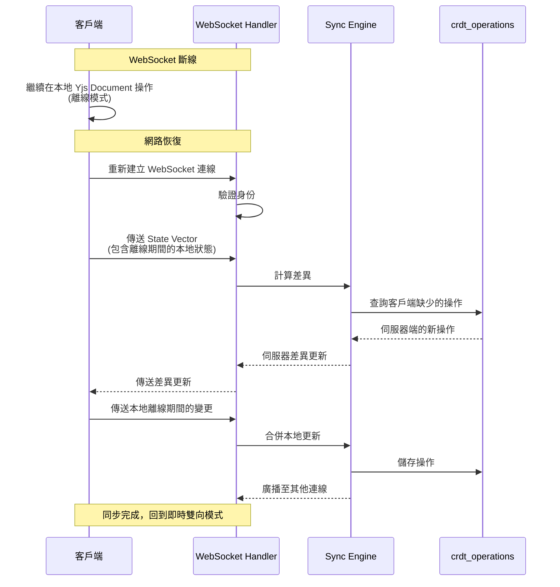

# 03 - CRDT 選型與同步協定

## 1. 問題描述

Conf-Ops 系統中，多位參與人可同時在同一任務對話中留言、確認 AI 建議、編輯待辦事項與資料表欄位。傳統的鎖定式（pessimistic locking）併行控制方案在即時協作場景下會導致嚴重的使用者體驗問題——操作延遲、衝突頻繁、離線無法工作。

系統需要一套**無衝突的分散式資料同步機制**，讓：
- 多人同時編輯同一實體時，自動合併所有變更，不需人工處理衝突
- 支援離線操作，重新連線後自動同步
- 透過 WebSocket 實現即時推送，並提供 HTTP 備援

適用範圍包含：
- **任務對話 (messages)**：多人同時留言、確認 AI 建議
- **待辦事項 (todos)**：多人同時修改狀態、指派、截止日期
- **資料表 (data_entries)**：多人同時編輯同一任務的資料列欄位
- **記憶與記憶庫文件 (memories / library_documents)**：多人同時編輯記憶內容

---

## 2. 設計決策

### 2.1 CRDT 函式庫：yrs（Yjs Rust port）

| 項目 | 決策 |
|------|------|
| 函式庫 | `yrs`（Yjs 的 Rust 實作） |
| 版本 | yrs 0.x（穩定版） |
| 編碼格式 | yrs 原生二進位格式 |
| 儲存方式 | `crdt_operations.operation` BYTEA 欄位 |

**選擇理由：**
- Yjs 是目前最成熟的 CRDT 實作之一，yrs 為其官方 Rust port，效能與記憶體使用均經過優化
- 支援多種 CRDT 資料型別（Map、Array、Text），涵蓋系統所有協作場景
- 原生二進位格式壓縮率高，適合透過 WebSocket 傳輸與 BYTEA 欄位儲存
- 內建 awareness protocol，可追蹤線上使用者與編輯狀態
- 與前端 Yjs JavaScript 生態完全相容，前後端可無縫互通

### 2.2 考慮過的替代方案

| 方案 | 優點 | 缺點 | 結論 |
|------|------|------|------|
| **Operational Transform (OT)** | 成熟、Google Docs 使用 | 需要中央伺服器調序、無法離線、實作複雜度高 | 否決 |
| **Automerge** | Rust 原生、API 簡潔 | 生態規模較小、與前端整合不如 Yjs 成熟 | 否決 |
| **自建 CRDT** | 完全控制 | 開發成本極高、正確性難以保證 | 否決 |
| **yrs (Yjs Rust port)** | 效能佳、前後端相容、社群活躍、型別豐富 | 二進位格式不可人讀 | **採用** |

### 2.3 CRDT 型別對應

| 協作資料 | CRDT 型別 | 說明 |
|----------|----------|------|
| `data_entries.values`（資料表欄位值） | Y.Map | 鍵值結構，欄位獨立合併 |
| `todos` 欄位（狀態、指派、截止日期） | Y.Map | 每個欄位獨立更新，Last-Writer-Wins |
| 訊息排序（conversation messages） | Y.Array | 插入順序自動解決，保證一致的時間線 |
| 記憶 / 記憶庫文件的文字內容 | Y.Text | 字元級別的即時協同編輯 |

### 2.4 傳輸協定

| 項目 | 決策 |
|------|------|
| 即時同步 | WebSocket（warp/axum upgrade） |
| 備援同步 | HTTP POST `/api/v1/tasks/{taskId}/conversation/sync` |
| 編碼格式 | yrs 原生二進位 |
| Awareness | yrs awareness protocol（追蹤線上使用者、游標位置） |

---

## 3. 元件圖



---

## 4. 資料流

### 4.1 初始同步流程



### 4.2 即時雙向同步流程



### 4.3 併發編輯衝突自動解決



### 4.4 斷線重連流程



---

## 5. 內部介面契約

### 5.1 Sync Engine Trait

```rust
use uuid::Uuid;

/// CRDT 同步引擎介面
#[async_trait]
pub trait CrdtSyncService: Send + Sync {
    /// 根據客戶端的 state vector 計算伺服器端的差異更新
    async fn compute_diff(
        &self,
        task_id: Uuid,
        client_state_vector: &[u8],
    ) -> Result<Vec<u8>>;

    /// 套用客戶端傳入的 CRDT 更新
    async fn apply_update(
        &self,
        task_id: Uuid,
        update: &[u8],
        sender_id: Uuid,
    ) -> Result<ApplyResult>;

    /// 取得指定任務的完整 CRDT 文件狀態
    async fn get_document_state(
        &self,
        task_id: Uuid,
    ) -> Result<Vec<u8>>;

    /// 壓縮操作日誌並更新物化狀態
    async fn compact_operations(
        &self,
        task_id: Uuid,
    ) -> Result<CompactionResult>;
}

pub struct ApplyResult {
    /// 是否成功套用
    pub applied: bool,
    /// 需要廣播給其他客戶端的更新
    pub broadcast_update: Option<Vec<u8>>,
}

pub struct CompactionResult {
    /// 壓縮前的操作數量
    pub operations_before: u64,
    /// 壓縮後的操作數量（通常為 1 個快照）
    pub operations_after: u64,
    /// 更新的主表記錄數
    pub materialized_records: u64,
}
```

### 5.2 Awareness Service Trait

```rust
/// Awareness 服務介面：追蹤誰在編輯什麼
#[async_trait]
pub trait AwarenessService: Send + Sync {
    /// 更新使用者的 awareness 狀態
    async fn update_awareness(
        &self,
        task_id: Uuid,
        member_id: Uuid,
        state: AwarenessState,
    ) -> Result<()>;

    /// 取得指定任務的所有線上使用者 awareness 狀態
    async fn get_awareness_states(
        &self,
        task_id: Uuid,
    ) -> Result<Vec<AwarenessEntry>>;

    /// 移除離線使用者的 awareness
    async fn remove_awareness(
        &self,
        task_id: Uuid,
        member_id: Uuid,
    ) -> Result<()>;
}

pub struct AwarenessState {
    /// 使用者正在編輯的實體類型
    pub editing_entity: Option<EditingEntity>,
    /// 游標位置（適用於文字編輯）
    pub cursor_position: Option<u64>,
    /// 使用者的顯示名稱
    pub display_name: String,
    /// 使用者的顯示顏色（用於游標標記）
    pub color: String,
}

pub enum EditingEntity {
    Message,
    Todo { todo_id: Uuid },
    DataEntry { entry_id: Uuid, field_key: String },
    Memory { memory_id: Uuid },
    LibraryDocument { document_id: Uuid },
}

pub struct AwarenessEntry {
    pub member_id: Uuid,
    pub state: AwarenessState,
    pub last_updated: chrono::DateTime<chrono::Utc>,
}
```

### 5.3 WebSocket 訊息格式

```rust
/// WebSocket 訊息類型（客戶端 → 伺服器）
pub enum ClientWsMessage {
    /// CRDT 同步：初始 state vector
    SyncStep1 { state_vector: Vec<u8> },
    /// CRDT 同步：本地更新
    SyncStep2 { update: Vec<u8> },
    /// Awareness 狀態更新
    AwarenessUpdate { state: AwarenessState },
    /// 寫入操作附帶的已讀驗證
    WriteOperation {
        update: Vec<u8>,
        last_seen_message_id: Uuid,
    },
}

/// WebSocket 訊息類型（伺服器 → 客戶端）
pub enum ServerWsMessage {
    /// CRDT 同步：差異更新
    SyncDiff { update: Vec<u8> },
    /// 其他客戶端的 CRDT 更新
    PeerUpdate { update: Vec<u8> },
    /// Awareness 狀態變更
    AwarenessChange { entries: Vec<AwarenessEntry> },
    /// 寫入操作被拒絕（lastSeenMessageId 過舊）
    WriteRejected {
        reason: String,
        latest_message_id: Uuid,
    },
}
```

### 5.4 HTTP 備援同步端點

```
POST /api/v1/tasks/{taskId}/conversation/sync

Request Body (binary): yrs state vector
Response Body (binary): yrs diff update

Headers:
  Content-Type: application/octet-stream
  Authorization: Bearer <JWT>
```

用於 WebSocket 無法建立時（如防火牆限制）的備援同步。客戶端定期輪詢此端點，傳送 state vector 取得差異更新。不支援 awareness protocol。

---

## 6. 錯誤處理

| 情境 | 處理方式 |
|------|---------|
| WebSocket 連線中斷 | 客戶端自動重連，重連後透過 state vector 重新同步差異 |
| CRDT 更新解碼失敗 | 記錄錯誤日誌，丟棄該更新，回傳錯誤訊息。不影響其他客戶端 |
| `lastSeenMessageId` 驗證失敗 | 拒絕寫入操作，回傳 `WriteRejected` 訊息，附帶最新 `messageId` |
| 操作日誌寫入資料庫失敗 | 回傳錯誤，客戶端重試。本地變更保留在 Yjs Document 中不會遺失 |
| 壓縮作業失敗 | 記錄錯誤日誌，不影響正常讀寫。下次壓縮週期重試 |
| 身份驗證失敗 | 關閉 WebSocket 連線，回傳 4001 錯誤碼 |
| 無任務參與權限 | 關閉 WebSocket 連線，回傳 4003 錯誤碼 |
| 伺服器記憶體壓力 | 主動要求客戶端降低同步頻率（backpressure），暫停非關鍵的 awareness 更新 |

---

## 7. 擴展性考量

### 7.1 操作日誌壓縮策略

隨時間推移，`crdt_operations` 表會持續增長。系統透過定期壓縮作業控制增長：

1. **壓縮週期**：每個任務每 5 分鐘檢查一次；觸發條件：操作數量 > 100 或距離上次壓縮超過 30 分鐘（以先到者為準）
2. **壓縮方式**：將多筆操作合併為一個 yrs snapshot，刪除已合併的個別操作
3. **物化狀態更新**：壓縮同時將最新狀態寫入主表（`messages`、`todos`、`data_entries` 等）

### CRDT Snapshot 壓縮與大小控制

大型任務（數百則訊息、多輪 AI 建議）的 CRDT state snapshot 可能成長到數 MB，影響同步效能和儲存成本。

#### Compaction 策略

1. **定期快照壓縮**：每 5 分鐘檢查一次，當操作數量 > 100 或距離上次壓縮超過 30 分鐘時（以先到者為準），將 `crdt_operations` 合併為單一 snapshot
2. **快照格式**：使用 yrs 的 `encode_state_as_update_v2` 產生壓縮後的 binary，存入 `crdt_snapshots` 表
3. **舊 operation 清理**：快照建立後，刪除快照之前的所有 `crdt_operations` 記錄

```sql
CREATE TABLE crdt_snapshots (
    id UUID PRIMARY KEY DEFAULT gen_random_uuid(),
    task_id UUID NOT NULL REFERENCES tasks(id),
    snapshot BYTEA NOT NULL,
    operation_count INT NOT NULL,
    snapshot_size INT NOT NULL,       -- bytes
    last_operation_id UUID NOT NULL,  -- 此快照包含到哪個 operation
    created_at TIMESTAMPTZ NOT NULL DEFAULT NOW()
);

CREATE INDEX idx_crdt_snapshots_task ON crdt_snapshots(task_id, created_at DESC);
```

**實作要點：**

1. **同步初始化**：客戶端連線時，先載入最新 snapshot，再 apply snapshot 之後的 operations
2. **大小監控**：snapshot_size 超過 5MB 時產生告警，考慮歷史訊息歸檔
3. **二進位壓縮**：snapshot BYTEA 使用 zstd 壓縮，典型壓縮率 3:1 ~ 5:1
4. **背景任務**：compaction 在 Tokio background task 中執行，不阻塞即時同步

```rust
// 虛擬碼：Compaction
async fn compact_crdt(pool: &PgPool, task_id: Uuid) -> Result<()> {
    let snapshot = get_latest_snapshot(pool, task_id).await?;
    let operations = get_operations_after(pool, task_id, snapshot.last_operation_id).await?;

    if operations.len() < 100 {
        return Ok(()); // 不需要壓縮
    }

    let mut doc = Doc::new();
    // Apply snapshot
    if let Some(s) = snapshot {
        let update = Update::decode_v2(&s.snapshot)?;
        doc.transact_mut().apply_update(update);
    }
    // Apply operations
    for op in &operations {
        let update = Update::decode_v2(&op.data)?;
        doc.transact_mut().apply_update(update);
    }

    // Create new snapshot
    let new_snapshot = doc.transact().encode_state_as_update_v2(&StateVector::default());
    let compressed = zstd::encode_all(&new_snapshot[..], 3)?;

    save_snapshot(pool, task_id, &compressed, operations.last().unwrap().id).await?;
    delete_operations_before(pool, task_id, operations.last().unwrap().id).await?;

    Ok(())
}
```

### 7.2 大型任務對話效能

- **分頁載入**：初始同步僅載入最近的 CRDT 狀態，歷史訊息透過 HTTP API 分頁查詢物化狀態
- **Document 分片**：超大型任務可依時間區間將 CRDT Document 分片，每片獨立同步

### 7.3 WebSocket 連線管理

- 每個任務維護一個 WebSocket 房間（room），管理該任務所有連線的客戶端
- 使用 `tokio::sync::broadcast` channel 在房間內廣播更新
- 連線數上限：每個任務最多 50 個同時連線

### 7.4 未來拆分

conversation 模組若從 Modular Monolith 拆離為獨立服務：
- WebSocket 連線管理需引入跨節點廣播機制（PostgreSQL LISTEN/NOTIFY 或 NATS）
- CRDT 操作日誌可遷移至獨立資料庫
- HTTP 備援端點無需修改，仍透過 trait 呼叫（替換為 gRPC）

---

## 8. 設定項

| 環境變數 | 說明 | 預設值 |
|---------|------|--------|
| `CRDT_COMPACTION_INTERVAL_SECS` | 壓縮作業檢查間隔（秒） | `300`（5 分鐘） |
| `CRDT_COMPACTION_THRESHOLD` | 觸發壓縮的操作數閾值 | `100` |
| `CRDT_WS_MAX_CONNECTIONS_PER_TASK` | 每個任務最大 WebSocket 連線數 | `50` |
| `CRDT_WS_HEARTBEAT_INTERVAL_SECS` | WebSocket 心跳間隔（秒） | `30` |
| `CRDT_WS_IDLE_TIMEOUT_SECS` | WebSocket 閒置斷線時間（秒） | `300` |
| `CRDT_AWARENESS_TIMEOUT_SECS` | Awareness 過期時間（秒） | `60` |
| `CRDT_HTTP_SYNC_ENABLED` | 是否啟用 HTTP 備援同步 | `true` |
| `CRDT_MAX_UPDATE_SIZE_BYTES` | 單筆 CRDT 更新最大大小 | `1048576`（1 MB） |
