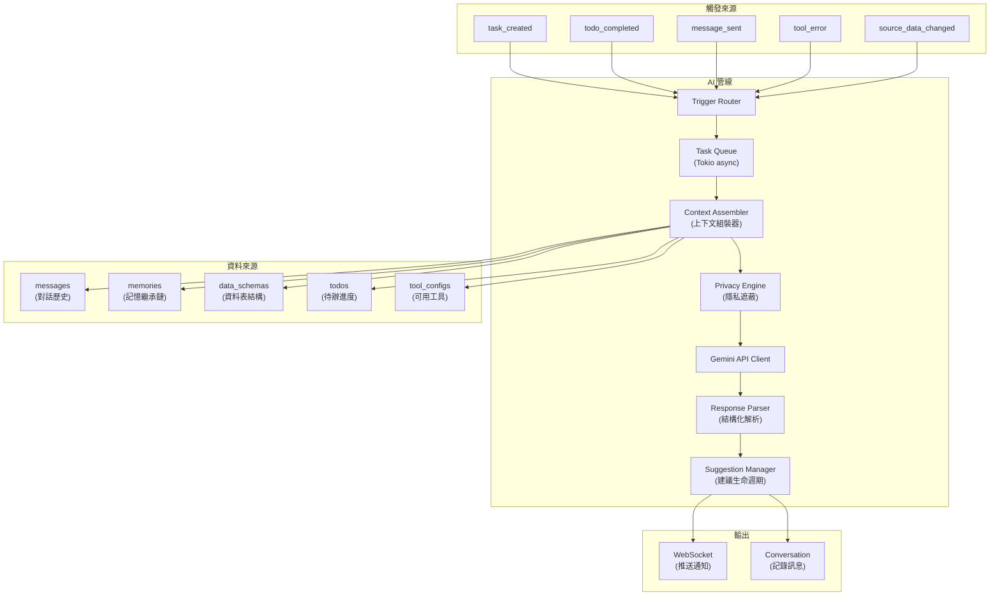
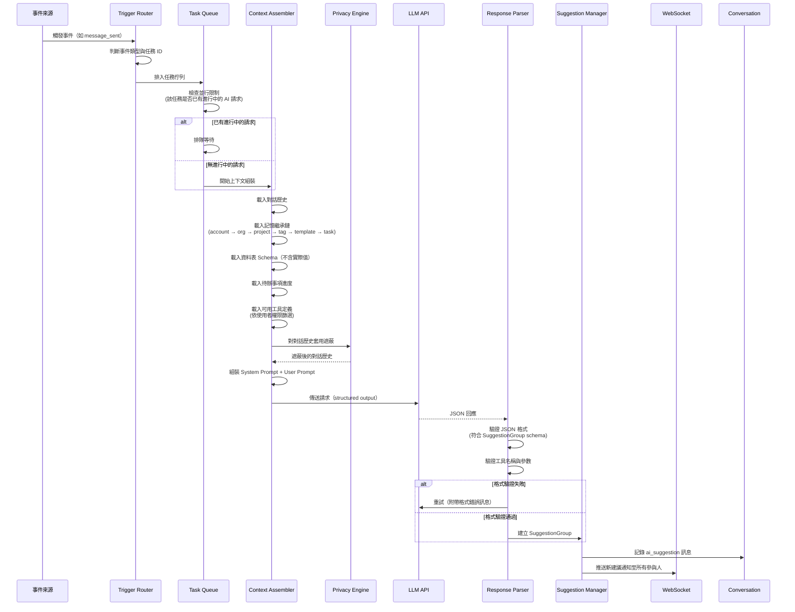
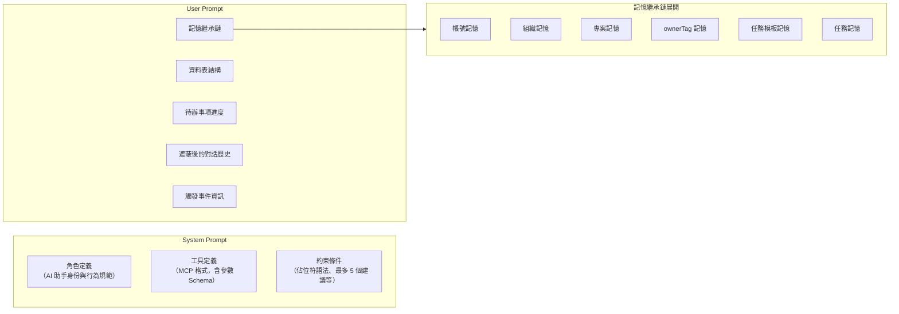
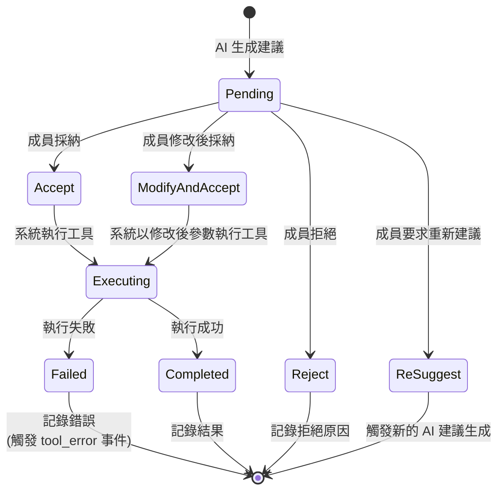

# 04 - AI 建議管線

## 1. 問題描述

Conf-Ops 的核心機制是 AI-Human 協作迴圈：系統偵測到特定事件後觸發 AI 生成建議，人類審核後決定是否執行。此迴圈的每一步都是**確定性的程式碼邏輯**，不是 AI 自行決定何時介入。

AI 建議管線需解決以下問題：

1. **事件觸發**：明確定義哪些事件觸發 AI 生成建議
2. **上下文收集**：從多層級記憶繼承鏈、資料 Schema、對話歷史中組裝完整的 AI 上下文
3. **隱私遮蔽**：在傳送給 LLM 前，套用隱私引擎遮蔽實際資料值
4. **結構化輸出**：LLM 回傳符合 SuggestionGroup 格式的結構化建議
5. **建議生命週期**：管理建議從 pending 到最終狀態的完整流程
6. **即時通知**：透過 WebSocket 推送新建議給所有任務參與人
7. **並行控制**：限制每個任務同時僅一個 AI 請求，避免重複建議

---

## 2. 設計決策

### 2.1 非同步任務佇列

| 項目 | 決策 |
|------|------|
| 執行模型 | Tokio async task queue |
| 並行控制 | 每個任務最多 1 個並行 AI 請求 |
| 重試策略 | 指數退避（exponential backoff） |

**選擇理由：**
- LLM API 呼叫延遲高（數秒到數十秒），必須非同步處理以避免阻塞 HTTP 請求
- Tokio 提供高效的非同步執行環境，無需引入額外的訊息佇列
- 每任務最多 1 個並行請求，避免同一任務產生重複或矛盾的建議

### 2.2 結構化輸出

| 項目 | 決策 |
|------|------|
| LLM 回應格式 | JSON，符合 SuggestionGroup schema |
| 最大建議數 | 每個 SuggestionGroup 最多 5 個 Suggestion |
| 工具定義格式 | MCP 工具格式（tool name + JSON Schema parameters） |

### 2.3 考慮過的替代方案

| 方案 | 優點 | 缺點 | 結論 |
|------|------|------|------|
| **同步 AI 呼叫** | 實作簡單 | 阻塞 HTTP 請求、使用者等待時間長 | 否決 |
| **外部訊息佇列（RabbitMQ 等）** | 可靠度高、可獨立擴展 | 初期過度複雜、增加基礎設施依賴 | 否決 |
| **Tokio async task + PostgreSQL 持久化** | 輕量、無額外依賴、效能佳；PostgreSQL 持久化確保重啟後可恢復 | 需額外實作事件表與恢復邏輯 | **採用** |

---

## 3. 元件圖



---

## 4. 資料流

### 4.1 完整管線序列圖



### 4.2 上下文組裝結構



### 4.3 SuggestionGroup 狀態機



---

## 5. 內部介面契約

### 5.1 AI Pipeline Trait

```rust
use uuid::Uuid;

/// 觸發事件類型
pub enum TriggerEvent {
    TaskCreated { task_id: Uuid },
    TodoCompleted { todo_id: Uuid, completed_by: Uuid },
    MessageSent { task_id: Uuid, message_id: Uuid },
    ToolError { task_id: Uuid, tool_name: String, error: String },
    SourceDataChanged { task_id: Uuid, source_task_id: Uuid, changed_fields: Vec<String> },
}

/// AI 管線服務介面
#[async_trait]
pub trait AiPipelineService: Send + Sync {
    /// 觸發 AI 建議生成
    async fn trigger_suggestion(
        &self,
        event: TriggerEvent,
        triggered_by: Uuid,
    ) -> Result<()>;

    /// 對建議做出決策
    async fn apply_decision(
        &self,
        suggestion_id: Uuid,
        decision: SuggestionDecisionInput,
        decided_by: Uuid,
    ) -> Result<DecisionResult>;

    /// 取得指定任務的待決策建議
    async fn get_pending_suggestions(
        &self,
        task_id: Uuid,
    ) -> Result<Vec<SuggestionGroup>>;
}

/// 決策輸入
pub enum SuggestionDecisionInput {
    Accept,
    ModifyAndAccept { modified_parameters: serde_json::Value },
    Reject { reason: Option<String> },
    ReSuggest { additional_instructions: Option<String> },
}

/// 決策結果
pub struct DecisionResult {
    pub suggestion_id: Uuid,
    pub decision: String,
    /// 工具執行結果（Accept / ModifyAndAccept 時）
    pub execution_result: Option<serde_json::Value>,
    /// 新的建議群組（ReSuggest 時）
    pub new_suggestion_group: Option<SuggestionGroup>,
}
```

### 5.2 Context Assembler

```rust
/// AI 上下文
pub struct AiContext {
    /// System prompt（角色定義、工具定義、約束）
    pub system_prompt: String,
    /// User prompt（記憶、Schema、對話歷史、觸發資訊）
    pub user_prompt: String,
    /// 上下文中使用的記憶引用（用於記錄 context_used）
    pub memory_refs: Vec<MemoryRef>,
}

pub struct MemoryRef {
    pub memory_id: Uuid,
    pub scope: MemoryScope,
    pub content_summary: String,
}

/// 上下文組裝器介面
#[async_trait]
pub trait ContextAssembler: Send + Sync {
    /// 組裝指定任務的 AI 上下文
    async fn assemble(
        &self,
        task_id: Uuid,
        trigger_event: &TriggerEvent,
        account_id: Uuid,
    ) -> Result<AiContext>;
}
```

### 5.3 LLM Client

```rust
/// LLM 回應
pub struct LlmResponse {
    pub suggestion_group: SuggestionGroupRaw,
    /// Token 使用量
    pub usage: LlmUsage,
}

pub struct LlmUsage {
    pub prompt_tokens: u32,
    pub completion_tokens: u32,
}

/// LLM 請求格式（結構化輸出）
pub struct LlmRequest {
    pub system_prompt: String,
    pub user_prompt: String,
    /// JSON Schema 定義期望的回應格式
    pub response_schema: serde_json::Value,
    /// 溫度參數
    pub temperature: f32,
    /// Gemini Context Cache ID（由 GeminiCacheManager 管理）
    pub cached_content: Option<String>,
}

/// SuggestionGroup 原始格式（LLM 回傳）
pub struct SuggestionGroupRaw {
    pub suggestions: Vec<SuggestionRaw>,
}

pub struct SuggestionRaw {
    pub summary: String,
    pub tool: String,
    pub parameters: serde_json::Value,
    pub reasoning: String,
    pub context_used: Vec<String>,
}
```

---

## 6. 錯誤處理

| 情境 | 處理方式 |
|------|---------|
| LLM API 呼叫逾時 | 指數退避重試（最多 3 次：5s → 10s → 20s）。仍失敗則在對話中記錄 system 訊息通知參與人 |
| LLM 回傳非 JSON 格式 | 重試一次（附帶格式修正指示）。仍失敗則記錄錯誤，不產生建議 |
| LLM 回傳的工具名稱不存在 | 過濾掉無效的建議，僅保留有效建議。若全部無效，記錄錯誤不產生建議 |
| LLM 回傳的參數不符合工具 Schema | 過濾掉參數無效的建議，僅保留有效建議 |
| 上下文組裝失敗（如記憶載入錯誤） | 以可取得的上下文繼續（降級），記錄警告日誌 |
| 並行請求衝突（任務已有進行中的 AI 請求） | 新請求排隊等待，前一請求完成後再處理 |
| 建議決策時建議已過期（任務狀態已變更） | 拒絕決策操作，回傳錯誤訊息引導使用者確認最新狀態 |
| Tokio task panic | 記錄錯誤日誌，該次建議生成失敗。不影響其他任務的 AI 請求 |

---

## 7. 擴展性考量

### 7.1 LLM Provider：Google Gemini

初期以 Google Gemini 為主要 LLM provider，直接使用 Gemini API（非 OpenAI 相容模式）以獲得最佳效能。

#### 模型選擇

| 用途 | 模型 | 理由 |
|------|------|------|
| **AI 建議生成**（預設） | `gemini-2.0-flash` | 速度快、成本低、結構化輸出品質佳，適合高頻互動場景 |
| **複雜推理**（需要時） | `gemini-2.5-pro` | 更強的推理能力，用於多步驟工具編排或複雜任務分析 |

#### Context Caching（效能關鍵）

Gemini API 提供 [Context Caching](https://ai.google.dev/gemini-api/docs/caching) 功能，可將重複使用的上下文快取在 API 端，大幅降低延遲與成本：

- **System Prompt + 記憶繼承鏈**：同一任務的多次 AI 呼叫共用相同的系統提示與記憶上下文
- **快取策略**：以 `task_id` 為 key，首次呼叫時建立 cached content，後續呼叫帶入 `cachedContent` 參數
- **TTL**：預設 30 分鐘，任務活躍期間自動續期
- **失效時機**：任務的記憶鏈變更、工具設定變更時，清除對應快取

```rust
/// Gemini Context Cache 管理
pub struct GeminiCacheManager {
    /// task_id → cached_content_name（Gemini API 回傳的 cache ID）
    cache_map: moka::future::Cache<Uuid, String>,
}

impl GeminiCacheManager {
    /// 取得或建立 cached content
    pub async fn get_or_create(
        &self,
        task_id: Uuid,
        system_prompt: &str,
        memory_context: &str,
        tool_definitions: &[ToolDefinition],
    ) -> Result<String>;

    /// 任務上下文變更時，清除快取
    pub fn invalidate(&self, task_id: Uuid);
}
```

#### Streaming Response

使用 Gemini 的 `streamGenerateContent` 端點，以 SSE 串流方式接收回應：

- 降低首 token 延遲（TTFT），提升使用者感知速度
- 串流過程中即時透過 WebSocket 推送「AI 正在思考」狀態
- 回應完成後一次性解析 JSON 結構

#### Provider 抽象

LLM 呼叫透過 trait 抽象，未來可擴充其他 provider：

```rust
#[async_trait]
pub trait LlmProvider: Send + Sync {
    /// 發送結構化輸出請求（串流）
    async fn generate_structured(
        &self,
        request: LlmRequest,
        cached_content: Option<&str>,
    ) -> Result<LlmResponse>;

    /// 建立 context cache
    async fn create_cache(
        &self,
        content: &CacheableContent,
        ttl: Duration,
    ) -> Result<String>;

    /// 刪除 context cache
    async fn delete_cache(&self, cache_id: &str) -> Result<()>;
}
```

### 7.2 上下文大小管理

- 記憶繼承鏈可能產生大量上下文，需控制總 token 數
- 策略：記憶摘要 + 按需查詢完整內容（透過 `queryLibraryDocument`）
- 對話歷史過長時，保留最近的 N 則訊息，較舊的訊息以摘要形式帶入

### 記憶繼承鏈查詢優化（正式方案）

記憶繼承鏈沿 scope 由具體到抽象查詢（task → template → tag → project → org → account），原始實作需要 6 次 DB 查詢（N+1 問題）。

#### 解決方案：PostgreSQL CTE 遞迴查詢

使用單一 SQL 查詢取得完整繼承鏈：

```sql
WITH scope_chain AS (
    -- 1. 起點：任務層級
    SELECT 'task' AS scope_type, task_id AS scope_id, 0 AS depth
    FROM tasks WHERE id = $1

    UNION ALL

    -- 2. 任務 → 模板
    SELECT 'template', t.template_id, 1
    FROM tasks t WHERE t.id = $1 AND t.template_id IS NOT NULL

    UNION ALL

    -- 3. 模板 → 標籤（透過 task_template_tags）
    SELECT 'tag', ttt.tag_id, 2
    FROM tasks t
    JOIN task_template_tags ttt ON ttt.template_id = t.template_id
    WHERE t.id = $1

    UNION ALL

    -- 4. 任務 → 專案
    SELECT 'project', t.project_id, 3
    FROM tasks t WHERE t.id = $1

    UNION ALL

    -- 5. 專案 → 組織
    SELECT 'organization', p.organization_id, 4
    FROM tasks t
    JOIN projects p ON p.id = t.project_id
    WHERE t.id = $1

    UNION ALL

    -- 6. 帳號層級（從請求 context 取得）
    SELECT 'account', $2::uuid, 5
)
SELECT m.*
FROM memories m
JOIN scope_chain sc ON m.scope_type = sc.scope_type AND m.scope_id = sc.scope_id
WHERE m.deleted_at IS NULL
ORDER BY sc.depth ASC, m.updated_at DESC;
```

**效能預估：** 單一查詢 < 5ms（已建立適當索引），相比 6 次查詢的 ~30ms 有顯著改善。

**可選的效能優化：** 若查詢頻率極高（每次 AI pipeline 呼叫都需要），可在 in-memory cache（`moka` crate）快取 scope chain 結果，TTL 設為 5 分鐘。此為效能優化選項，非正式方案的一部分，PostgreSQL CTE 查詢已可滿足效能需求（< 5ms）。

### 7.3 佇列持久化

- Tokio async task 為執行層，PostgreSQL `ai_pipeline_events` 表為持久化層，確保重啟後可恢復未處理事件
- 服務啟動時掃描 `pending` 和超時的 `processing` 事件，重新排入處理佇列
- 未來若拆為獨立服務，可替換為 NATS / RabbitMQ 等持久化佇列

### AI 事件佇列持久化

Tokio in-memory channel（`mpsc`）在服務重啟時會丟失所有排隊中的事件。對於 AI 建議生成這類非冪等操作，需要持久化保障。

#### 解決方案：PostgreSQL 事件表 + Tokio Worker

```sql
CREATE TABLE ai_pipeline_events (
    id UUID PRIMARY KEY DEFAULT gen_random_uuid(),
    task_id UUID NOT NULL REFERENCES tasks(id),
    trigger_type VARCHAR(50) NOT NULL,  -- task_created, message_sent, etc.
    payload JSONB NOT NULL DEFAULT '{}',
    status VARCHAR(20) NOT NULL DEFAULT 'pending',  -- pending, processing, completed, failed
    attempts INT NOT NULL DEFAULT 0,
    max_attempts INT NOT NULL DEFAULT 3,
    scheduled_at TIMESTAMPTZ NOT NULL DEFAULT NOW(),
    started_at TIMESTAMPTZ,
    completed_at TIMESTAMPTZ,
    error_message TEXT,
    created_at TIMESTAMPTZ NOT NULL DEFAULT NOW()
);

CREATE INDEX idx_ai_pipeline_events_status ON ai_pipeline_events(status, scheduled_at)
    WHERE status IN ('pending', 'failed');
```

**實作要點：**

1. **寫入**：觸發事件時先寫入 `ai_pipeline_events` 表，`PipelineWorker` 透過訂閱 `EventBus`（in-process `tokio::broadcast`）接收通知後喚醒處理
2. **消費**：Tokio worker 使用 `SELECT ... FOR UPDATE SKIP LOCKED` 取得待處理事件，避免多 worker 競爭
3. **背壓控制**：限制同時處理的事件數（如 `max_concurrent = 10`），超過時新事件排隊等待
4. **重試策略**：失敗事件使用指數退避重試（30s, 2m, 10m），超過 `max_attempts` 標記為 `failed`
5. **超時處理**：processing 超過 5 分鐘的事件自動重置為 pending（防止 worker crash 導致事件卡住）
6. **服務啟動**：啟動時掃描 `pending` 和超時的 `processing` 事件，重新排入處理佇列

```rust
// 虛擬碼：Worker loop
async fn ai_pipeline_worker(pool: PgPool) {
    loop {
        let event = sqlx::query_as!(
            AiPipelineEvent,
            r#"UPDATE ai_pipeline_events
               SET status = 'processing', started_at = NOW(), attempts = attempts + 1
               WHERE id = (
                   SELECT id FROM ai_pipeline_events
                   WHERE status = 'pending' AND scheduled_at <= NOW()
                   ORDER BY scheduled_at
                   FOR UPDATE SKIP LOCKED
                   LIMIT 1
               )
               RETURNING *"#
        ).fetch_optional(&pool).await?;

        match event {
            Some(e) => process_event(e).await,
            None => tokio::time::sleep(Duration::from_secs(1)).await,
        }
    }
}
```

### 7.4 Prompt 版本管理

- System prompt 和 response schema 以版本化設定檔管理
- 支援 A/B 測試不同的 prompt 版本
- 記錄每次 AI 請求使用的 prompt 版本，便於品質追蹤

### 7.5 監控與審計

- 記錄每次 AI 請求的完整 prompt 與 response（供審計）
- 追蹤 token 使用量、回應延遲、成功率
- 建議的採納率、拒絕率統計，用於評估 AI 建議品質

### 7.6 工具權限矩陣

AI 建議生成時，可用工具依操作者的權限篩選。權限矩陣定義於專案的 `permissionSettings.toolPermissions` 中：

| 工具類型 | 權限檢查規則 | 說明 |
|----------|-------------|------|
| **核心查詢工具** | 無需額外授權 | `queryMemories`、`queryDataSchema` 等，所有參與人皆可使用 |
| **核心寫入工具** | 無需額外授權 | `createTask`、`upsertDataEntry` 等，所有參與人皆可使用，但需人類確認 |
| **可設定內建工具** | 需在 `toolPermissions` 中明確允許 | `smtp/sendEmail`、`hackmd/createDocument` 等 |
| **第三方工具** | 需在 `toolPermissions` 中明確允許 | 專案擁有者接入的 MCP Server 工具 |

**AI 建議中的權限處理：**
- AI 可對任何可用工具生成建議，但執行時需由具有該工具使用權限的參與人確認
- Context Assembler 依據操作者的 `member_tags` 與 `toolPermissions` 篩選可用工具定義，僅將授權工具納入 AI 上下文
- 若 AI 建議的工具超出操作者權限（如跨標籤場景），系統會標示需由具有權限的參與人確認

---

## 8. 設定項

| 環境變數 | 說明 | 預設值 |
|---------|------|--------|
| `LLM_API_URL` | Gemini API 端點 | `https://generativelanguage.googleapis.com/v1beta` |
| `LLM_API_KEY` | Gemini API 金鑰 | （必填，無預設） |
| `LLM_MODEL` | 預設 LLM 模型名稱 | `gemini-2.0-flash` |
| `LLM_MODEL_COMPLEX` | 複雜推理用模型名稱 | `gemini-2.5-pro` |
| `AI_CONTEXT_CACHE_TTL_SECS` | Gemini Context Cache TTL（秒） | `1800` |
| `AI_LLM_TEMPERATURE` | LLM 溫度參數 | `0.3` |
| `AI_LLM_TIMEOUT_SECS` | LLM API 呼叫逾時（秒） | `60` |
| `AI_MAX_RETRY_COUNT` | LLM 呼叫失敗最大重試次數 | `3` |
| `AI_RETRY_INITIAL_DELAY_SECS` | 重試初始延遲（秒） | `5` |
| `AI_MAX_CONCURRENT_PER_TASK` | 每個任務最大並行 AI 請求數 | `1` |
| `AI_MAX_SUGGESTIONS_PER_GROUP` | 每個 SuggestionGroup 最大建議數 | `5` |
| `AI_MAX_CONTEXT_TOKENS` | 上下文最大 token 數 | `32000` |
| `AI_MAX_CONVERSATION_MESSAGES` | 上下文中最大對話訊息數 | `100` |
| `AI_PROMPT_VERSION` | 使用的 prompt 版本 | `v1` |
| `AI_AUDIT_FULL_PROMPT` | 是否記錄完整 prompt 至審計日誌 | `true` |
