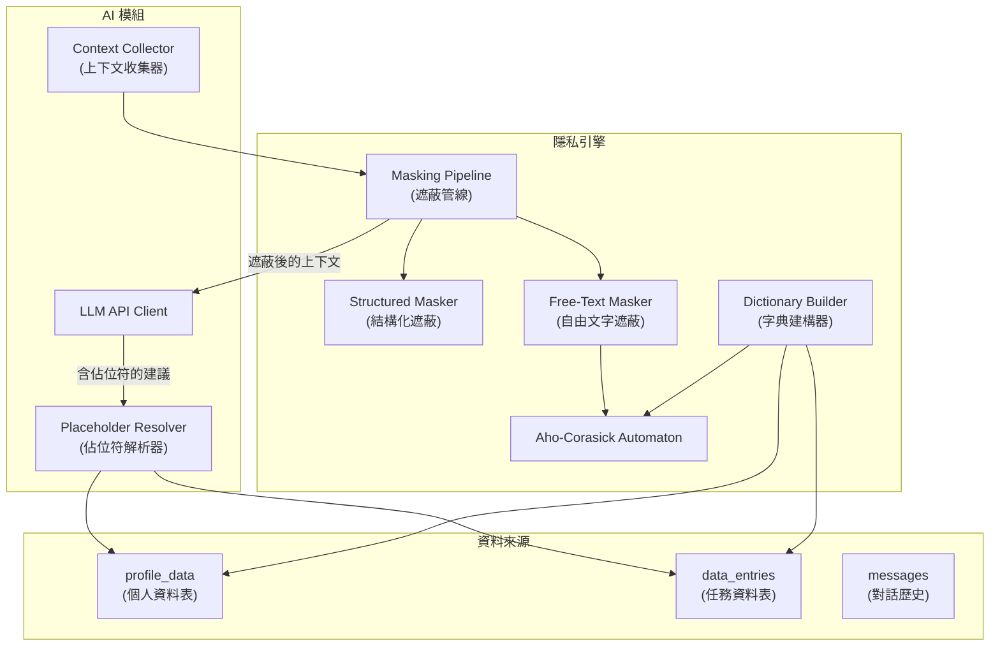
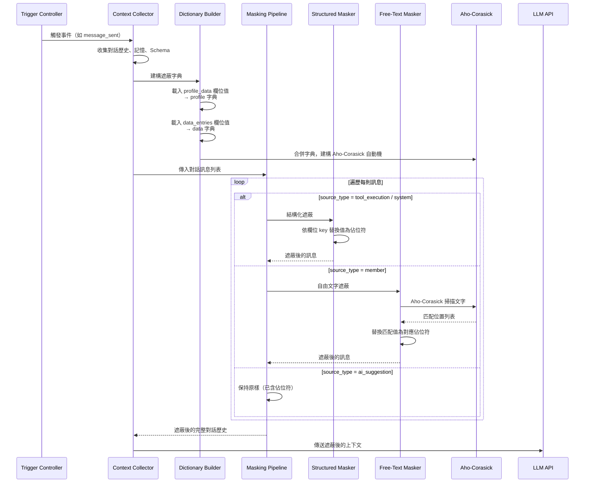
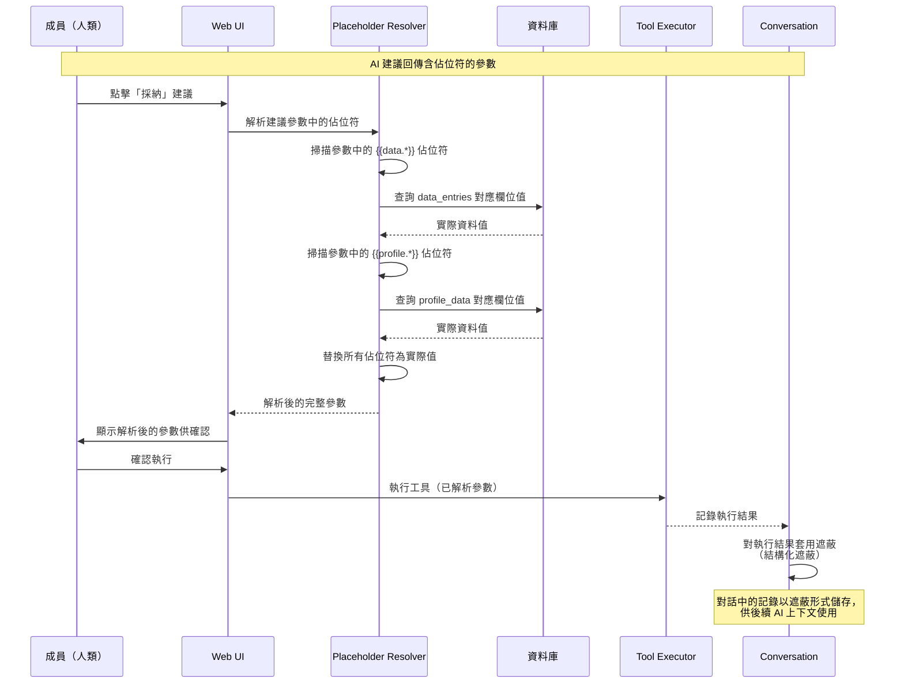
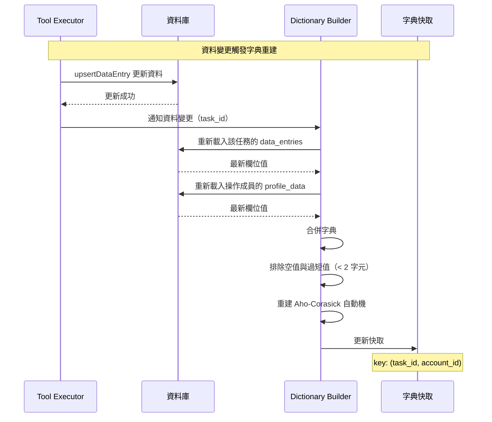

# 05 - 隱私引擎：佔位符解析與資料遮蔽管線

## 1. 問題描述

Conf-Ops 系統的核心隱私原則是 **AI 永遠不看到實際資料值**。AI 僅接收資料表的欄位結構（Schema），透過佔位符語法（如 `{{data.companyName}}`、`{{profile.phone}}`）引用欄位值。

然而，任務對話歷史作為 AI 的上下文時，對話中可能包含實際資料值——工具執行結果中的欄位值、成員在自由文字中提及的個人資料或業務資料。系統需要一套**自動化的資料遮蔽管線**，在將對話歷史傳送給 AI 前，將已知的資料值替換為對應的佔位符。

同時，AI 回傳的建議中包含佔位符，系統需要在執行前**將佔位符解析回實際資料值**，供人類確認後執行。

需解決的問題：
1. **結構化資料遮蔽**：工具執行結果、系統訊息中的欄位值可精確替換
2. **自由文字遮蔽**：成員的自由輸入中，已知資料值需透過字串匹配找出並替換
3. **佔位符解析**：AI 回傳的佔位符需解析為實際資料值，供人類確認
4. **效能要求**：遮蔽管線在每次 AI 建議生成前執行，需高效處理

---

## 2. 設計決策

### 2.1 雙策略遮蔽

| 策略 | 適用訊息類型 | 方法 | 精確度 |
|------|------------|------|--------|
| **結構化遮蔽** | `tool_execution`、`system` | 依欄位 key 精確替換 | 100% |
| **自由文字遮蔽** | `member` | Aho-Corasick 多模式字串匹配 | 依賴字典完整性 |

**選擇理由：**
- 結構化訊息有明確的欄位 key，可直接對應佔位符，無需模糊匹配
- 自由文字無結構可依循，需透過已知資料值建立字典進行字串比對
- Aho-Corasick 演算法在多模式匹配場景下效能極佳（O(n + m)，n 為文字長度，m 為匹配數）

### 2.2 Aho-Corasick 選型

| 項目 | 決策 |
|------|------|
| 函式庫 | `aho-corasick` crate（Rust 生態中最成熟的實作） |
| 匹配策略 | 最長匹配優先（Longest Match First） |
| 大小寫 | 區分大小寫（Case-Sensitive） |
| 自動機重建 | 當資料字典變更時重建 |

### 2.3 考慮過的替代方案

| 方案 | 優點 | 缺點 | 結論 |
|------|------|------|------|
| **正則表達式比對** | 彈性高 | 多模式時效能差、維護困難 | 否決 |
| **NLP 命名實體辨識** | 可偵測未知敏感資料 | 準確度不穩定、需 GPU、延遲高 | 否決 |
| **Aho-Corasick 多模式匹配** | 效能佳、確定性高、無 false positive | 僅能匹配已知值 | **採用** |
| **不遮蔽自由文字** | 最簡單 | 隱私保護不足 | 否決 |

### 2.4 已知限制

- **首次出現的未知敏感資料無法遮蔽**：成員在自由文字中首次提及某個資料值時，若該值尚未存入資料表或個人資料表，系統無法識別並遮蔽。一旦該資料透過工具存入後，後續的對話歷史傳送皆會自動遮蔽。這是已接受的限制。

---

## 3. 元件圖



---

## 4. 資料流

### 4.1 遮蔽管線流程（建構 AI 上下文時）



### 4.2 佔位符解析流程（執行工具時）



### 4.3 字典建構與自動機重建



---

## 5. 內部介面契約

### 5.1 Masking Pipeline Trait

```rust
use uuid::Uuid;

/// 遮蔽管線服務介面
#[async_trait]
pub trait MaskingService: Send + Sync {
    /// 對一組對話訊息套用遮蔽，回傳遮蔽後的訊息列表
    async fn mask_messages(
        &self,
        task_id: Uuid,
        account_id: Uuid,
        messages: Vec<Message>,
    ) -> Result<Vec<MaskedMessage>>;

    /// 對單一結構化資料（如工具執行結果）套用遮蔽
    async fn mask_structured_data(
        &self,
        task_id: Uuid,
        data: serde_json::Value,
        field_mappings: &FieldMappings,
    ) -> Result<serde_json::Value>;
}

/// 遮蔽後的訊息
pub struct MaskedMessage {
    pub id: Uuid,
    pub task_id: Uuid,
    pub source_type: MessageSourceType,
    pub source_id: Option<Uuid>,
    /// 遮蔽後的內容（實際值已替換為佔位符）
    pub content: serde_json::Value,
    pub attachments: Option<Vec<AttachmentMetadata>>,
    pub created_at: chrono::DateTime<chrono::Utc>,
}

/// 欄位對應表：欄位 key → 佔位符前綴
pub struct FieldMappings {
    /// data_entries 的欄位 key 列表
    pub data_fields: Vec<String>,
    /// profile_data 的欄位 key 列表
    pub profile_fields: Vec<String>,
}
```

### 5.2 Placeholder Resolver Trait

```rust
/// 佔位符解析服務介面
#[async_trait]
pub trait PlaceholderResolver: Send + Sync {
    /// 解析參數中的所有佔位符，替換為實際值
    async fn resolve(
        &self,
        task_id: Uuid,
        account_id: Uuid,
        parameters: serde_json::Value,
    ) -> Result<ResolveResult>;
}

pub struct ResolveResult {
    /// 解析後的參數（佔位符已替換為實際值）
    pub resolved_parameters: serde_json::Value,
    /// 解析過程中遇到的未找到的佔位符
    pub unresolved_placeholders: Vec<String>,
}
```

### 5.3 Dictionary Builder

```rust
/// 遮蔽字典建構器
pub struct MaskingDictionary {
    /// 字典項目：(實際值, 對應佔位符)
    entries: Vec<DictionaryEntry>,
    /// 已建構的 Aho-Corasick 自動機
    automaton: aho_corasick::AhoCorasick,
}

pub struct DictionaryEntry {
    /// 實際資料值（用於匹配）
    pub value: String,
    /// 對應的佔位符（用於替換）
    pub placeholder: String,
    /// 來源類型
    pub source: DictionarySource,
}

pub enum DictionarySource {
    ProfileData { field_key: String },
    DataEntry { field_key: String },
}

impl MaskingDictionary {
    /// 從 profile_data 與 data_entries 建構字典
    pub fn build(
        profile_data: &HashMap<String, serde_json::Value>,
        data_entries: &HashMap<String, serde_json::Value>,
    ) -> Self {
        let mut entries = Vec::new();

        // 展開 profile_data 值
        for (key, value) in profile_data {
            if let Some(text) = value.as_str() {
                if text.len() >= 2 {
                    entries.push(DictionaryEntry {
                        value: text.to_string(),
                        placeholder: format!("{{{{profile.{key}}}}}"),
                        source: DictionarySource::ProfileData {
                            field_key: key.clone(),
                        },
                    });
                }
            }
        }

        // 展開 data_entries 值
        for (key, value) in data_entries {
            if let Some(text) = value.as_str() {
                if text.len() >= 2 {
                    entries.push(DictionaryEntry {
                        value: text.to_string(),
                        placeholder: format!("{{{{data.{key}}}}}"),
                        source: DictionarySource::DataEntry {
                            field_key: key.clone(),
                        },
                    });
                }
            }
        }

        // 依值長度降序排序（最長匹配優先）
        entries.sort_by(|a, b| b.value.len().cmp(&a.value.len()));

        let patterns: Vec<&str> = entries.iter().map(|e| e.value.as_str()).collect();
        let automaton = aho_corasick::AhoCorasickBuilder::new()
            .match_kind(aho_corasick::MatchKind::LeftmostLongest)
            .build(&patterns)
            .expect("Failed to build Aho-Corasick automaton");

        Self { entries, automaton }
    }

    /// 對自由文字套用遮蔽
    pub fn mask_text(&self, text: &str) -> String {
        self.automaton.replace_all(
            text,
            &self.entries.iter().map(|e| e.placeholder.as_str()).collect::<Vec<_>>(),
        )
    }
}
```

### 5.4 佔位符語法規範

```
佔位符格式：
  {{profile.<fieldKey>}}    引用當前成員的個人資料表欄位
  {{data.<fieldKey>}}       引用當前任務的資料表欄位

範例：
  {{profile.phone}}         → 0912-345-678
  {{profile.bankAccount}}   → 012-3456789
  {{data.companyName}}      → COSCUP Corp.
  {{data.contactEmail}}     → sponsor@example.com
  {{data.amount}}           → 150000

正則表達式（用於解析）：
  \{\{(profile|data)\.([a-zA-Z0-9_]+)\}\}
```

---

## 6. 錯誤處理

| 情境 | 處理方式 |
|------|---------|
| 佔位符引用的欄位不存在 | `PlaceholderResolver` 將該佔位符保留原樣，並加入 `unresolved_placeholders` 清單，回傳給 UI 提示使用者 |
| profile_data / data_entries 載入失敗 | 記錄錯誤日誌，以空字典執行遮蔽（降級為不遮蔽自由文字）。結構化遮蔽仍正常運作 |
| Aho-Corasick 自動機建構失敗 | 記錄錯誤日誌，降級為不遮蔽自由文字。極端情境（如字典項目過多），限制字典大小 |
| 遮蔽後的文字過長（超過 LLM context limit） | 依訊息時間由舊到新截斷，保留最近的訊息 |
| 佔位符格式錯誤 | `PlaceholderResolver` 略過無法解析的文字，不替換 |
| 同一值對應多個欄位 | 取第一個匹配的佔位符（依字典建構順序：profile 優先於 data） |

---

## 7. 擴展性考量

### 7.1 字典快取策略

- 以 `(task_id, account_id)` 為快取 key，快取已建構的 `MaskingDictionary`
- 當 `data_entries` 或 `profile_data` 變更時，清除對應的快取
- 快取 TTL：10 分鐘

### 7.2 大量資料值的效能

- Aho-Corasick 自動機的建構時間與字典大小成正比（O(sum of pattern lengths)）
- 匹配時間與文字長度成正比（O(n)），不受字典大小影響
- 實務上，單一任務的字典大小通常在數十到數百個項目，建構時間可忽略

### 7.3 數值型資料的遮蔽

- 數值（如金額 `150000`）轉為字串後加入字典
- 考慮常見格式變體（如 `150,000`、`150000`、`NT$150,000`），可在建構字典時展開格式變體
- 初期僅支援精確匹配，後續可依需求新增格式展開

### 7.4 附件處理

- 附件的檔案內容不傳送給 AI，僅傳送 metadata（檔案名稱、類型、大小）
- 附件 metadata 中的檔案名稱也會經過遮蔽處理

---

## 8. 設定項

| 環境變數 | 說明 | 預設值 |
|---------|------|--------|
| `PRIVACY_DICTIONARY_CACHE_TTL_SECS` | 遮蔽字典快取 TTL（秒） | `600`（10 分鐘） |
| `PRIVACY_MIN_VALUE_LENGTH` | 加入字典的最小值長度（避免過短值造成過度遮蔽） | `2` |
| `PRIVACY_MAX_DICTIONARY_SIZE` | 字典最大項目數（防止記憶體過度使用） | `10000` |
| `PRIVACY_EXPAND_NUMBER_FORMATS` | 是否展開數值的常見格式變體 | `false` |
| `PRIVACY_LOG_MASKING_STATS` | 是否記錄遮蔽統計（命中數、遮蔽率）至日誌 | `false` |
