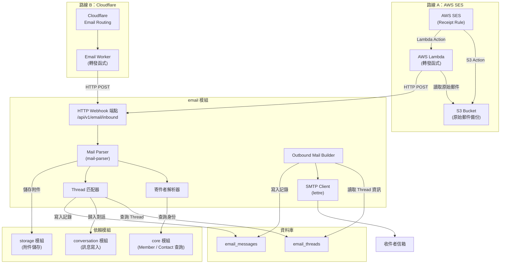
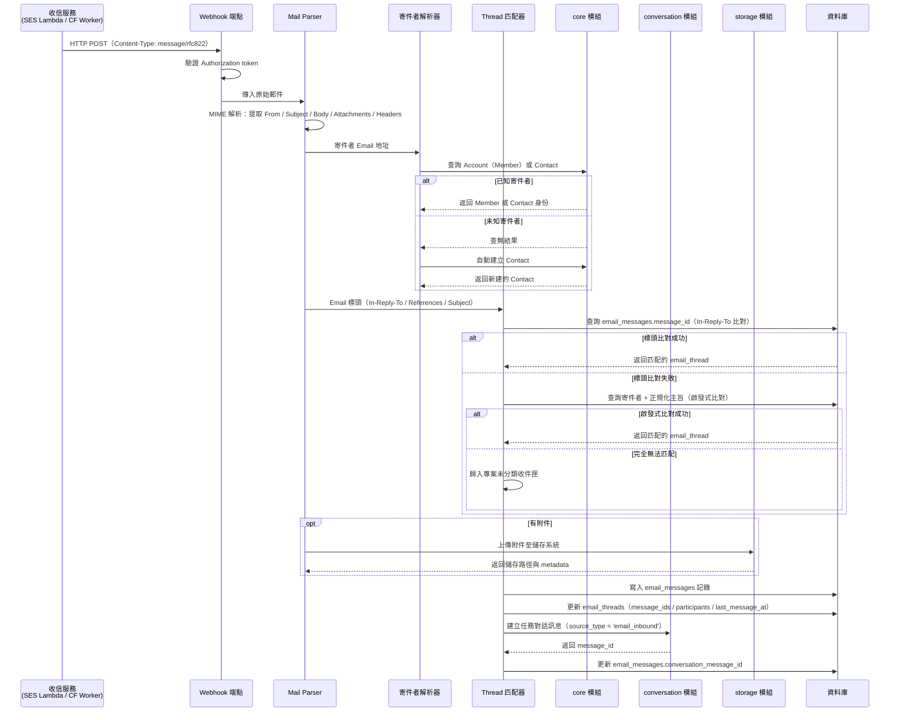
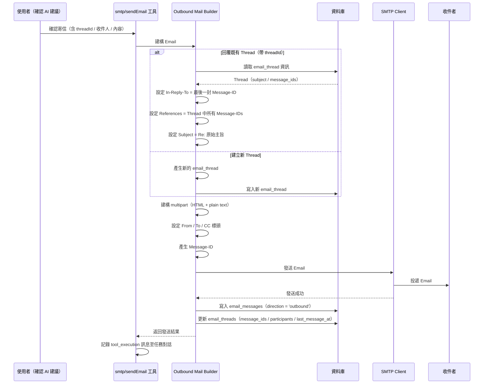
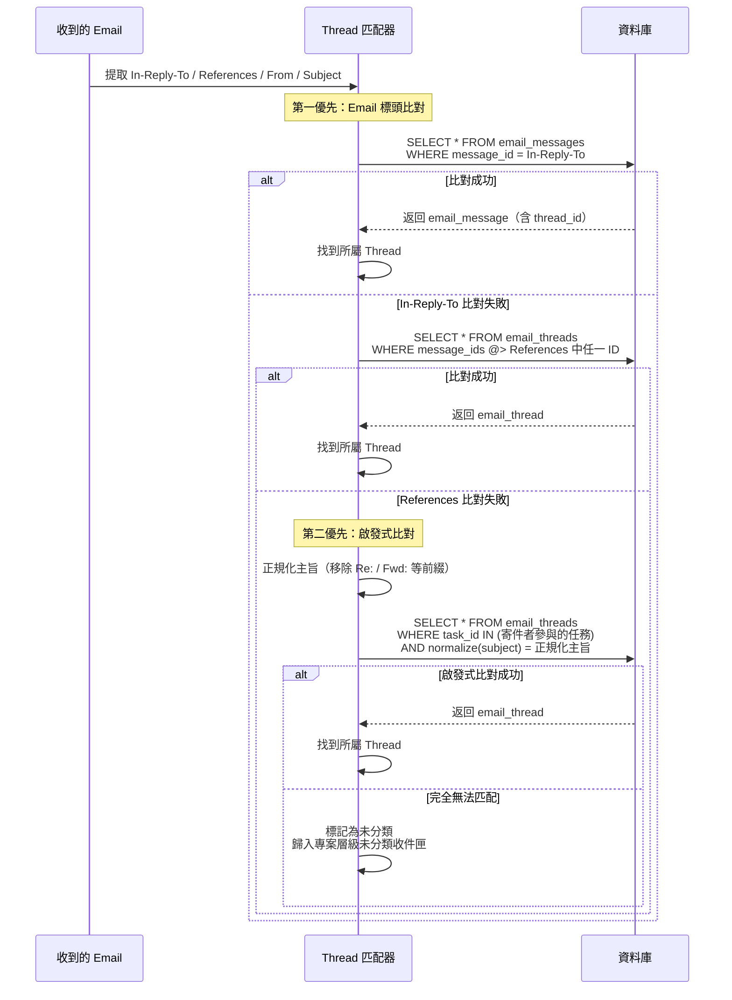

# 06 - Email 整合系統（Email Integration）

## 1. 問題描述

Conf-Ops 系統中，成員（Member）與外部聯絡人（Contact）皆可透過 Email 與任務對話互動。系統需要：

1. **收信能力**：接收外部 Email，解析內容與附件，識別寄件者身份（Member 或 Contact），並將郵件自動歸入對應的任務對話串（Thread）
2. **寄信能力**：從任務對話中發送 Email 給收件者，維持正確的 Thread 標頭，確保收件者的信箱正確歸入同一對話串
3. **Thread 管理**：維護 Email 對話串的完整生命週期，支援多條獨立 Thread 並存於同一任務

若缺乏可靠的 Thread 匹配機制，外部聯絡人的回信將無法正確歸入任務，導致對話脈絡中斷。若寄信時未正確設定 Email 標頭，收件者的信箱也無法將回信歸入同一對話串。

---

## 2. 設計決策

### 2.1 收信機制

| 項目 | 決策 |
|------|------|
| 收信方式 | HTTP Webhook — 支援兩條路線（見下方） |
| MIME 解析 | `mail-parser` crate |
| 寄件者解析 | Email 地址比對 → Account（Member）或 Contact，未知地址自動建立 Contact |

系統提供統一的 `/api/v1/email/inbound` 端點接收原始 MIME 郵件，前端收信服務可替換而不影響應用邏輯。目前支援兩條收信路線：

| 路線 | 架構 | 適用場景 |
|------|------|---------|
| **路線 A** | AWS SES Receipt Rule → Lambda → API | 已使用 AWS 生態、需要 spam/virus 檢查 |
| **路線 B** | Cloudflare Email Routing → Email Worker → API | 已使用 Cloudflare、追求簡潔部署 |

兩條路線最終都以 `POST /api/v1/email/inbound`（Content-Type: `message/rfc822`）送入原始郵件，應用端處理邏輯完全相同。

---

### 路線 A：AWS SES + Lambda

```
外部郵件 → AWS SES（Receipt Rule）→ Lambda Action → HTTP POST /api/v1/email/inbound → Conf-Ops
                                  ↘ S3 Action（備份，選用）
```

#### SES Receipt Rule 設定

1. **MX 記錄**：將收信域名（如 `*.confops.dev`）MX 記錄指向 AWS SES（`inbound-smtp.<region>.amazonaws.com`）
2. **Receipt Rule Set**：建立收信規則集
3. **Actions（依序執行）**：
   - **S3 Action**（選用）：將原始郵件儲存至 S3 bucket 作為備份
   - **Lambda Action**：直接觸發 Lambda 函式，SES 會將完整 SES event（含郵件 metadata 與 content）傳入 Lambda

#### SES Lambda Event 格式

SES Receipt Rule 的 Lambda Action 會傳入 `SES event`，包含：
- `Records[].ses.mail`：郵件 metadata（messageId、source、destination、timestamp、commonHeaders）
- `Records[].ses.receipt`：SES 接收資訊（spamVerdict、virusVerdict、spfVerdict、dkimVerdict）
- 原始郵件內容需從 S3 讀取（SES event 本身不含原始 MIME body）

#### Lambda 轉發函式

```python
# Lambda handler（Python）
# 使用流式轉發，避免大型郵件佔用過多記憶體
import boto3
import os
from urllib.request import Request, urlopen

s3 = boto3.client('s3')

CONFOPS_API_URL = os.environ['CONFOPS_API_URL']
EMAIL_INBOUND_API_KEY = os.environ['EMAIL_INBOUND_API_KEY']
S3_BUCKET = os.environ['SES_INBOUND_S3_BUCKET']

def handler(event, context):
    for record in event['Records']:
        ses_mail = record['ses']['mail']
        ses_receipt = record['ses']['receipt']
        message_id = ses_mail['messageId']

        # 從 S3 取得串流（StreamingBody），不載入全部至記憶體
        obj = s3.get_object(Bucket=S3_BUCKET, Key=message_id)
        stream = obj['Body']
        content_length = obj['ContentLength']

        # 流式轉發至 Conf-Ops API
        req = Request(
            f'{CONFOPS_API_URL}/api/v1/email/inbound',
            data=stream,
            method='POST',
            headers={
                'Content-Type': 'message/rfc822',
                'Content-Length': str(content_length),
                'Authorization': f'Bearer {EMAIL_INBOUND_API_KEY}',
                'X-SES-Message-Id': message_id,
                'X-SES-Spam-Verdict': ses_receipt['spamVerdict']['status'],
                'X-SES-Virus-Verdict': ses_receipt['virusVerdict']['status'],
            },
        )

        with urlopen(req) as resp:
            if resp.status >= 400:
                raise Exception(f'API returned {resp.status}')
```

> **注意**：SES Receipt Rule 中 S3 Action 必須排在 Lambda Action 之前，確保 Lambda 執行時原始郵件已存入 S3。

---

### 路線 B：Cloudflare Email Worker

```
外部郵件 → Cloudflare Email Routing → Email Worker → HTTP POST /api/v1/email/inbound → Conf-Ops
```

#### Cloudflare Email Routing 設定

1. **MX 記錄**：Cloudflare Email Routing 啟用後自動設定（指向 Cloudflare 的收信伺服器）
2. **Email Routing Rule**：設定 Catch-all 或特定地址規則，路由至 Email Worker

#### Email Worker 實作

Cloudflare Email Worker 使用 `email` event handler 接收郵件，`message.raw` 為 `ReadableStream`，可直接作為 fetch body 流式轉發，不需要先讀取到記憶體：

```typescript
// Email Worker（TypeScript）
// message.raw 為 ReadableStream，直接傳入 fetch body 實現流式轉發
export default {
  async email(message: EmailMessage, env: Env, ctx: ExecutionContext) {
    // 流式轉發：message.raw（ReadableStream）直接作為 fetch body
    // 不呼叫 arrayBuffer() 或 text()，避免大型郵件佔用記憶體
    const resp = await fetch(`${env.CONFOPS_API_URL}/api/v1/email/inbound`, {
      method: 'POST',
      body: message.raw,
      headers: {
        'Content-Type': 'message/rfc822',
        'Authorization': `Bearer ${env.EMAIL_INBOUND_API_KEY}`,
        'X-CF-Mail-From': message.from,
        'X-CF-Mail-To': message.to,
        'X-CF-Raw-Size': message.rawSize.toString(),
      },
    });

    if (!resp.ok) {
      message.setReject(`Processing failed: ${resp.status}`);
    }
  },
} satisfies ExportedHandler<Env>;

interface Env {
  CONFOPS_API_URL: string;
  EMAIL_INBOUND_API_KEY: string;
}
```

#### 路線 B 特性

| 項目 | 說明 |
|------|------|
| **郵件大小限制** | Cloudflare Email Worker 支援最大 25 MB 郵件 |
| **Spam/Virus 檢查** | Cloudflare 不提供內建 verdict，應用端需自行處理（或接受所有郵件） |
| **重試機制** | Worker 拋出例外或呼叫 `message.setReject()` 時，Cloudflare 會產生 bounce 通知寄件者 |
| **部署方式** | `wrangler deploy`，無需額外基礎設施 |

---

### 統一 Webhook 端點

無論使用哪條路線，Conf-Ops 的 `/api/v1/email/inbound` 端點接收相同格式的原始 MIME 郵件：

- **Content-Type**：`message/rfc822`（原始 RFC 5322 格式）
- **Authorization**：Bearer token（收信專用的 inbound API key）
- **X-SES-* / X-CF-* Headers**（選用）：前端收信服務附帶的 metadata
- **Body**：原始 MIME 郵件內容

```rust
/// 收信 Webhook 請求（provider-agnostic）
pub struct InboundWebhookRequest {
    /// 原始 MIME 郵件（RFC 5322 格式）
    pub raw_mail: Vec<u8>,
    /// 來源識別（用於除錯與冪等處理）
    pub provider_message_id: Option<String>,
    /// 安全檢查結果（僅 SES 路線提供）
    pub spam_verdict: Option<String>,
    pub virus_verdict: Option<String>,
}
```

**效能考量：** 兩條路線的轉發函式均為無狀態、事件驅動，自動隨收信量擴展。主要瓶頸在應用端的 MIME 解析和附件存儲。SES Lambda Action 有 30 秒同步呼叫超時限制；Cloudflare Email Worker 有 30 秒 CPU 時間限制。

### 2.2 寄信機制

| 項目 | 決策 |
|------|------|
| 寄信方式 | `lettre` crate + SMTP |
| 郵件格式 | HTML + plain text multipart |
| Thread 延續 | 自動設定 `In-Reply-To`、`References` 標頭 |

**選擇理由：**
- `lettre` 是 Rust 中最成熟的 SMTP 客戶端，支援 TLS、STARTTLS、認證等
- Multipart 格式確保在純文字與 HTML 郵件客戶端皆有良好閱讀體驗
- 正確的 Email 標頭是確保 Thread 延續的關鍵

### 2.3 Thread 匹配策略

| 優先序 | 策略 | 可靠度 |
|--------|------|--------|
| 1 | `In-Reply-To` / `References` 標頭比對 | 高 |
| 2 | 寄件者 + 正規化主旨啟發式比對 | 中 |
| 3 | 歸入專案層級未分類收件匣（依收件地址所屬專案判定） | — |

**選擇理由：**
- Email 標頭比對為業界標準做法，大多數郵件客戶端皆會正確設定回覆標頭
- 啟發式比對作為備援，處理標頭遺失或被修改的邊界情況
- 無法匹配的郵件不應丟棄，歸入專案層級未分類收件匣等待人工分類（依收件地址所屬專案判定）

---

## 3. 元件圖



---

## 4. 資料流

### 4.1 收信流程（Inbound Email Processing）



### 4.2 寄信流程（Outbound Email Sending）



### 4.3 Thread 匹配演算法



---

## 5. 內部介面契約

Email 模組對外公開的 Rust Trait 介面：

```rust
use uuid::Uuid;

/// 解析後的 Email 結構
pub struct ParsedMail {
    pub from_address: String,
    pub to_addresses: Vec<String>,
    pub cc_addresses: Vec<String>,
    pub subject: String,
    pub text_body: Option<String>,
    pub html_body: Option<String>,
    pub message_id: String,
    pub in_reply_to: Option<String>,
    pub references: Vec<String>,
    pub attachments: Vec<MailAttachment>,
    pub raw_headers: serde_json::Value,
}

/// Email 附件
pub struct MailAttachment {
    pub filename: String,
    pub mime_type: String,
    pub size: u64,
    pub data: Vec<u8>,
}

/// 寄件者身份
pub enum SenderIdentity {
    /// 已知成員
    Member { member_id: Uuid, account_id: Uuid },
    /// 已知外部聯絡人
    Contact { contact_id: Uuid },
    /// 新建的外部聯絡人
    NewContact { contact_id: Uuid },
}

/// 收信處理結果
pub struct InboundMailResult {
    pub email_message_id: Uuid,
    pub thread_id: Uuid,
    pub task_id: Option<Uuid>,
    pub sender: SenderIdentity,
    pub conversation_message_id: Uuid,
}

/// 寄信參數
pub struct SendMailParams {
    pub task_id: Uuid,
    pub thread_id: Option<Uuid>,
    pub to: Vec<String>,
    pub cc: Vec<String>,
    pub subject: String,
    pub html_body: String,
    pub text_body: String,
}

/// 寄信結果
pub struct SendMailResult {
    pub email_message_id: Uuid,
    pub thread_id: Uuid,
    pub message_id: String,
}

/// Email 服務介面
#[async_trait]
pub trait EmailService: Send + Sync {
    /// 處理收到的原始 Email
    async fn receive_mail(&self, raw_mail: &[u8]) -> Result<InboundMailResult>;

    /// 發送 Email
    async fn send_mail(&self, params: SendMailParams) -> Result<SendMailResult>;

    /// 依據 Email 標頭匹配 Thread
    async fn match_thread(
        &self,
        in_reply_to: Option<&str>,
        references: &[String],
        from_address: &str,
        subject: &str,
    ) -> Result<Option<Uuid>>;

    /// 解析寄件者身份
    async fn resolve_sender(
        &self,
        email_address: &str,
        organization_id: Uuid,
    ) -> Result<SenderIdentity>;
}
```

---

## 6. 錯誤處理

| 情境 | 處理方式 |
|------|---------|
| Inbound API token 驗證失敗 | 回傳 401，記錄警告日誌（可能為偽造請求） |
| 【SES】Lambda 讀取 S3 失敗 | Lambda 拋出例外，SES 視為處理失敗並通知（可設定 bounce） |
| 【SES】Lambda 呼叫 API 失敗 | Lambda 拋出例外；可搭配 SQS DLQ 記錄失敗事件供後續重試 |
| 【SES】Lambda 30 秒超時 | Lambda 應在超時前完成 API 呼叫；若郵件處理耗時過長，改為寫入 SQS 非同步處理 |
| 【CF】Email Worker 呼叫 API 失敗 | Worker 呼叫 `message.setReject()` 產生 bounce 通知寄件者 |
| 【CF】Email Worker 30 秒 CPU 超時 | 大型郵件解析應由應用端處理，Worker 僅負責轉發 |
| MIME 解析失敗 | 記錄原始郵件至錯誤佇列，通知管理員手動處理 |
| 寄件者解析失敗 | 自動建立 Contact，Email 仍正常歸入 |
| Thread 匹配失敗 | 歸入**專案層級**未分類收件匣（每個專案獨立），等待專案成員人工分類 |
| SMTP 發送失敗 | 記錄錯誤至 tool_execution 訊息，通知使用者重試 |
| SMTP 連線逾時 | 重試最多 3 次（指數退避），仍失敗則回傳錯誤 |
| 附件上傳儲存系統失敗 | Email 本體仍正常處理，附件標記為上傳失敗 |
| 重複 Message-ID | 忽略重複郵件（依 `email_messages.message_id` UNIQUE 約束） |
| 轉寄信件偵測 | 解析轉寄格式，提取原始寄件者作為實際寄件者 |

---

## 7. 擴展性考量

### 收信擴展

- 統一 HTTP Webhook 端點為無狀態處理，可透過多個應用實例水平擴展
- 兩條收信路線均為全託管服務，無需自行維護 MTA
- 【SES】大量收信場景可改為 Lambda 寫入 SQS、另一 Lambda 從 SQS 消費，實現背壓控制；S3 儲存原始郵件可作為永久備份
- 【CF】Email Worker 自動全球分布於 Cloudflare 邊緣節點，天然低延遲

### 寄信擴展

- SMTP 發送為獨立操作，可透過連線池管理並行發送
- 寄信同樣使用 AWS SES SMTP 介面，利用其內建的速率限制與退信處理
- 未來可加入寄信佇列，將寄信操作非同步化

### 模組拆離

- email 模組在服務拆分路線圖中為優先拆離候選（參見 [01-service-decomposition.md](./01-service-decomposition.md)）
- 拆離後收信轉發函式（Lambda / Email Worker）改為呼叫獨立部署的 email 服務 API
- Trait 介面已預留拆離彈性，替換為 RPC 客戶端實作即可

---

## 8. 設定項

| 環境變數 | 說明 | 預設值 |
|---------|------|--------|
| `SMTP_HOST` | SMTP 伺服器位址 | （必填，無預設） |
| `SMTP_PORT` | SMTP 埠號 | `587` |
| `SMTP_USERNAME` | SMTP 帳號 | （必填，無預設） |
| `SMTP_PASSWORD` | SMTP 密碼 | （必填，無預設） |
| `SMTP_FROM` | 預設寄件者地址 | （必填，無預設） |
| `SMTP_TLS` | TLS 模式：`starttls` / `tls` / `none` | `starttls` |
| `SMTP_TIMEOUT` | SMTP 連線逾時（秒） | `30` |
| `SMTP_MAX_RETRIES` | SMTP 發送失敗重試次數 | `3` |
| `EMAIL_INBOUND_API_KEY` | 收信轉發函式呼叫 API 的認證 token | （必填，無預設） |
| `EMAIL_DOMAIN` | 系統 Email 網域（用於產生 Message-ID） | （必填，無預設） |

以下為路線 A（AWS SES）轉發函式的環境變數（設定於 Lambda，非應用本身）：

| 環境變數 | 說明 | 預設值 |
|---------|------|--------|
| `SES_INBOUND_S3_BUCKET` | SES 收信原始郵件 S3 bucket 名稱 | （必填） |
| `SES_INBOUND_S3_PREFIX` | S3 key 前綴 | `inbound-emails/` |
| `CONFOPS_API_URL` | Conf-Ops API base URL | （必填） |
| `EMAIL_INBOUND_API_KEY` | 呼叫收信 API 的認證 token（與應用端 `EMAIL_INBOUND_API_KEY` 相同值） | （必填） |

路線 B（Cloudflare Email Worker）的環境變數（設定於 Worker，非應用本身）：

| 環境變數 | 說明 | 預設值 |
|---------|------|--------|
| `CONFOPS_API_URL` | Conf-Ops API base URL | （必填） |
| `EMAIL_INBOUND_API_KEY` | 呼叫收信 API 的認證 token（與應用端 `EMAIL_INBOUND_API_KEY` 相同值） | （必填） |
| `EMAIL_UNMATCHED_INBOX_ENABLED` | 是否啟用未分類收件匣 | `true` |
