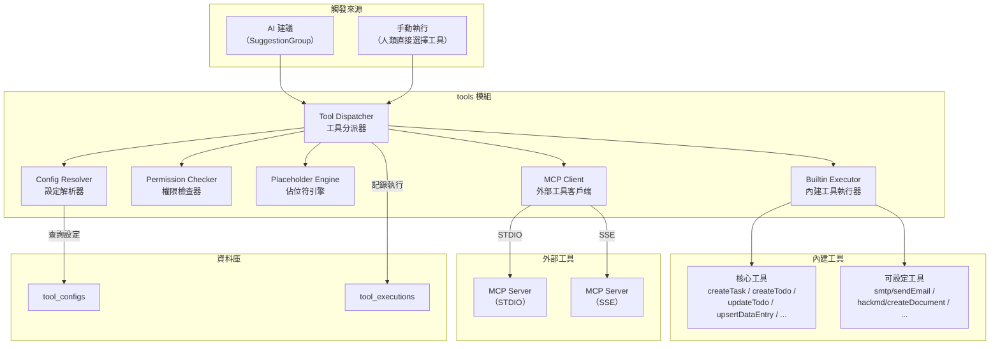
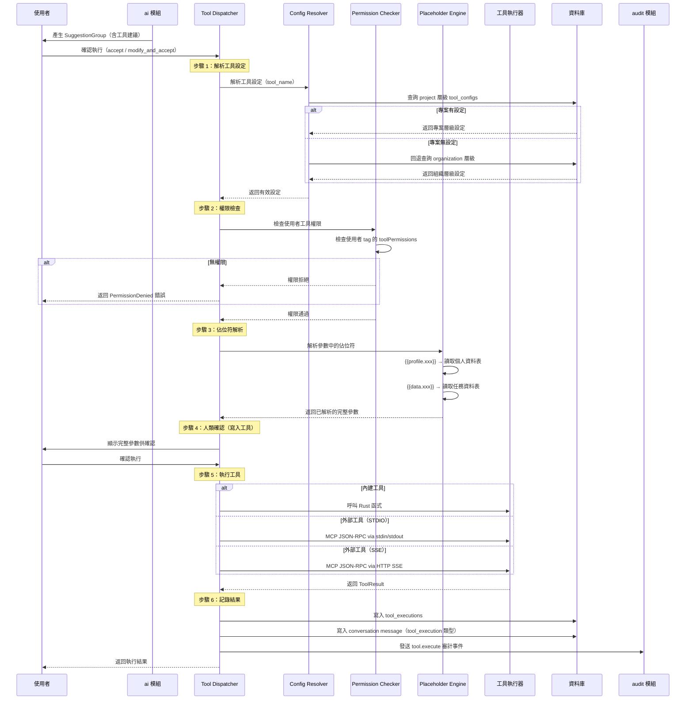
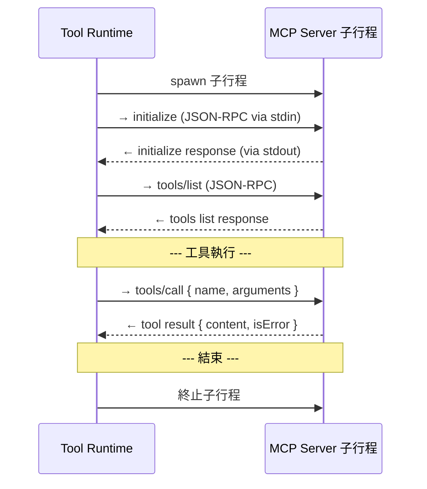

# 07 - MCP 工具執行引擎（MCP Tool Runtime）

## 1. 問題描述

Conf-Ops 的 AI-Human 協作迴圈中，AI 建議的動作最終需透過「工具」來執行。系統需要一個統一的工具執行引擎，能夠：

1. 以統一的 MCP（Model Context Protocol）格式定義與執行所有工具，無論是系統內建或第三方接入
2. 支援多種工具類型：核心工具（全域可用）、可設定內建工具（需啟用）、外部 MCP Server 工具
3. 管理工具設定的繼承（組織 → 專案）與權限控管
4. 在執行前進行佔位符解析、人類確認等流程控制
5. 完整記錄工具執行結果與審計軌跡

若缺乏統一的工具介面，內建工具與外部工具將需要不同的呼叫方式，增加 AI 上下文的複雜度。若權限控管不完善，可能導致未授權的工具執行。

---

## 2. 設計決策

### 2.1 統一 MCP 格式

| 項目 | 決策 |
|------|------|
| 工具定義格式 | MCP Tool Definition（name, description, inputSchema） |
| 參數格式 | JSON Schema |
| 回傳格式 | MCP Tool Result（content, isError） |

**選擇理由：**
- MCP 為 Anthropic 提出的開放協定，已成為 AI 工具整合的業界標準
- 統一格式讓 AI 不需區分工具來源，簡化 prompt 設計
- 第三方 MCP Server 可無縫接入，不需格式轉換

### 2.2 工具類型與通訊方式

| 工具類型 | 通訊方式 | 說明 |
|----------|---------|------|
| 核心工具 | 直接 Rust 函式呼叫 | 零傳輸開銷，系統內建 |
| 可設定內建工具 | 直接 Rust 函式呼叫 | 需專案層級啟用與設定 |
| 外部工具（STDIO） | MCP over STDIO | spawn 子行程，透過 stdin/stdout 通訊 |
| 外部工具（SSE） | MCP over SSE | HTTP 連線至外部 MCP Server |

**選擇理由：**
- 內建工具直接呼叫避免不必要的序列化/反序列化開銷
- STDIO 適合本地部署的 MCP Server（如 CLI 工具）
- SSE 適合遠端部署的 MCP Server（如 SaaS 服務）

### 外部 MCP Server 沙箱隔離

外部 MCP Server 透過 STDIO 子進程執行，需要沙箱隔離以防止惡意或失控的工具影響主系統。

#### 隔離層級

| 層級 | 方案 | 適用場景 |
|------|------|---------|
| L1 | 進程資源限制 | 所有外部 MCP Server |
| L2 | Linux namespaces | 自建部署 |
| L3 | Container 隔離 | K8s 部署 |

#### L1：進程資源限制（最低要求）

所有外部 MCP Server 子進程強制套用：

```rust
use std::process::Command;
use nix::sys::resource::{setrlimit, Resource};

fn spawn_mcp_server(config: &McpServerConfig) -> Result<Child> {
    // 資源限制
    let limits = ProcessLimits {
        max_memory_mb: 512,        // RSS 上限
        max_cpu_seconds: 30,       // 單次執行 CPU 時間
        max_open_files: 64,        // 檔案描述符上限
        max_output_size_mb: 10,    // STDOUT 輸出上限
    };

    let child = Command::new(&config.command)
        .args(&config.args)
        .stdin(Stdio::piped())
        .stdout(Stdio::piped())
        .stderr(Stdio::piped())
        .env_clear()                    // 清除所有環境變數
        .envs(&config.allowed_env)      // 只設定白名單環境變數
        .pre_exec(move || {
            // 設定 rlimits
            setrlimit(Resource::RLIMIT_AS, limits.max_memory_mb * 1024 * 1024, limits.max_memory_mb * 1024 * 1024)?;
            setrlimit(Resource::RLIMIT_CPU, limits.max_cpu_seconds, limits.max_cpu_seconds)?;
            setrlimit(Resource::RLIMIT_NOFILE, limits.max_open_files, limits.max_open_files)?;
            Ok(())
        })
        .spawn()?;

    Ok(child)
}
```

#### L2：Linux Namespaces（自建部署）

```rust
// 使用 unshare 建立隔離 namespace
fn spawn_sandboxed(config: &McpServerConfig) -> Result<Child> {
    Command::new("unshare")
        .args(&["--net", "--pid", "--mount", "--fork"])  // 網路、PID、檔案系統隔離
        .arg("--")
        .arg(&config.command)
        .args(&config.args)
        // ... stdin/stdout/stderr 設定同上
        .spawn()
}
```

#### L3：Container 隔離（K8s 部署）

在 K8s 環境中，每個外部 MCP Server 作為 sidecar container 或獨立 Pod 執行：

```yaml
# MCP Server Pod template
spec:
  containers:
    - name: mcp-server
      image: "{{ .mcpServer.image }}"
      resources:
        limits:
          memory: "512Mi"
          cpu: "500m"
      securityContext:
        runAsNonRoot: true
        readOnlyRootFilesystem: true
        allowPrivilegeEscalation: false
        capabilities:
          drop: ["ALL"]
```

#### 通訊超時與健康檢查

```rust
const MCP_CALL_TIMEOUT: Duration = Duration::from_secs(30);
const MCP_HEALTH_CHECK_INTERVAL: Duration = Duration::from_secs(60);

// 每次 tool call 都有超時保護
async fn call_mcp_tool(server: &McpServer, request: ToolRequest) -> Result<ToolResponse> {
    tokio::time::timeout(MCP_CALL_TIMEOUT, server.call(request))
        .await
        .map_err(|_| Error::McpTimeout)?
}
```

**建議：** 初版使用 L1（進程資源限制），足以防止資源耗盡。L2/L3 在需要更強隔離時啟用。

### 2.3 設定繼承

| 層級 | 設定來源 | 覆寫規則 |
|------|---------|---------|
| 核心工具 | 系統內建 | 不可覆寫 |
| 組織層級 | `tool_configs`（scope_type = 'organization'） | 預設值 |
| 專案層級 | `tool_configs`（scope_type = 'project'） | 完全覆寫組織同名設定 |

---

## 3. 元件圖



---

## 4. 資料流

### 4.1 工具執行流程



### 4.2 MCP 協定互動（STDIO 模式）



---

## 5. 內部介面契約

工具執行模組對外公開的 Rust Trait 介面：

```rust
use serde_json::Value;
use uuid::Uuid;

/// MCP 工具定義
pub struct ToolDefinition {
    pub name: String,
    pub description: String,
    pub input_schema: Value,
    /// 工具類型：core / configurable / external
    pub tool_category: ToolCategory,
    /// 是否為寫入工具（需人類確認）
    pub requires_confirmation: bool,
}

/// 工具類別
pub enum ToolCategory {
    /// 核心工具（全域可用）
    Core,
    /// 可設定內建工具
    Configurable,
    /// 外部 MCP Server 工具
    External,
}

/// 工具執行結果
pub struct ToolResult {
    pub content: Value,
    pub is_error: bool,
    pub duration_ms: u64,
}

/// 工具執行上下文
pub struct ToolContext {
    pub task_id: Uuid,
    pub project_id: Uuid,
    pub organization_id: Uuid,
    pub actor_id: Uuid,
    pub actor_tags: Vec<Uuid>,
}

/// 工具執行服務介面
#[async_trait]
pub trait ToolService: Send + Sync {
    /// 執行工具
    async fn execute_tool(
        &self,
        tool_name: &str,
        params: Value,
        context: &ToolContext,
    ) -> Result<ToolResult>;

    /// 列出可用工具
    async fn list_available_tools(
        &self,
        project_id: Uuid,
        actor_tags: &[Uuid],
    ) -> Result<Vec<ToolDefinition>>;

    /// 解析參數中的佔位符
    async fn resolve_placeholders(
        &self,
        params: Value,
        context: &ToolContext,
    ) -> Result<Value>;
}

/// 內建工具執行器 Trait（每個內建工具實作此 trait）
#[async_trait]
pub trait BuiltinToolExecutor: Send + Sync {
    /// 工具名稱
    fn name(&self) -> &str;

    /// 工具定義（MCP 格式）
    fn definition(&self) -> ToolDefinition;

    /// 執行工具
    async fn execute(
        &self,
        params: Value,
        context: &ToolContext,
    ) -> Result<ToolResult>;
}
```

---

## 6. 錯誤處理

| 情境 | 錯誤類型 | 處理方式 |
|------|---------|---------|
| 工具名稱不存在 | `ToolNotFound` | 回傳錯誤，通知使用者 |
| 工具未啟用 | `ToolDisabled` | 回傳錯誤，提示管理員啟用 |
| 權限不足 | `PermissionDenied` | 回傳錯誤，顯示所需權限 |
| 佔位符解析失敗 | `PlaceholderResolutionFailed` | 回傳錯誤，指出無法解析的佔位符 |
| 外部工具連線失敗 | `McpConnectionFailed` | 重試 1 次，仍失敗則回傳錯誤 |
| 外部工具執行逾時 | `McpTimeout` | 終止連線，回傳逾時錯誤 |
| 外部工具回傳無效 JSON-RPC | `McpInvalidResponse` | 回傳錯誤，記錄原始回應供除錯 |
| 工具執行回傳 isError=true | `ToolExecutionError` | 將錯誤內容記錄至對話，觸發 `tool_error` 事件 |
| STDIO 子行程崩潰 | `McpProcessCrashed` | 回傳錯誤，記錄 stderr 輸出 |

所有工具執行錯誤皆記錄至任務對話（`tool_execution` 訊息類型），並觸發 `tool_error` 事件供 AI 建議修正方案。

---

## 7. 擴展性考量

### 工具註冊

- 核心工具透過 Rust 編譯期註冊，不需執行期動態載入
- 可設定內建工具透過 feature flags 控制編譯範圍
- 外部工具透過 `tool_configs` 資料表動態管理

### 並行執行

- 單一 SuggestionGroup 中的多個工具建議依序執行（避免競態條件）
- 不同任務的工具可並行執行，透過 `MCP_MAX_CONCURRENT_TOOLS` 控制全域並行上限
- 外部 MCP Server 連線可透過連線池復用

### 未來拆分

- tools 模組依賴 core 模組取得設定，拆離後需透過 RPC 查詢
- 外部工具執行為 I/O 密集操作，適合獨立擴展
- 內建工具因直接操作資料庫，短期內與 core 模組保持同一程序

---

## 8. 設定項

| 環境變數 | 說明 | 預設值 |
|---------|------|--------|
| `MCP_TOOL_TIMEOUT` | 外部工具執行逾時（秒） | `30` |
| `MCP_MAX_CONCURRENT_TOOLS` | 全域最大並行工具執行數 | `10` |
| `MCP_STDIO_PROCESS_TIMEOUT` | STDIO 子行程初始化逾時（秒） | `10` |
| `MCP_SSE_CONNECT_TIMEOUT` | SSE 連線建立逾時（秒） | `5` |
| `MCP_RETRY_COUNT` | 外部工具連線失敗重試次數 | `1` |
