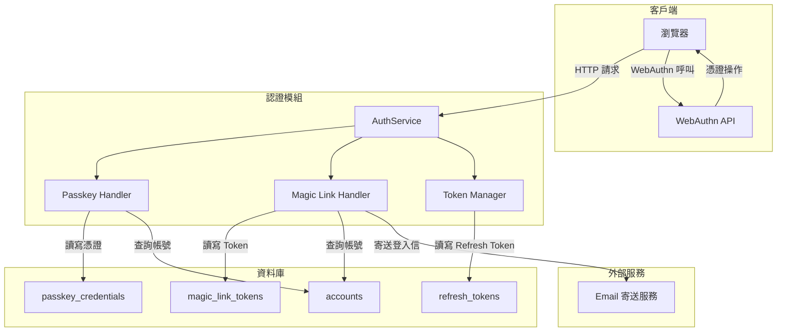
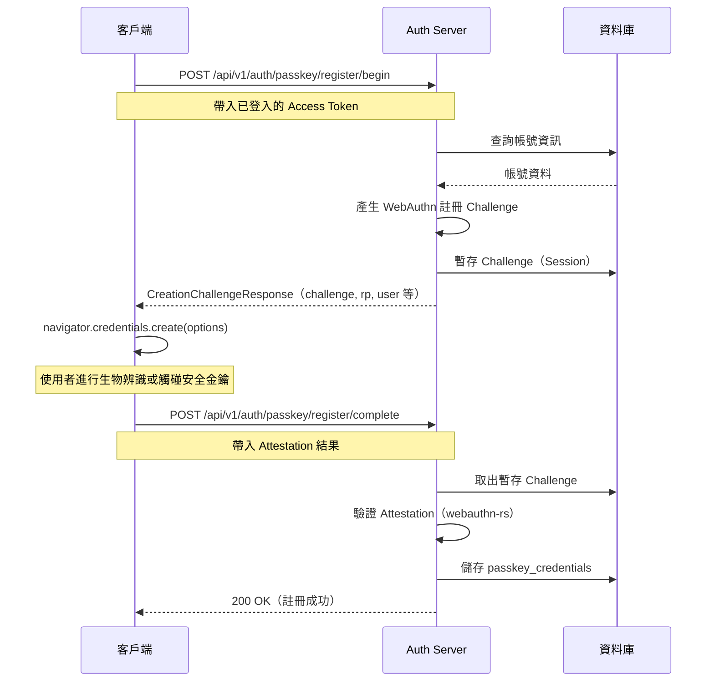
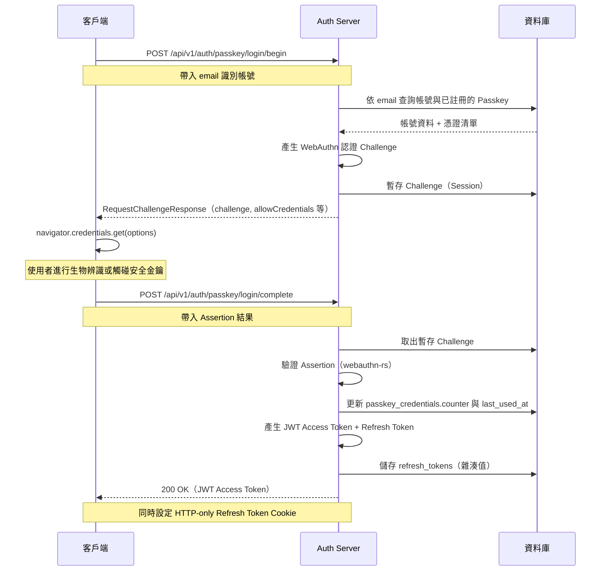
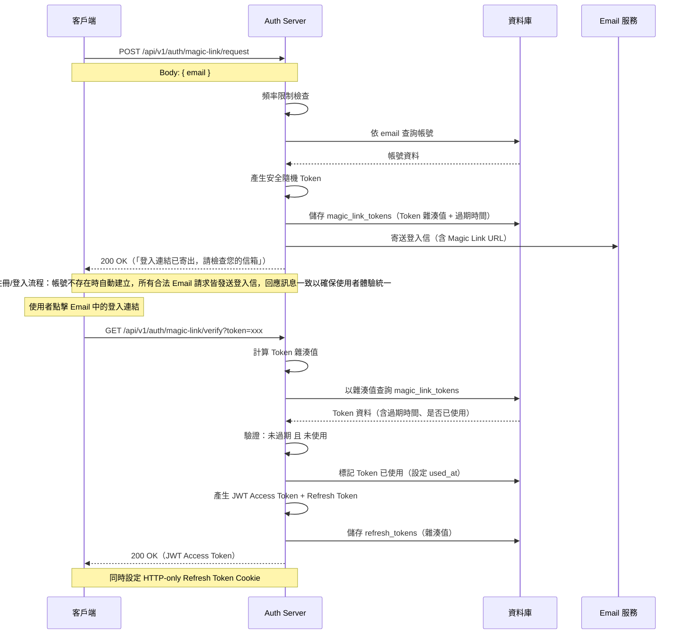
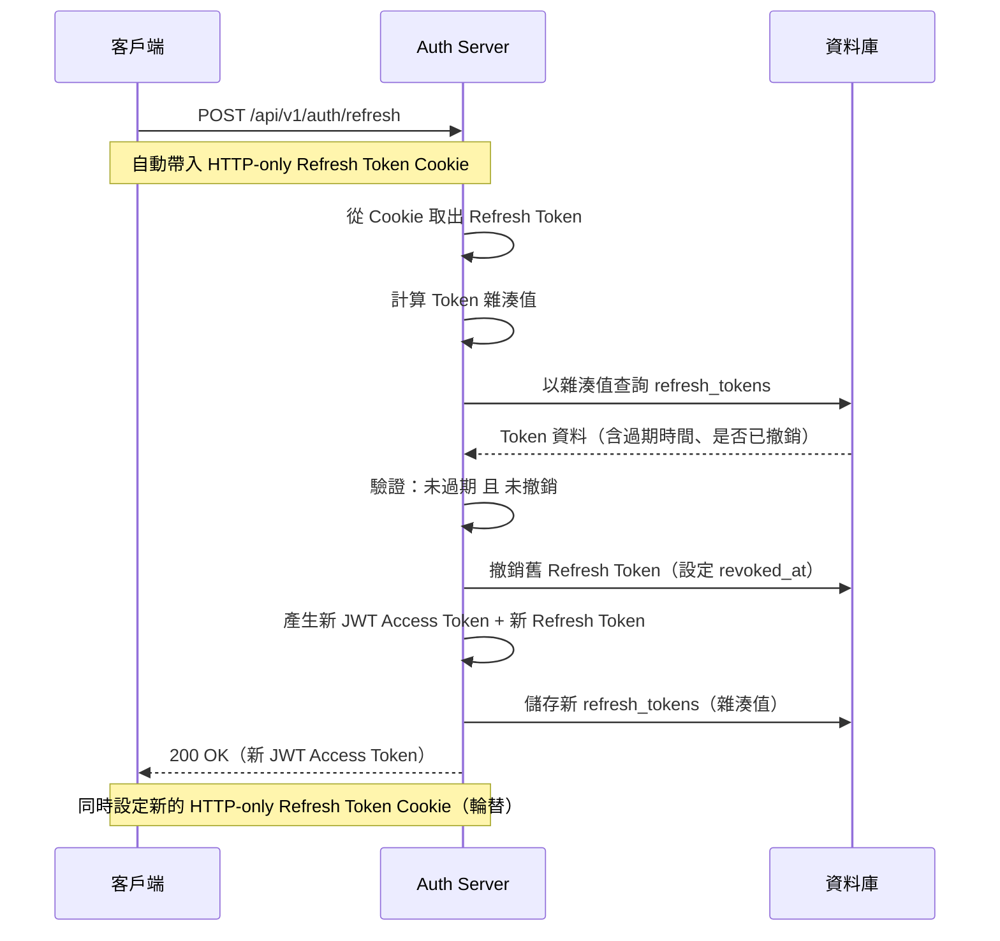

# 08 - 認證系統 (Authentication)

## 1. 問題描述

Conf-Ops 系統需要安全且無密碼的認證機制，支援兩種登入方式：

1. **Passkey (WebAuthn)**：基於 FIDO2/WebAuthn 標準的免密碼認證，支援平台驗證器（Touch ID、Windows Hello）及漫遊驗證器（YubiKey）
2. **Email Magic Link**：透過 Email 發送一次性登入連結

認證成功後，系統發行 JWT Access Token 供 API 存取，並搭配 HTTP-only Refresh Token Cookie 實現安全的 Token 續期機制。

---

## 2. 設計決策

### 2.1 Passkey (WebAuthn)

| 項目 | 決策 |
|------|------|
| 標準 | WebAuthn / FIDO2 |
| 實作函式庫 | `webauthn-rs`（Rust WebAuthn 函式庫） |
| 平台驗證器 | Touch ID、Windows Hello 等裝置內建生物辨識 |
| 漫遊驗證器 | YubiKey 等外部安全金鑰 |

**選擇理由：**
- 免密碼、防釣魚、抵抗重放攻擊
- 使用者體驗佳（一指觸碰即可登入）
- 業界標準，主流瀏覽器與作業系統皆已支援

### 2.2 Email Magic Link

| 項目 | 決策 |
|------|------|
| 機制 | 產生安全隨機 Token，資料庫僅儲存 Token 雜湊值，連結中包含明文 Token |
| Token 有效期 | 15 分鐘 |
| 使用次數 | 一次性，使用後立即失效 |

**選擇理由：**
- 作為 Passkey 的備援方案，確保使用者在任何裝置皆可登入
- 不需安裝額外軟體或設定
- 實作簡單、安全性高（Token 單次使用且短效期）

### 2.3 Token 策略

| 項目 | 決策 |
|------|------|
| Access Token | JWT 格式，有效期 15 分鐘，包含 `account_id`，透過 Response Body 回傳 |
| Refresh Token | HTTP-only Cookie，有效期 7 天，`Secure`、`SameSite=Strict` 屬性 |
| Token 續期 | `POST /api/v1/auth/refresh`，使用 Refresh Cookie，回傳新的 Access Token 並輪替 Refresh Token |
| Token 撤銷 | 維護拒絕清單（Deny List），儲存於 PostgreSQL `revoked_tokens` 表，用於記錄已登出的 Refresh Token |

**選擇理由：**
- Access Token 短效期降低洩漏風險
- Refresh Token 使用 HTTP-only Cookie 防止 XSS 竊取
- Token 輪替（Rotation）確保 Refresh Token 洩漏時能及時偵測與阻斷

---

## 3. 元件圖



---

## 4. 資料流

### 4.1 Passkey 註冊流程



### 4.2 Passkey 登入流程



### 4.3 Magic Link 流程



### 4.4 Token Refresh 流程



---

## 5. 內部介面契約

認證模組對外公開的 Rust Trait 介面：

```rust
use uuid::Uuid;
use webauthn_rs::prelude::*;

/// Token 配對：Access Token + Refresh Token
pub struct TokenPair {
    pub access_token: String,
    pub refresh_token: String,
}

/// JWT Claims 內容
pub struct Claims {
    pub account_id: Uuid,
    pub exp: i64,
    pub iat: i64,
}

/// 認證服務介面
#[async_trait]
pub trait AuthService: Send + Sync {
    /// Passkey 註冊 - 開始（產生 Challenge）
    async fn passkey_register_begin(
        &self,
        account_id: Uuid,
    ) -> Result<CreationChallengeResponse>;

    /// Passkey 註冊 - 完成（驗證並儲存憑證）
    async fn passkey_register_complete(
        &self,
        account_id: Uuid,
        credential: RegisterPublicKeyCredential,
    ) -> Result<()>;

    /// Passkey 登入 - 開始（產生 Challenge）
    async fn passkey_login_begin(
        &self,
        email: &str,
    ) -> Result<RequestChallengeResponse>;

    /// Passkey 登入 - 完成（驗證並發行 Token）
    async fn passkey_login_complete(
        &self,
        assertion: PublicKeyCredential,
    ) -> Result<TokenPair>;

    /// Magic Link - 請求發送登入連結
    async fn magic_link_request(&self, email: &str) -> Result<()>;

    /// Magic Link - 驗證 Token 並發行 Token
    async fn magic_link_verify(&self, token: &str) -> Result<TokenPair>;

    /// 使用 Refresh Token 換發新 Token
    async fn refresh_token(&self, refresh_token: &str) -> Result<TokenPair>;

    /// 撤銷 Refresh Token（登出）
    async fn revoke_token(&self, refresh_token: &str) -> Result<()>;

    /// 驗證 Access Token 並解析 Claims
    async fn validate_access_token(&self, token: &str) -> Result<Claims>;
}
```

---

## 6. 資料表

### passkey_credentials（Passkey 憑證）

儲存使用者已註冊的 WebAuthn 憑證。

```sql
CREATE TABLE passkey_credentials (
    id UUID PRIMARY KEY,
    account_id UUID NOT NULL REFERENCES accounts(id),
    credential_id BYTEA NOT NULL UNIQUE,
    public_key BYTEA NOT NULL,
    counter BIGINT NOT NULL DEFAULT 0,
    name VARCHAR(255),  -- 使用者自訂名稱，如 "MacBook Touch ID"
    created_at TIMESTAMPTZ NOT NULL DEFAULT NOW(),
    last_used_at TIMESTAMPTZ
);

CREATE INDEX idx_passkey_credentials_account_id ON passkey_credentials(account_id);
```

### magic_link_tokens（Magic Link Token）

儲存 Magic Link 的 Token 雜湊值。

```sql
CREATE TABLE magic_link_tokens (
    id UUID PRIMARY KEY,
    account_id UUID NOT NULL REFERENCES accounts(id),
    token_hash BYTEA NOT NULL UNIQUE,
    expires_at TIMESTAMPTZ NOT NULL,
    used_at TIMESTAMPTZ,
    created_at TIMESTAMPTZ NOT NULL DEFAULT NOW()
);

CREATE INDEX idx_magic_link_tokens_token_hash ON magic_link_tokens(token_hash);
CREATE INDEX idx_magic_link_tokens_account_id ON magic_link_tokens(account_id);
```

### refresh_tokens（Refresh Token）

儲存 Refresh Token 的雜湊值，支援撤銷與輪替。

```sql
CREATE TABLE refresh_tokens (
    id UUID PRIMARY KEY,
    account_id UUID NOT NULL REFERENCES accounts(id),
    token_hash BYTEA NOT NULL UNIQUE,
    expires_at TIMESTAMPTZ NOT NULL,
    revoked_at TIMESTAMPTZ,
    rotated_at TIMESTAMPTZ,
    replaced_by UUID REFERENCES refresh_tokens(id),
    created_at TIMESTAMPTZ NOT NULL DEFAULT NOW()
);

CREATE INDEX idx_refresh_tokens_token_hash ON refresh_tokens(token_hash);
CREATE INDEX idx_refresh_tokens_account_id ON refresh_tokens(account_id);
```

---

## 7. 錯誤處理

| 情境 | HTTP 狀態碼 | 處理方式 |
|------|------------|---------|
| Magic Link Token 無效或已過期 | 400 Bad Request | 回傳明確錯誤訊息，引導使用者重新請求 |
| Magic Link Token 已使用 | 400 Bad Request | 回傳「此連結已使用」訊息 |
| WebAuthn 驗證失敗 | 401 Unauthorized | 回傳「認證失敗」，不揭露詳細原因 |
| Access Token 過期 | 401 Unauthorized | 客戶端應嘗試使用 Refresh Token 續期 |
| Refresh Token 過期或已撤銷 | 401 Unauthorized | 使用者須重新登入 |
| Magic Link 請求頻率超限 | 429 Too Many Requests | 回傳速率限制訊息，包含重試等待時間 |
| 帳號不存在（Magic Link） | 200 OK | 回傳與成功相同的訊息，防止帳號列舉攻擊 |

---

## 8. 安全考量

### Token 儲存安全
- 資料庫中僅儲存 Token 的雜湊值（SHA-256），不儲存明文 Token
- 即使資料庫洩漏，攻擊者無法取得可用的 Token

### Refresh Token 輪替
- 每次使用 Refresh Token 換發新 Token 時，舊 Token 立即失效
- 若偵測到已撤銷的 Refresh Token 被重複使用，應視為安全事件，撤銷該帳號所有 Refresh Token

### Refresh Token 並發安全

並發 refresh 請求（例如多個瀏覽器分頁同時觸發 401 → refresh）可能導致 token 被錯誤撤銷。

#### 問題場景

1. Tab A 發送 refresh 請求，使用 refresh_token_1
2. Tab B 同時發送 refresh 請求，也使用 refresh_token_1
3. Tab A 的請求先完成，refresh_token_1 被撤銷，發放 refresh_token_2
4. Tab B 的請求到達時，refresh_token_1 已撤銷 → 拒絕請求 → 使用者被登出

#### 解決方案：Grace Period + 原子操作

**實作要點：**

1. **Grace Period（30 秒）**：refresh token 被 rotate 後，舊 token 在 30 秒內仍可使用，返回相同的新 token pair
2. **原子操作**：使用 `SELECT ... FOR UPDATE` 鎖定 refresh token 記錄，避免 TOCTOU race condition
3. **重複偵測**：若舊 token 在 grace period 內再次使用，返回上次 rotation 產生的同一組新 token（透過 `replaced_by` 追蹤）
4. **安全邊界**：若舊 token 在 grace period 結束後被使用，視為 token 竊取，撤銷整個 token family

```rust
// 虛擬碼
async fn refresh_token(old_token: &str) -> Result<TokenPair> {
    let mut tx = pool.begin().await?;
    let record = sqlx::query!(
        "SELECT * FROM refresh_tokens WHERE token_hash = $1 FOR UPDATE",
        hash(old_token)
    ).fetch_one(&mut tx).await?;

    if record.revoked_at.is_some() {
        if let Some(rotated_at) = record.rotated_at {
            if Utc::now() - rotated_at < Duration::seconds(30) {
                // Grace period: 返回上次 rotation 的結果
                let new_record = get_token_by_id(record.replaced_by).await?;
                return Ok(new_record.to_token_pair());
            }
        }
        // Token reuse attack: 撤銷整個 family
        revoke_token_family(&mut tx, record.family_id).await?;
        return Err(Error::TokenReuse);
    }

    // 正常 rotation
    let new_token = create_refresh_token(&mut tx, record.account_id, record.family_id).await?;
    sqlx::query!(
        "UPDATE refresh_tokens SET revoked_at = NOW(), rotated_at = NOW(), replaced_by = $1 WHERE id = $2",
        new_token.id, record.id
    ).execute(&mut tx).await?;

    tx.commit().await?;
    Ok(new_token.to_token_pair())
}
```

### 傳輸安全
- 所有 API 端點強制使用 HTTPS
- Refresh Token Cookie 設定 `Secure` 屬性，僅透過 HTTPS 傳送

### CORS 設定
- 嚴格設定允許的 Origin，僅允許前端應用的網域
- 不使用萬用字元 `*`

### 頻率限制
- Magic Link 請求：每個 Email 每小時最多 5 次
- 登入嘗試：依 IP 限制，防止暴力破解

### WebAuthn Origin 驗證
- 嚴格驗證 WebAuthn 操作的 `origin` 與 `rpId`，防止釣魚攻擊

---

## 9. 設定項

| 環境變數 | 說明 | 預設值 |
|---------|------|--------|
| `AUTH_JWT_SECRET` | JWT 簽章金鑰 | （必填，無預設） |
| `AUTH_JWT_ACCESS_EXPIRY` | Access Token 有效期（秒） | `900`（15 分鐘） |
| `AUTH_REFRESH_EXPIRY` | Refresh Token 有效期（秒） | `604800`（7 天） |
| `AUTH_MAGIC_LINK_EXPIRY` | Magic Link Token 有效期（秒） | `900`（15 分鐘） |
| `AUTH_MAGIC_LINK_BASE_URL` | Magic Link 基礎 URL | `https://app.conf-ops.io/auth/verify` |
| `AUTH_WEBAUTHN_RP_ID` | WebAuthn Relying Party ID | `conf-ops.io` |
| `AUTH_WEBAUTHN_RP_ORIGIN` | WebAuthn Relying Party Origin | `https://app.conf-ops.io` |
| `AUTH_RATE_LIMIT_MAGIC_LINK` | Magic Link 頻率限制 | `5/hour` |
| `AUTH_REFRESH_TOKEN_GRACE_PERIOD` | Refresh Token 並發 Grace Period（秒） | `30` |

---

## 10. External API 認證（`/external/v1/`）

系統除了面向前端的 `/api/v1/`（JWT 認證）外，另提供 `/external/v1/` 前綴的外部資料 API，供第三方系統串接使用。

### 10.1 認證機制

| 項目 | 決策 |
|------|------|
| 認證方式 | 專案層級 API Key，透過 `X-API-Key` HTTP header 傳入 |
| Key 儲存 | 資料庫中僅儲存 API Key 的 SHA-256 雜湊值，不儲存明文 |
| Key 管理 | 由專案擁有者（`project_owner`）建立、撤銷，每個專案可建立多組 API Key |
| Key 格式 | `confops_<project_id_prefix>_<random_32bytes_base62>`，總長度約 60 字元 |

### 10.2 安全規範

- **傳輸安全**：所有 `/external/v1/` 端點強制 HTTPS
- **權限範圍**：每組 API Key 可設定允許存取的資源範圍（如僅限特定資料表）
- **IP 白名單**（選用）：可為 API Key 設定允許的來源 IP 範圍
- **Key 輪替**：支援建立新 Key 後再撤銷舊 Key，實現無停機輪替

### 10.3 速率限制

| 限制層級 | 限制值 | 說明 |
|---------|--------|------|
| Per API Key | 60 req/min | 防止單一串接端過度使用 |
| Per Project（所有 Key 合計） | 300 req/min | 防止單一專案佔用過多資源 |

速率限制回應遵循 RFC 7807 Problem Details 格式，HTTP 429，包含 `Retry-After` header。

### 10.4 與 `/api/v1/` 的差異

| 項目 | `/api/v1/`（內部 API） | `/external/v1/`（外部 API） |
|------|----------------------|---------------------------|
| 認證方式 | JWT Bearer Token | `X-API-Key` header |
| 認證粒度 | 使用者層級 | 專案層級 |
| 操作範圍 | 完整 CRUD + 即時協作 | 唯讀資料查詢 + 有限寫入 |
| 速率限制 | Per IP / Per User | Per API Key / Per Project |
| 審計追蹤 | `actor_type = 'user'` | `actor_type = 'api_key'` |
