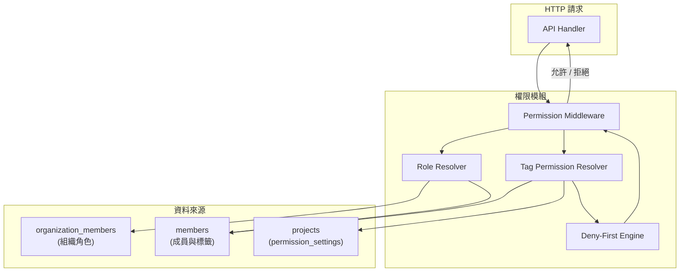
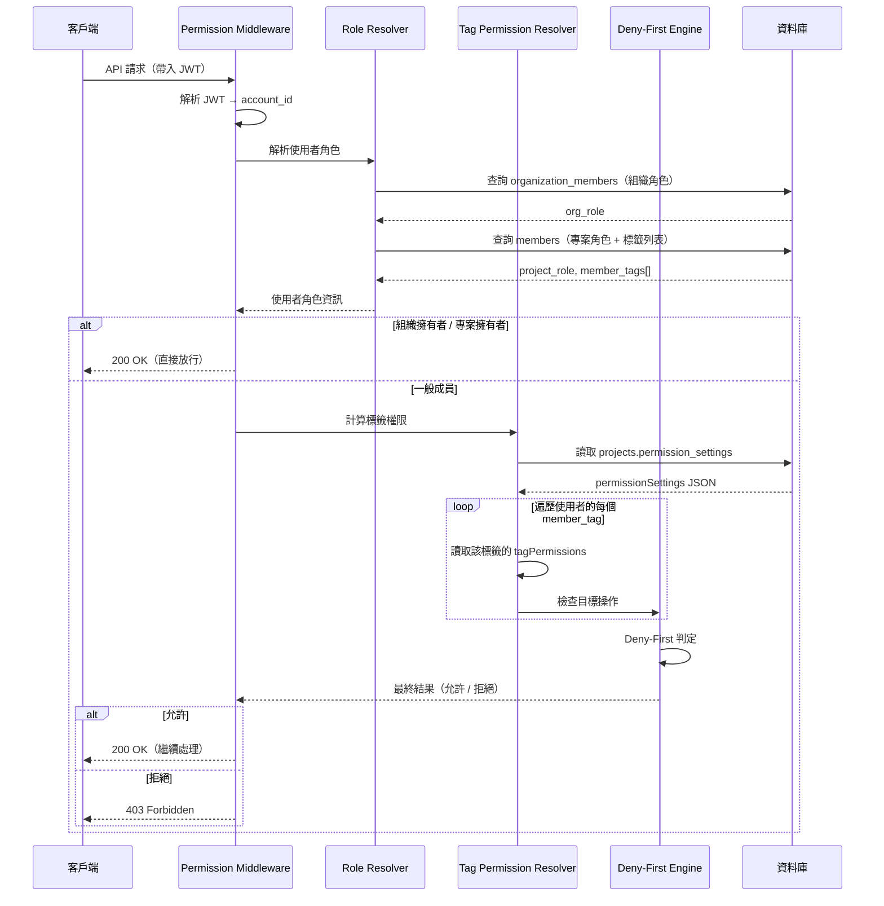
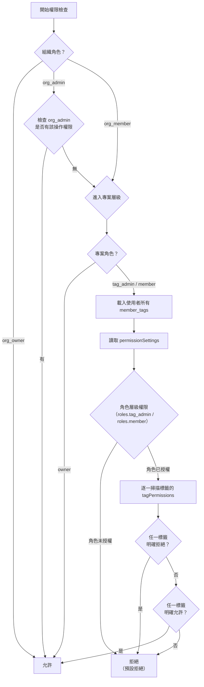

# 09 - RBAC + Deny-First 權限模型

## 1. 問題描述

Conf-Ops 系統支援大型活動的跨組協作，一個專案中可能有數十個成員標籤（組別），每個成員可同時擁有多個標籤。系統需要一套彈性但安全的權限模型，滿足以下需求：

- **組織層級**：控管成員與專案的管理權限
- **專案層級**：依成員標籤精細控制任務可見性、工具使用權限、記憶存取範圍、資料表存取等
- **衝突解決**：當一個成員擁有多個標籤且權限設定矛盾時，以**禁止優先（deny-first）**原則處理
- **AI 操作限制**：AI 查詢工具遵循操作者的可見性範圍，AI 寫入工具需有對應權限的成員確認
- **預設拒絕**：未明確允許的操作一律拒絕

---

## 2. 設計決策

### 2.1 權限模型：分層 RBAC + 標籤權限 + Deny-First

| 項目 | 決策 |
|------|------|
| 模型 | 分層 RBAC（組織角色 + 專案角色）搭配標籤級權限設定 |
| 衝突解決策略 | Deny-First：任一標籤禁止即禁止 |
| 預設策略 | 未明確允許的操作一律拒絕 |
| 權限儲存 | `projects.permission_settings` JSONB 欄位 |

**選擇理由：**
- 組織與專案兩層角色提供粗粒度權限控管，簡化常見場景
- 標籤級權限提供細粒度控制，滿足跨組協作的複雜需求
- Deny-First 確保安全性：寧可過度限制也不允許未授權存取
- JSONB 儲存權限設定，提供彈性的結構演進能力

### 2.2 考慮過的替代方案

| 方案 | 優點 | 缺點 | 結論 |
|------|------|------|------|
| **純 RBAC** | 簡單直觀 | 無法處理標籤級別的精細控制 | 否決 |
| **ABAC（屬性存取控制）** | 極度彈性 | 規則複雜度高、難以審計、效能開銷大 | 否決 |
| **ACL（存取控制清單）** | 直觀、精確 | 管理成本隨實體數量線性增長 | 否決 |
| **RBAC + 標籤權限 + Deny-First** | 平衡彈性與安全、可審計 | 多標籤時需完整掃描所有標籤設定 | **採用** |

---

## 3. 元件圖



---

## 4. 資料流

### 4.1 權限計算決策流程



### 4.2 Deny-First 決策樹



---

## 5. 內部介面契約

### 5.1 permissionSettings JSONB 結構

儲存於 `projects.permission_settings` 欄位，採用 `Vec<PermissionRule>` 結構，每條規則以 `tag`（成員標籤名稱，`"*"` 表示所有標籤）搭配 `allow` / `deny` 清單實現 Deny-First 控制。

```json
{
  "task_visibility": [
    {
      "tag": "贊助組",
      "allow": ["own_tag_tasks"],
      "deny": []
    },
    {
      "tag": "資訊組",
      "allow": ["own_tag_tasks", "cross_tag_linked_tasks"],
      "deny": []
    }
  ],
  "tool_permissions": [
    {
      "tag": "贊助組",
      "allow": ["smtp/sendEmail", "google/sheets"],
      "deny": []
    }
  ],
  "memory_visibility": [
    {
      "tag": "*",
      "allow": ["project_memories", "own_tag_memories"],
      "deny": ["other_tag_memories"]
    }
  ],
  "data_access": [
    {
      "tag": "贊助組",
      "allow": ["own_tag_data"],
      "deny": ["other_tag_data"]
    }
  ]
}
```

**四個權限維度：**

| 維度 | 說明 | allow / deny 可選值 |
|------|------|---------------------|
| `task_visibility` | 各標籤可查看的任務範圍 | `own_tag_tasks`、`cross_tag_linked_tasks`、`all_project_tasks` |
| `tool_permissions` | 各標籤可使用的執行工具 | 工具名稱（如 `smtp/sendEmail`、`hackmd/createDocument`） |
| `memory_visibility` | 各標籤可瀏覽的記憶範圍 | `project_memories`、`own_tag_memories`、`other_tag_memories` |
| `data_access` | 各標籤可存取的資料表範圍 | `own_tag_data`、`other_tag_data`、`all_project_data` |

**PermissionRule 結構：**

| 欄位 | 型別 | 說明 |
|------|------|------|
| `tag` | string | 成員標籤名稱，`"*"` 表示所有標籤 |
| `allow` | string[] | 允許的權限項目 |
| `deny` | string[] | 拒絕的權限項目（Deny-First：任一標籤拒絕即拒絕） |

### 5.2 Permission Checker Trait

```rust
use uuid::Uuid;

/// 權限操作類型
pub enum Action {
    // 任務操作
    ViewTask { task_id: Uuid },
    CreateTask { template_id: Uuid, owner_tag_id: Uuid },
    OperateInConversation { task_id: Uuid },

    // 待辦事項操作
    ManageTodo { task_id: Uuid },

    // 資料表操作
    ViewDataSheet { template_id: Uuid },
    EditDataEntry { task_id: Uuid },

    // 工具操作
    UseTool { tool_name: String },

    // 記憶操作
    BrowseMemory { scope: MemoryScope },
    EditMemory { scope: MemoryScope, scope_id: Uuid },

    // 管理操作
    ManageTagSettings { tag_id: Uuid },
    ManageTaskTemplates { tag_id: Uuid },
    ManageTagMembers { tag_id: Uuid },
}

/// 權限檢查結果
pub struct PermissionResult {
    pub allowed: bool,
    /// 拒絕原因（當 allowed = false 時）
    pub reason: Option<String>,
    /// 觸發拒絕的標籤 ID（Deny-First 時）
    pub denied_by_tag: Option<Uuid>,
}

/// 權限檢查服務介面
#[async_trait]
pub trait PermissionService: Send + Sync {
    /// 檢查使用者是否有權執行指定操作
    async fn check_permission(
        &self,
        account_id: Uuid,
        project_id: Uuid,
        action: Action,
    ) -> Result<PermissionResult>;

    /// 批次檢查多個操作的權限（效能優化）
    async fn check_permissions_batch(
        &self,
        account_id: Uuid,
        project_id: Uuid,
        actions: Vec<Action>,
    ) -> Result<Vec<PermissionResult>>;

    /// 取得使用者在指定專案中可使用的工具清單
    async fn get_allowed_tools(
        &self,
        account_id: Uuid,
        project_id: Uuid,
    ) -> Result<Vec<String>>;

    /// 取得使用者在指定專案中可見的記憶層級
    async fn get_visible_memory_scopes(
        &self,
        account_id: Uuid,
        project_id: Uuid,
    ) -> Result<Vec<MemoryScope>>;
}
```

### 5.3 Permission Middleware

```rust
/// Axum 權限中介層
/// 從 JWT claims 取得 account_id，搭配路由參數解析目標資源與操作，
/// 呼叫 PermissionService 進行權限檢查
pub struct PermissionLayer {
    permission_service: Arc<dyn PermissionService>,
}

/// 路由層級的權限標註
/// 使用範例：
///   .route("/tasks/:taskId", get(get_task).layer(require_permission(Action::ViewTask)))
pub fn require_permission(action_factory: impl Fn(RouteParams) -> Action) -> PermissionLayer {
    // ...
}
```

### 5.4 角色（Role）與權限（Permission）的命名對應

系統中「角色」（Role）與「權限」（Permission）是兩個不同層級的概念：

- **角色（Role）**：定義於資料模型層，儲存在 `members.role` 欄位，表示成員在專案中的身份。值為 `owner`、`tag_admin`、`member`
- **權限（Permission）**：用於 API 授權檢查（`x-permissions` 標註），表示執行特定 API 端點所需的授權。值為 `project_owner`、`tag_admin`、`project_member` 等

**映射關係：**

| 資料模型角色（`members.role`） | API 權限（`x-permissions`） | 說明 |
|-------------------------------|---------------------------|------|
| `owner` | `project_owner` | 專案擁有者，完整管理權限 |
| `tag_admin` | `tag_admin` | 標籤管理者，名稱一致 |
| `member` | `project_member` | 一般成員，基本操作權限 |

**設計理由：** 資料模型中的角色名稱保持簡潔（`owner`、`member`），因為 `role` 欄位已明確屬於專案成員的上下文。API 權限標註加上 `project_` 前綴（`project_owner`、`project_member`），是為了在 API 層級區分組織角色（`org_owner`、`org_admin`、`org_member`）與專案角色，避免混淆。此外，`task_participant` 為動態計算的權限（依參與人邏輯判定），不對應固定的資料模型角色。

### 5.5 權限矩陣（實作對照表）

以下矩陣對應程式碼中 `is_allowed`（組織層級）與 `is_allowed_project_role`（專案層級）的實作。

#### 組織層級權限矩陣

| Action | `org_owner` | `org_admin` | `org_member` |
|--------|:-----------:|:-----------:|:------------:|
| ViewOrganization | O | O | O |
| UpdateOrganization | O | O | X |
| DeleteOrganization | O | X | X |
| InviteMember | O | O | X |
| RemoveMember | O | O | X |
| UpdateMemberRole | O | X | X |
| CreateProject | O | O | X |
| ViewProject | O | O | O |
| UpdateProject | O | O | X |
| DeleteProject | O | O | X |
| UpdateProjectStatus | O | O | X |
| ViewPermissionSettings | O | X | X |
| UpdatePermissionSettings | O | X | X |
| CreateContact | O | O | X |
| UpdateContact | O | O | X |
| DeleteContact | O | O | X |
| MergeContacts | O | O | X |

> `org_owner` 擁有完整權限。`org_admin` 不可刪除組織、變更成員角色、檢視/修改權限設定。`org_member` 僅可檢視組織與專案。

#### 專案層級權限矩陣（ProjectScoped）

當 `org_owner` 存取 ProjectScoped 資源時直接放行；`org_admin` 先檢查組織矩陣，若組織矩陣允許則放行，否則 fallback 至專案角色矩陣。

| Action | `owner` | `tag_admin` | `member` |
|--------|:-------:|:-----------:|:--------:|
| ViewProjectMembers | O | O | O |
| InviteProjectMember | O | O | X |
| RemoveProjectMember | O | X | X |
| UpdateProjectMemberRole | O | X | X |
| ViewTags | O | O | O |
| CreateTag | O | O | O |
| UpdateTag | O | O | X |
| DeleteTag | O | X | X |
| AssignTag | O | O | X |
| UnassignTag | O | O | X |
| UpdateExternalTaskCreation | O | O | X |

> `owner` 擁有完整專案管理權限。`tag_admin` 可管理標籤與指派，但不可移除成員或變更成員角色。`member` 僅可檢視與建立標籤。

---

## 6. 錯誤處理

| 情境 | HTTP 狀態碼 | 處理方式 |
|------|------------|---------|
| 未認證（無 JWT 或 JWT 無效） | 401 Unauthorized | 引導使用者重新登入 |
| 無權存取指定資源 | 403 Forbidden | 回傳拒絕原因（不揭露具體標籤設定細節） |
| 使用者非專案成員 | 403 Forbidden | 回傳「您不是此專案的成員」 |
| 使用者非任務參與人 | 403 Forbidden | 回傳「您不是此任務的參與人」 |
| 工具未授權使用 | 403 Forbidden | 回傳「您的成員標籤不允許使用此工具」 |
| permissionSettings 格式異常 | 500 Internal Server Error | 記錄錯誤日誌，拒絕操作（安全降級：拒絕） |
| AI 寫入操作無授權確認者 | 403 Forbidden | 等待具有對應權限的參與人確認 |

### AI 操作的權限規則

| 操作類型 | 權限規則 |
|----------|---------|
| AI 查詢工具 | 遵循觸發操作的成員（即當前使用者）的可見性範圍。AI 只能查詢該成員有權看到的資料 |
| AI 寫入工具（建議） | AI 可對任何可用工具生成建議，但執行時需由具有該工具使用權限的參與人確認（詳見下方確認權限規則） |
| AI 上下文收集 | 記憶收集遵循繼承鏈，不受個別成員的 memoryVisibility 限制（AI 需要完整上下文才能生成有品質的建議） |

#### AI 寫入操作確認權限規則

當 AI 產生寫入建議（如透過 `smtp/sendEmail` 發送郵件、透過 `hackmd/createDocument` 建立文件等）時，需由任務參與人確認後才會實際執行。確認者的權限檢查流程如下：

1. **確認者身份要求**：確認者必須是該任務的參與人（`task_participant`），且具有 `project_member` 以上的專案角色
2. **工具使用權限檢查**：確認者本身必須擁有該工具的使用權限（即確認者的 `member_tags` 在 `tool_permissions` 中允許使用該工具）
3. **Deny-First 規則適用對象**：Deny-First 規則套用於**確認者**的標籤權限，而非 AI 本身。若確認者的任一標籤明確拒絕使用該工具，則該確認者無法確認此操作
4. **無合格確認者時的處理**：若任務中無任何參與人擁有該工具的確認權限，AI 建議將保持待確認狀態，系統記錄至審計日誌並通知專案擁有者

---

## 7. 擴展性考量

### 7.1 權限快取

- 使用者的權限計算結果可快取於 in-memory cache（`moka` crate，TTL 5 分鐘），key 為 `perm:{project_id}:{account_id}`
- 當以下事件發生時，透過 `EventBus`（Tokio broadcast channel）清除對應的快取：
  - `permissionSettings` 變更（`PermissionSettingsUpdated`）
  - 使用者的 `member_tags` 變更（`TagAssigned` / `TagUnassigned`）
  - 使用者的專案角色變更（`ProjectMemberRoleChanged`）
- 快取 TTL：5 分鐘（即使未收到清除事件，也會定期重新計算）
- **未來擴展**：當系統需要多節點部署時，改用 PostgreSQL `LISTEN/NOTIFY`（透過 `sqlx::PgListener`）取代 `EventBus`，實現跨節點的快取清除通知

### 7.2 permissionSettings 版本控制

- 每次修改 `permissionSettings` 時，記錄修改前後的 diff 至審計日誌
- 支援回滾至先前版本（由專案擁有者操作）

### 7.3 多標籤效能

- 權限計算需遍歷使用者的所有標籤，時間複雜度為 O(T)，T 為使用者的標籤數
- 實務上 T 通常小於 10，效能影響極小
- 若未來 T 顯著增長，可引入標籤權限預計算（在標籤變更時計算合併結果）

### 7.4 複製專案時的權限繼承

- `permissionSettings` 隨專案複製完整繼承
- 複製後新專案的擁有者可修改權限設定
- 標籤 ID 在複製時重新產生，`tagPermissions` 中的鍵對應更新

---

## 8. 設定項

| 環境變數 | 說明 | 預設值 |
|---------|------|--------|
| `AUTHZ_CACHE_ENABLED` | 是否啟用權限快取 | `true` |
| `AUTHZ_CACHE_TTL_SECS` | 權限快取 TTL（秒） | `300`（5 分鐘） |
| `AUTHZ_DEFAULT_DENY` | 預設拒絕策略（安全開關，應永遠為 true） | `true` |
| `AUTHZ_LOG_DENIED_REQUESTS` | 是否記錄被拒絕的請求至審計日誌 | `true` |
