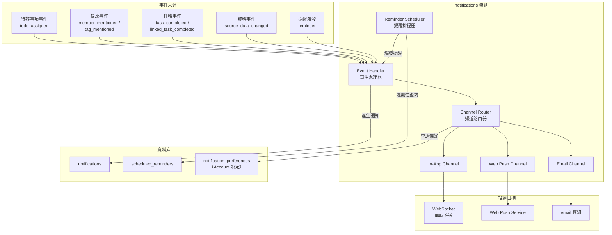
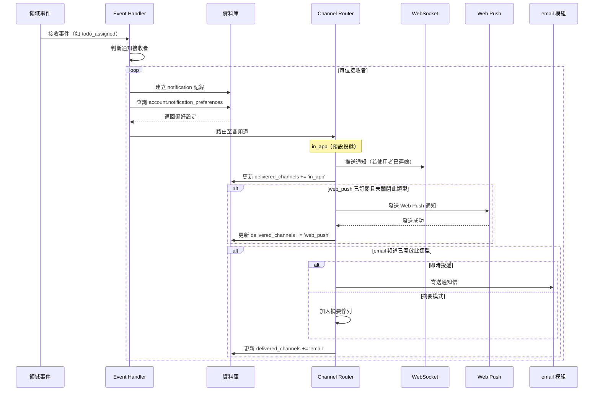
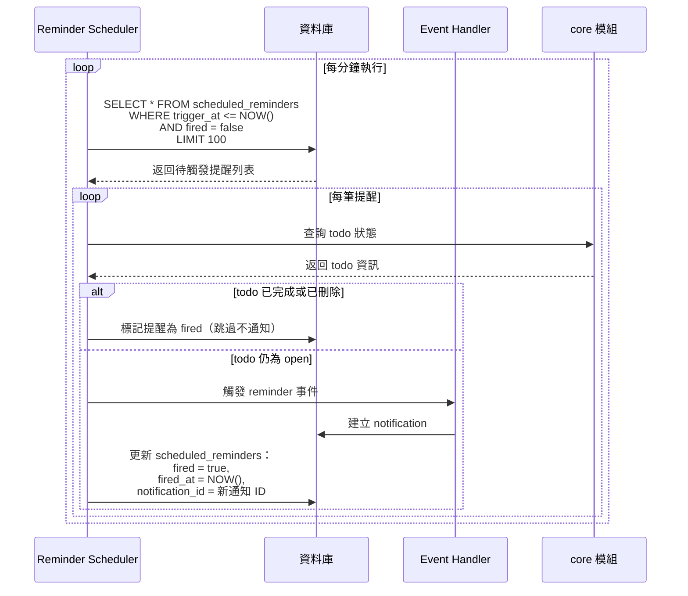
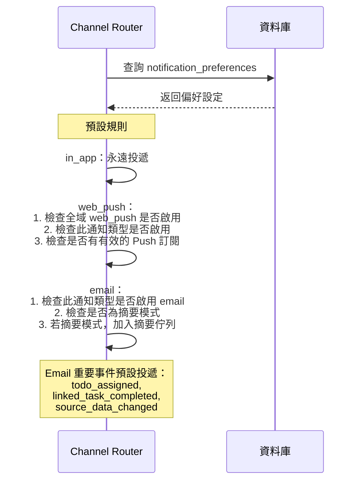

# 10 - 通知系統（Notification System）

## 1. 問題描述

Conf-Ops 系統中存在多種需要即時通知使用者的事件：待辦事項指派、對話中被提及、任務完成、來源資料異動等。此外，待辦事項的截止日期逼近、逾期、長期未處理等情境需要排程提醒機制。

系統需要一套統一的通知派發架構，能夠：

1. 將各類事件轉換為通知，依使用者偏好投遞至不同頻道（應用內、Web Push、Email）
2. 提供排程提醒功能，定期檢查待辦事項狀態並觸發提醒通知
3. 支援即時推送（WebSocket），確保線上使用者立即收到通知
4. 提供 Email 摘要選項，避免頻繁通知造成干擾

通知系統為**確定性的規則引擎**，不涉及 AI 生成內容，與 AI 建議流程完全獨立。

---

## 2. 設計決策

### 2.1 通知架構

| 項目 | 決策 |
|------|------|
| 通知儲存 | PostgreSQL `notifications` 表 |
| 即時推送 | WebSocket（已連線使用者） |
| Web Push | Web Push API + VAPID 認證 |
| Email 通知 | 透過 email 模組寄送 |

**選擇理由：**
- 資料庫儲存確保通知不遺失，即使使用者離線也能在上線後查看
- WebSocket 已用於 CRDT 即時同步，復用連線推送通知零額外成本
- Web Push 覆蓋使用者未開啟應用但瀏覽器仍在背景的場景
- Email 適合重要事件的離線通知

### 2.2 提醒排程

| 項目 | 決策 |
|------|------|
| 排程器 | Tokio 週期性任務（每分鐘執行） |
| 提醒儲存 | PostgreSQL `scheduled_reminders` 表 |
| 觸發機制 | 查詢 `trigger_at <= NOW() AND fired = false` |

**選擇理由：**
- Tokio 週期性任務輕量且與應用同程序，無需額外基礎設施
- 分鐘級精度對提醒場景足夠，避免高頻輪詢浪費資源
- Worker Deployment 負責執行排程，避免多 replica 重複觸發

### 2.3 頻道路由

| 頻道 | 預設行為 | 使用者可控 |
|------|---------|-----------|
| `in_app` | 所有通知皆投遞 | 不可關閉，可調整個別類型 |
| `web_push` | 訂閱後自動投遞 | 可關閉全域或個別類型 |
| `email` | 僅重要事件投遞 | 可調整個別類型 |

---

## 3. 元件圖



---

## 4. 資料流

### 4.1 通知派發流程



### 4.2 提醒排程流程



### 4.3 偏好路由邏輯



---

## 5. 內部介面契約

通知模組對外公開的 Rust Trait 介面：

```rust
use uuid::Uuid;

/// 通知事件
pub enum NotificationEvent {
    TodoAssigned {
        todo_id: Uuid,
        assignee_ids: Vec<Uuid>,
        assigner_id: Uuid,
    },
    MemberMentioned {
        message_id: Uuid,
        mentioned_member_ids: Vec<Uuid>,
        mentioner_id: Uuid,
    },
    TagMentioned {
        message_id: Uuid,
        tag_id: Uuid,
        mentioner_id: Uuid,
    },
    TaskCompleted {
        task_id: Uuid,
        completed_by: Uuid,
    },
    LinkedTaskCompleted {
        parent_task_id: Uuid,
        parent_todo_id: Uuid,
        completed_task_id: Uuid,
    },
    SourceDataChanged {
        target_task_id: Uuid,
        source_task_id: Uuid,
        changed_fields: Vec<String>,
    },
    ReminderFired {
        reminder_id: Uuid,
        todo_id: Uuid,
        reminder_type: String,
    },
}

/// 通知派發結果
pub struct DispatchResult {
    pub notification_id: Uuid,
    pub delivered_channels: Vec<String>,
}

/// 通知服務介面
#[async_trait]
pub trait NotificationService: Send + Sync {
    /// 派發通知事件
    async fn dispatch_notification(
        &self,
        event: NotificationEvent,
    ) -> Result<Vec<DispatchResult>>;

    /// 排程提醒
    async fn schedule_reminder(
        &self,
        todo_id: Uuid,
        reminder_type: &str,
        trigger_at: DateTime<Utc>,
        config: Option<serde_json::Value>,
    ) -> Result<Uuid>;

    /// 查詢通知偏好
    async fn get_notification_preferences(
        &self,
        account_id: Uuid,
    ) -> Result<NotificationPreferences>;

    /// 更新通知偏好
    async fn update_notification_preferences(
        &self,
        account_id: Uuid,
        preferences: NotificationPreferences,
    ) -> Result<()>;

    /// 標記通知已讀
    async fn mark_as_read(
        &self,
        account_id: Uuid,
        notification_ids: Vec<Uuid>,
    ) -> Result<()>;
}
```

---

## 6. 錯誤處理

| 情境 | 處理方式 |
|------|---------|
| WebSocket 連線不存在 | 跳過即時推送，通知已存入資料庫，使用者上線後可查看 |
| Web Push 訂閱過期 | 移除過期訂閱記錄，不再嘗試推送 |
| Web Push 發送失敗 | 記錄錯誤日誌，不重試（非關鍵路徑） |
| Email 發送失敗 | 記錄錯誤日誌，加入重試佇列（最多 3 次） |
| 提醒排程器查詢失敗 | 記錄錯誤日誌，下一輪繼續嘗試 |
| 通知接收者帳號不存在 | 跳過該接收者，記錄警告日誌 |
| 摘要 Email 建構失敗 | 降級為個別通知 Email 發送 |
| 多 replica 重複觸發提醒 | 防重機制分層保障：(1) **基本保障**：Worker Deployment 為單一 replica，天然避免重複觸發 (2) **未來多 replica 保障**：使用 PostgreSQL Advisory Lock（`pg_advisory_lock`）或 `SELECT ... FOR UPDATE SKIP LOCKED` 確保同一筆提醒不被多個 Worker 同時處理 |

---

## 7. 擴展性考量

### 通知量擴展

- 通知派發為非同步操作（透過 Tokio channels 事件匯流排），不阻塞主流程
- 高通知量場景可在事件處理與投遞之間加入 PostgreSQL 任務佇列緩衝
- `notifications` 表可依 `created_at` 分區，配合保留政策定期清理

### 提醒排程擴展

- 當前由 Worker Deployment 單一 replica 執行，天然避免重複觸發
- 未來多 Worker 場景防重機制：
  - **方案 A**：使用 PostgreSQL Advisory Lock（`pg_advisory_lock(reminder_id_hash)`），Worker 取得鎖後才處理提醒
  - **方案 B**：使用 `SELECT ... FOR UPDATE SKIP LOCKED`，類似 AI Pipeline 事件佇列的消費模式，Worker 以行級鎖定取得待處理提醒
  - 兩種方案皆可保證同一筆提醒不會被多個 Worker 同時處理
- `scheduled_reminders` 表的 `idx_scheduled_reminders_trigger` 索引確保查詢效率

### 模組拆離

- notifications 模組在服務拆分路線圖中為第三優先拆離候選
- 拆離後通知事件透過訊息佇列接收
- Web Push 和 Email 投遞為 I/O 密集操作，適合獨立擴展

### Email 摘要

- 摘要排程以設定的間隔（預設 4 小時）收集未讀通知
- 將同一專案的通知分組，產生結構化的摘要 Email
- 使用者可在偏好設定中選擇即時或摘要模式

---

## 8. 設定項

| 環境變數 | 說明 | 預設值 |
|---------|------|--------|
| `WEB_PUSH_VAPID_PRIVATE_KEY` | Web Push VAPID 私鑰 | （必填，無預設） |
| `WEB_PUSH_VAPID_PUBLIC_KEY` | Web Push VAPID 公鑰 | （必填，無預設） |
| `NOTIFICATION_EMAIL_DIGEST_INTERVAL` | Email 摘要間隔（秒） | `14400`（4 小時） |
| `NOTIFICATION_STALE_TODO_DAYS` | 待辦事項視為停滯的天數 | `7` |
| `NOTIFICATION_DUE_DATE_ADVANCE_DAYS` | 截止日提前提醒天數 | `3` |
| `NOTIFICATION_REMINDER_CHECK_INTERVAL` | 提醒排程器檢查間隔（秒） | `60` |
| `NOTIFICATION_READ_RETENTION_DAYS` | 已讀通知保留天數 | `90` |
| `NOTIFICATION_UNREAD_RETENTION_DAYS` | 未讀通知保留天數 | `180` |
