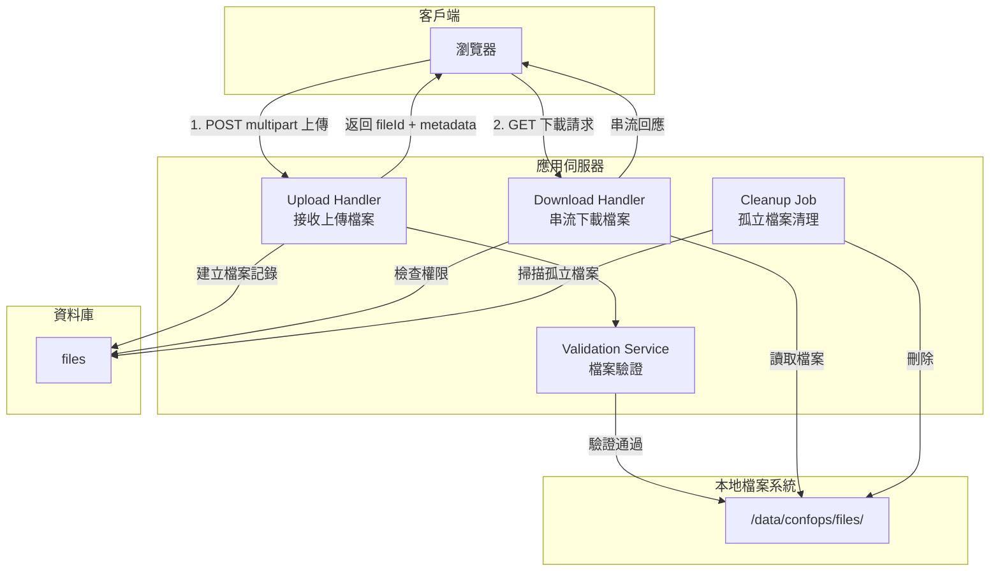
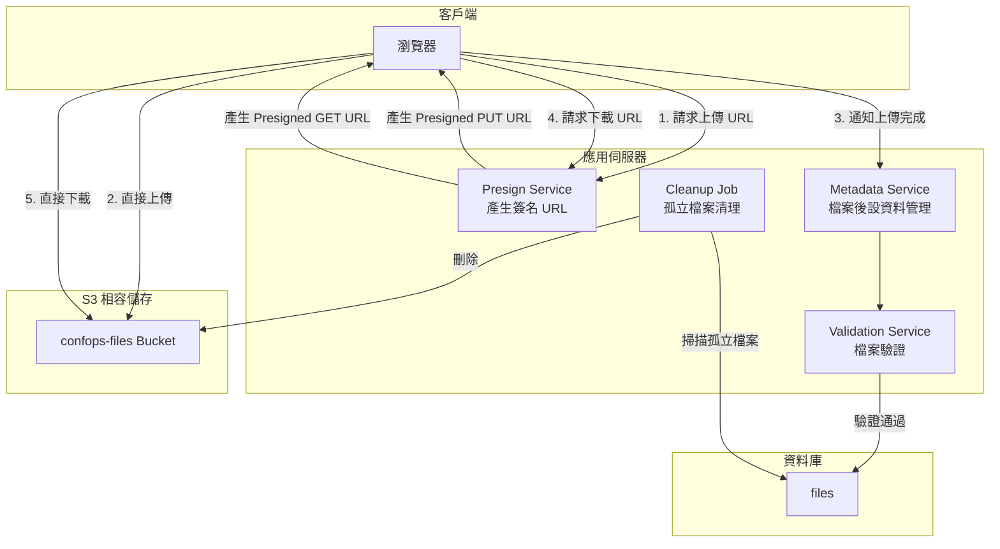
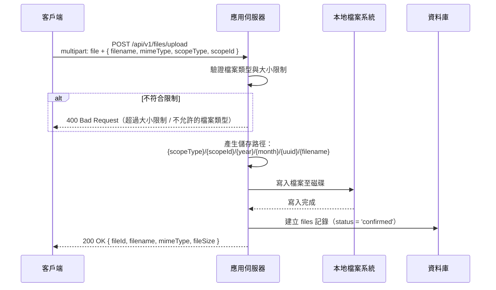
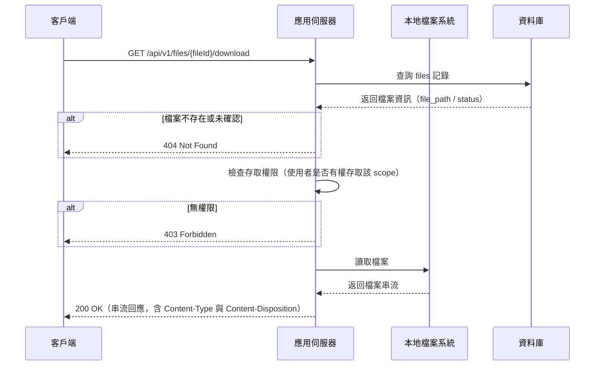
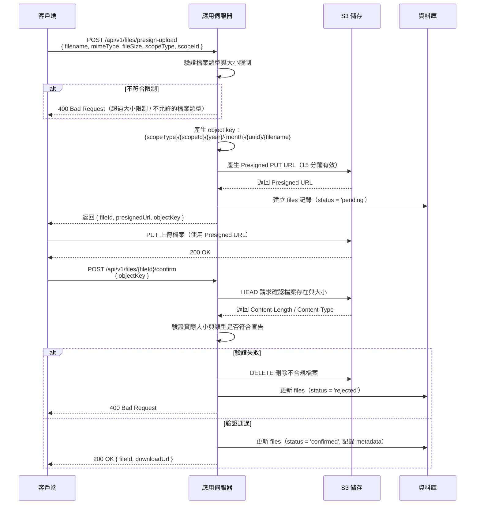
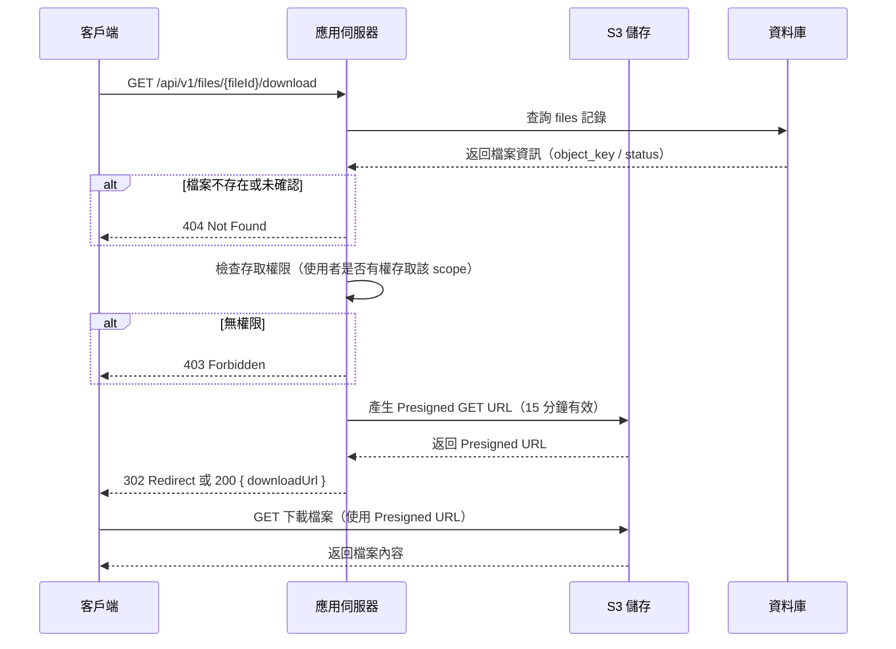

# 11 - 檔案儲存系統（File Storage）

## 1. 問題描述

Conf-Ops 系統中多個功能需要檔案儲存：

1. **Email 附件**：收到的 Email 可能包含附件，需要持久化儲存
2. **對話附件**：成員在任務對話中上傳的檔案
3. **資料表檔案欄位**：Data Sheet 中 `image` 與 `file` 類型欄位的上傳檔案

系統需要一套統一的檔案儲存架構，能夠安全地處理上傳、下載、存取控制與生命週期管理。透過抽象介面設計，系統可在本地檔案系統與 S3 相容物件儲存之間切換，降低環境差異帶來的問題。

---

## 2. 設計決策

### 2.1 儲存後端策略

| 項目 | 決策 |
|------|------|
| 預設儲存後端 | 本地檔案系統 |
| 替代後端 | S3 相容物件儲存（未來可選） |
| 選擇方式 | `STORAGE_BACKEND` 環境變數（`local` 或 `s3`） |
| Rust 抽象 | `StorageService` trait，支援多種後端實作 |

**選擇本地檔案系統的理由：**
- 最簡單的部署方式，不需要額外的服務依賴
- 單一伺服器部署情境下，檔案與應用程式位於同一台機器
- 透過 Docker volume 實現持久化，方便以 rsync 進行備份
- 不需要處理 Presigned URL 的複雜性

> **S3 為未來規劃（Post-MVP）：** Day 1 使用本地檔案系統作為儲存後端，透過 Docker volume 持久化，以 rsync 進行備份。S3 相容物件儲存（如 MinIO、AWS S3）為 Post-MVP 的擴展選項，當需要多節點部署或大量檔案儲存時切換。`StorageService` trait 已預留 S3 後端實作介面，切換時僅需實作 `S3StorageBackend` 並修改 `STORAGE_BACKEND` 環境變數。

### 2.2 上傳策略（本地後端）

| 項目 | 決策 |
|------|------|
| 上傳方式 | 客戶端透過 multipart POST 直接上傳至伺服器 |
| 檔案驗證 | 伺服器端即時驗證（大小、類型） |
| 儲存路徑 | `{STORAGE_BASE_PATH}/{scope_type}/{scope_id}/{year}/{month}/{uuid}/{filename}` |

**選擇理由：**
- 伺服器直接接收檔案，上傳流程簡單且可靠
- 即時驗證檔案，不需要二次確認步驟
- 單一 API 呼叫完成上傳，降低客戶端實作複雜度

### 2.3 下載策略（本地後端）

| 項目 | 決策 |
|------|------|
| 下載方式 | 伺服器代理串流下載 |
| 回應標頭 | 設定 `Content-Type` 與 `Content-Disposition` |
| 權限檢查 | 伺服器端驗證使用者存取權限 |

### 2.4 上傳/下載策略（S3 後端 — 未來可選）

| 項目 | 決策 |
|------|------|
| 上傳方式 | Presigned PUT URL（客戶端直傳 S3） |
| 下載方式 | Presigned GET URL |
| URL 有效期 | 15 分鐘 |
| 加密 | SSE-S3（Server-Side Encryption） |

當 `STORAGE_BACKEND=s3` 時，系統切換為 S3 後端，使用 Presigned URL 方式讓客戶端直接與 S3 互動，減輕應用伺服器頻寬負擔。需提供 `S3_*` 相關環境變數。

---

## 3. 元件圖

### 本地檔案系統後端（預設）



### S3 後端（替代方案）



---

## 4. 資料流

### 4.1 上傳流程（本地後端）



### 4.2 下載流程（本地後端）



### 4.3 上傳流程（S3 後端）



### 4.4 下載流程（S3 後端）



---

## 5. 內部介面契約

檔案儲存模組對外公開的 Rust Trait 介面：

```rust
use std::path::PathBuf;
use uuid::Uuid;
use tokio::io::AsyncRead;

/// 儲存後端類型
pub enum StorageBackend {
    /// 本地檔案系統（預設）
    Local,
    /// S3 相容物件儲存
    S3,
}

/// 檔案狀態
pub enum FileStatus {
    /// 等待上傳中（僅 S3 後端使用）
    Pending,
    /// 上傳完成，驗證通過
    Confirmed,
    /// 驗證失敗（僅 S3 後端使用）
    Rejected,
}

/// 檔案後設資料
pub struct FileMeta {
    pub id: Uuid,
    pub filename: String,
    pub mime_type: String,
    pub file_size: u64,
    pub storage_path: String,
    pub scope_type: String,
    pub scope_id: Uuid,
    pub status: FileStatus,
    pub uploaded_by: Uuid,
    pub created_at: DateTime<Utc>,
}

/// 儲存服務介面 — 本地與 S3 後端共用同一 trait
#[async_trait]
pub trait StorageService: Send + Sync {
    /// 上傳檔案
    async fn upload(
        &self,
        filename: &str,
        mime_type: &str,
        data: impl AsyncRead + Send,
        file_size: u64,
        scope_type: &str,
        scope_id: Uuid,
        uploaded_by: Uuid,
    ) -> Result<FileMeta>;

    /// 取得檔案下載串流
    async fn download(
        &self,
        file_id: Uuid,
    ) -> Result<(FileMeta, impl AsyncRead + Send)>;

    /// 刪除檔案
    async fn delete_file(&self, file_id: Uuid) -> Result<()>;

    /// 清理孤立檔案
    async fn cleanup_orphaned_files(&self) -> Result<u64>;
}

/// 本地檔案系統儲存服務
pub struct LocalStorageService {
    base_path: PathBuf,
    db_pool: PgPool,
}

/// S3 儲存服務（未來可選）
pub struct S3StorageService {
    s3_client: aws_sdk_s3::Client,
    bucket: String,
    db_pool: PgPool,
}
```

---

## 6. 錯誤處理

| 情境 | 處理方式 |
|------|---------|
| 檔案大小超過限制 | 在上傳時即拒絕，返回 400 |
| 不允許的檔案類型 | 在上傳時即拒絕，返回 400 |
| 磁碟空間不足 | 返回 503 Service Unavailable，記錄告警日誌 |
| 檔案寫入權限不足 | 返回 500 Internal Server Error，記錄錯誤日誌 |
| 下載時檔案不存在（磁碟上遺失） | 返回 404 Not Found，記錄錯誤日誌 |
| 下載時權限不足 | 返回 403 Forbidden |
| S3 連線失敗（S3 後端） | 返回 503 Service Unavailable，客戶端稍後重試 |
| Presigned URL 過期（S3 後端） | 客戶端需重新請求上傳 URL |
| Pending 狀態檔案超時未確認（S3 後端） | Cleanup Job 定期清理超過 1 小時的 pending 檔案 |

---

## 7. 擴展性考量

### 檔案組織

檔案在儲存系統中以結構化路徑組織：

```
{scope_type}/{scope_id}/{year}/{month}/{uuid}/{filename}
```

範例：
```
task/550e8400-e29b-41d4-a716-446655440000/2026/02/a1b2c3d4.../會議紀錄.pdf
email/660e8400-e29b-41d4-a716-446655440001/2026/02/b2c3d4e5.../attachment.png
```

此路徑結構在本地檔案系統與 S3 後端中保持一致。

### 安全性

- 本地後端：檔案存取權限由應用層控制，儲存目錄不對外公開
- S3 後端：Presigned URL 短效期（15 分鐘），降低 URL 洩漏風險；SSE-S3 伺服器端加密
- 兩種後端皆由伺服器驗證使用者權限後才提供檔案存取

### 大小限制

| 檔案類型 | 預設最大大小 |
|----------|-------------|
| 圖片（image/*） | 10 MB |
| 文件（pdf, doc, xlsx 等） | 50 MB |
| 其他 | 20 MB |

大小限制可透過環境變數覆寫。

### 孤立檔案清理

- 排程任務定期掃描 `files` 表中未被任何 `messages.attachments` 或 `data_entries` 引用的已確認檔案
- S3 後端另外掃描 `status = 'pending'` 且超過 1 小時的記錄
- 清理策略為先標記後刪除（標記 7 天後再從儲存系統刪除），避免誤刪

### 備份策略

- 本地後端：使用 rsync 或 rclone 定期備份儲存目錄
- Docker 部署時掛載 volume，確保容器重建後資料不遺失

### 多伺服器擴展

- 本地檔案系統適用於單一伺服器部署
- 需要多伺服器部署時，切換 `STORAGE_BACKEND=s3` 並提供 S3 相關設定即可

---

## 8. 設定項

### 通用設定

| 環境變數 | 說明 | 預設值 |
|---------|------|--------|
| `STORAGE_BACKEND` | 儲存後端類型（`local` 或 `s3`） | `local` |
| `STORAGE_BASE_PATH` | 本地儲存根目錄 | `/data/confops/files` |
| `STORAGE_MAX_IMAGE_SIZE` | 圖片最大大小（bytes） | `10485760`（10 MB） |
| `STORAGE_MAX_DOCUMENT_SIZE` | 文件最大大小（bytes） | `52428800`（50 MB） |
| `STORAGE_MAX_FILE_SIZE` | 其他檔案最大大小（bytes） | `20971520`（20 MB） |
| `STORAGE_CLEANUP_INTERVAL` | 孤立檔案清理間隔（秒） | `3600`（1 小時） |
| `STORAGE_CLEANUP_GRACE_PERIOD` | 孤立檔案清理寬限期（秒） | `604800`（7 天） |

### S3 後端設定（選用）

以下設定僅在 `STORAGE_BACKEND=s3` 時需要：

| 環境變數 | 說明 | 預設值 |
|---------|------|--------|
| `S3_ENDPOINT` | S3 相容儲存端點 | （必填，無預設） |
| `S3_BUCKET` | 儲存桶名稱 | （必填，無預設） |
| `S3_ACCESS_KEY` | S3 存取金鑰 | （必填，無預設） |
| `S3_SECRET_KEY` | S3 密鑰 | （必填，無預設） |
| `S3_REGION` | S3 區域 | `us-east-1` |
| `STORAGE_PRESIGN_EXPIRY` | Presigned URL 有效期（秒） | `900`（15 分鐘） |
