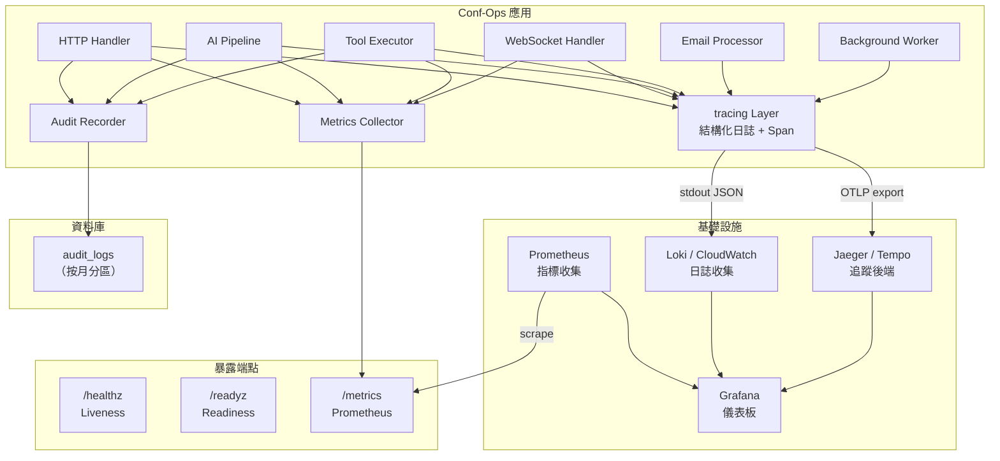
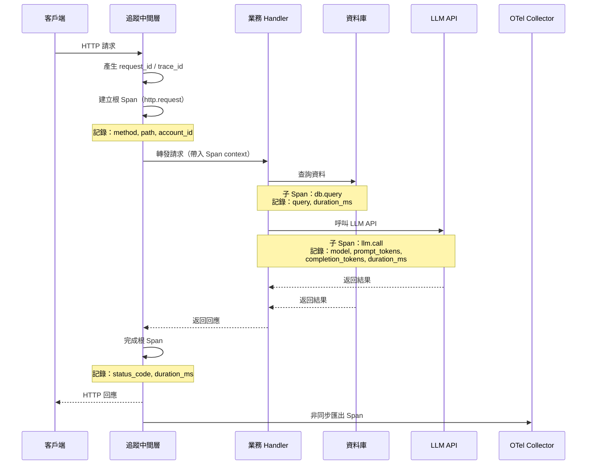
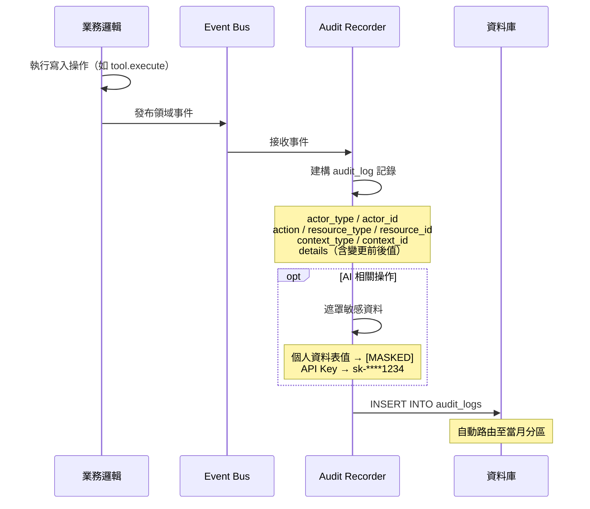

# 12 - 可觀測性基礎設施（Observability）

## 1. 問題描述

Conf-Ops 系統涵蓋 HTTP API、WebSocket 即時通訊、LLM API 呼叫、MCP 工具執行、Email 收發、背景排程等多種運行模式。在生產環境中，團隊需要：

1. **結構化日誌**：快速定位錯誤與異常行為，支援以 request_id、account_id 等維度過濾
2. **分散式追蹤**：追蹤跨模組的完整呼叫鏈，識別效能瓶頸（如 LLM API 延遲）
3. **指標監控**：掌握系統健康狀態，設定告警閾值
4. **審計基礎設施**：記錄所有寫入操作的完整軌跡，支援安全稽核與合規需求
5. **健康檢查**：供部署環境探測應用存活與就緒狀態

若缺乏可觀測性基礎設施，問題排查將極度依賴人工猜測，效能退化難以發現，安全事件無法追溯。

---

## 2. 設計決策

### 2.1 日誌系統

| 項目 | 決策 |
|------|------|
| 日誌框架 | `tracing` crate + `tracing-subscriber` |
| 日誌格式 | JSON 結構化格式（生產）/ 人類可讀格式（開發） |
| 日誌收集 | stdout 輸出，由基礎設施收集（Loki / CloudWatch） |

**選擇理由：**
- `tracing` 是 Rust 生態中最成熟的結構化日誌與追蹤框架，與 Tokio 生態完美整合
- JSON 格式便於日誌系統解析與查詢
- stdout 輸出符合 12-factor app 原則，日誌收集交由基礎設施處理

### 2.2 分散式追蹤

| 項目 | 決策 |
|------|------|
| 追蹤標準 | OpenTelemetry（OTLP） |
| Rust 整合 | `tracing-opentelemetry` + `opentelemetry-otlp` |
| 追蹤後端 | Jaeger 或 OTLP 相容收集器 |

**選擇理由：**
- OpenTelemetry 為可觀測性的業界標準，後端可自由替換
- `tracing-opentelemetry` 將 tracing spans 自動轉換為 OTel spans，零侵入性
- OTLP 匯出協定支援大多數追蹤後端

### 2.3 指標監控

| 項目 | 決策 |
|------|------|
| 指標格式 | Prometheus exposition format |
| 暴露方式 | `/metrics` HTTP 端點 |
| Rust 整合 | `metrics` crate + `metrics-exporter-prometheus` |

**選擇理由：**
- Prometheus 為 Kubernetes 生態中最普遍的指標收集方案
- `/metrics` 端點被 Prometheus 原生支援自動抓取
- `metrics` crate 提供低開銷的指標記錄

### 2.4 審計日誌

| 項目 | 決策 |
|------|------|
| 儲存方式 | PostgreSQL `audit_logs` 表（按月份分區） |
| 記錄觸發 | 領域事件匯流排（所有寫入操作自動產生） |
| AI 審計 | prompt/response 記錄（敏感資料遮罩） |

---

## 3. 元件圖



---

## 4. 資料流

### 4.1 請求追蹤流程



### 4.2 審計記錄流程



---

## 5. 內部介面契約

### 5.1 日誌層級規範

| 層級 | 用途 | 範例 |
|------|------|------|
| `ERROR` | 系統故障，需要立即關注 | 資料庫連線失敗、儲存目錄不可寫入 |
| `WARN` | 服務降級，但仍可運作 | LLM API 回應慢、Web Push 發送失敗 |
| `INFO` | 業務事件，正常運行的重要節點 | 任務建立、工具執行、使用者登入 |
| `DEBUG` | 開發除錯資訊 | SQL 查詢、HTTP 請求/回應詳情 |
| `TRACE` | 極細粒度追蹤 | CRDT 同步更新、WebSocket 訊框 |

### 5.2 日誌上下文欄位

所有日誌自動附帶以下結構化欄位：

```rust
/// 追蹤上下文（自動注入至每個 Span）
pub struct TraceContext {
    /// 全域唯一的請求追蹤 ID
    pub request_id: String,
    /// 操作者帳號 ID（已認證時）
    pub account_id: Option<Uuid>,
    /// 專案 ID（在專案上下文中時）
    pub project_id: Option<Uuid>,
    /// 任務 ID（在任務上下文中時）
    pub task_id: Option<Uuid>,
}
```

### 5.3 指標定義

```rust
/// HTTP 指標
pub const HTTP_REQUEST_DURATION: &str = "http_request_duration_seconds";
pub const HTTP_REQUEST_TOTAL: &str = "http_requests_total";

/// 資料庫指標
pub const DB_POOL_ACTIVE: &str = "db_pool_active_connections";
pub const DB_POOL_IDLE: &str = "db_pool_idle_connections";
pub const DB_QUERY_DURATION: &str = "db_query_duration_seconds";

/// WebSocket 指標
pub const WS_ACTIVE_CONNECTIONS: &str = "ws_active_connections";
pub const WS_MESSAGES_TOTAL: &str = "ws_messages_total";

/// AI Pipeline 指標
pub const AI_PIPELINE_DURATION: &str = "ai_pipeline_duration_seconds";
pub const AI_LLM_CALL_DURATION: &str = "ai_llm_call_duration_seconds";
pub const AI_LLM_TOKENS_TOTAL: &str = "ai_llm_tokens_total";

/// 工具執行指標
pub const TOOL_EXECUTION_DURATION: &str = "tool_execution_duration_seconds";
pub const TOOL_EXECUTION_TOTAL: &str = "tool_executions_total";
pub const TOOL_EXECUTION_ERRORS: &str = "tool_execution_errors_total";

/// CRDT 指標
pub const CRDT_SNAPSHOT_SIZE_BYTES: &str = "crdt_snapshot_size_bytes";

/// 通知指標
pub const NOTIFICATION_DISPATCH_TOTAL: &str = "notification_dispatch_total";
pub const NOTIFICATION_DELIVERY_ERRORS: &str = "notification_delivery_errors_total";
```

---

## 6. 健康檢查

### 6.1 Liveness Probe（`/healthz`）

確認程序存活，僅檢查應用程式本身是否仍在運作。

```json
// GET /healthz → 200 OK
{
  "status": "ok"
}
```

- 固定回傳 200，表示程序未當機
- 部署環境使用此端點判斷是否需要重啟容器

### 6.2 Readiness Probe（`/readyz`）

確認程序已準備好接收流量，檢查關鍵外部依賴。

```json
// GET /readyz → 200 OK
{
  "status": "ready",
  "checks": {
    "database": "ok",
    "storage": "ok"
  }
}

// GET /readyz → 503 Service Unavailable
{
  "status": "not_ready",
  "checks": {
    "database": "error: connection refused",
    "storage": "ok"
  }
}
```

- 任一關鍵依賴不可達時回傳 503
- 部署環境使用此端點決定是否將流量導向此容器

---

## 7. 錯誤處理

| 情境 | 處理方式 |
|------|---------|
| OTel Collector 不可達 | 記錄警告日誌，追蹤資料暫存於記憶體緩衝區，待恢復後重送 |
| 日誌寫入失敗 | stderr 輸出降級（不應影響主流程） |
| 審計日誌寫入失敗 | 重試 3 次，仍失敗則記錄至 ERROR 日誌並告警 |
| Prometheus 抓取逾時 | `/metrics` 端點應在 1 秒內回應，指標計算不應阻塞 |
| 分區不存在 | 排程任務自動建立未來 3 個月的分區，缺少時 INSERT 失敗觸發告警 |

---

## 8. 擴展性考量

### 日誌量管理

- 生產環境建議 `APP_LOG_LEVEL=info,confops=debug`，避免 trace 層級日誌量過大
- 日誌收集系統（Loki / CloudWatch）設定保留政策：INFO+ 保留 30 天，DEBUG 保留 7 天

### 追蹤取樣

- 高流量場景啟用追蹤取樣（sampling），避免追蹤後端負載過高
- 建議策略：錯誤請求 100% 取樣，正常請求 10% 取樣
- 取樣率可透過環境變數動態調整

### 審計日誌

- `audit_logs` 表按月份分區，避免單表過大影響效能
- 歷史分區可依保留政策封存至冷儲存（本地壓縮歸檔，未來可遷移至 S3 Glacier）
- 預設保留 1 年，可依合規需求調整
- AI prompt/response 記錄可能體積較大，建議壓縮儲存

#### 分區實作詳情

**父表定義（Range Partitioning by `created_at`）：**

```sql
CREATE TABLE audit_logs (
    id UUID NOT NULL,
    actor_type VARCHAR(50) NOT NULL,
    actor_id UUID NOT NULL,
    action VARCHAR(100) NOT NULL,
    resource_type VARCHAR(100) NOT NULL,
    resource_id UUID,
    context_type VARCHAR(50),
    context_id UUID,
    details JSONB,
    created_at TIMESTAMPTZ NOT NULL DEFAULT NOW(),
    PRIMARY KEY (id, created_at)
) PARTITION BY RANGE (created_at);
```

**月份分區 DDL 範例：**

```sql
-- 2026 年 1 月分區
CREATE TABLE audit_logs_2026_01 PARTITION OF audit_logs
    FOR VALUES FROM ('2026-01-01') TO ('2026-02-01');

-- 2026 年 2 月分區
CREATE TABLE audit_logs_2026_02 PARTITION OF audit_logs
    FOR VALUES FROM ('2026-02-01') TO ('2026-03-01');
```

**自動建立未來分區：**

`confops-worker` 背景任務每日檢查並自動建立未來 3 個月的分區，確保 INSERT 不會因分區不存在而失敗：

```sql
-- Worker 每日執行的分區維護邏輯（虛擬碼）
DO $$
DECLARE
    month_start DATE;
    month_end DATE;
    partition_name TEXT;
BEGIN
    FOR i IN 0..2 LOOP
        month_start := DATE_TRUNC('month', NOW() + (i || ' months')::INTERVAL);
        month_end := month_start + INTERVAL '1 month';
        partition_name := 'audit_logs_' || TO_CHAR(month_start, 'YYYY_MM');

        IF NOT EXISTS (
            SELECT 1 FROM pg_class WHERE relname = partition_name
        ) THEN
            EXECUTE FORMAT(
                'CREATE TABLE %I PARTITION OF audit_logs FOR VALUES FROM (%L) TO (%L)',
                partition_name, month_start, month_end
            );
        END IF;
    END LOOP;
END $$;
```

**清理與歸檔策略：**

- 超過 `AUDIT_RETENTION_DAYS`（預設 365 天）的分區執行以下步驟：
  1. **匯出歸檔**：`pg_dump -t audit_logs_YYYY_MM` 匯出為壓縮檔（`.sql.gz`），存放至備份目錄
  2. **卸離分區**：`ALTER TABLE audit_logs DETACH PARTITION audit_logs_YYYY_MM`
  3. **刪除分區**：確認歸檔完整後 `DROP TABLE audit_logs_YYYY_MM`
- 清理作業由 `confops-worker` 每日執行，與分區建立作業合併為單一排程任務

### 儀表板

建議設置以下 Grafana 儀表板：

| 儀表板 | 內容 |
|--------|------|
| **系統總覽** | HTTP 請求率、錯誤率、P99 延遲、WebSocket 連線數 |
| **AI Pipeline** | LLM 呼叫延遲、Token 使用量、建議生成成功率 |
| **工具執行** | 各工具執行延遲、成功/失敗率、並行數 |
| **資料庫** | 連線池使用率、查詢延遲、慢查詢 |
| **通知系統** | 通知派發量、各頻道成功率、提醒觸發量 |

### 告警規則

除基本的系統指標告警外，額外設定以下業務相關告警：

- **CRDT Snapshot 大小告警**：當 CRDT snapshot 超過 5MB 時觸發告警（參考 `docs/system/03-crdt-implementation.md`）
  - 指標名稱：`crdt_snapshot_size_bytes`
  - 閾值：> 5,242,880 bytes (5MB)
  - 嚴重度：warning

---

## 9. 設定項

| 環境變數 | 說明 | 預設值 |
|---------|------|--------|
| `APP_LOG_LEVEL` | 日誌等級 | `info,confops=debug` |
| `LOG_FORMAT` | 日誌格式：`json` / `pretty` | `json` |
| `OTEL_EXPORTER_ENDPOINT` | OpenTelemetry Collector 端點 | （選填，未設定則不啟用追蹤） |
| `OTEL_SERVICE_NAME` | 服務名稱 | `confops` |
| `OTEL_TRACE_SAMPLE_RATE` | 追蹤取樣率（0.0 ~ 1.0） | `1.0` |
| `METRICS_ENABLED` | 是否啟用 `/metrics` 端點 | `true` |
| `AUDIT_RETENTION_DAYS` | 審計日誌保留天數 | `365` |
| `AUDIT_AI_LOGGING_ENABLED` | 是否記錄 AI prompt/response | `true` |
| `HEALTH_CHECK_DB_TIMEOUT` | 健康檢查資料庫超時（秒） | `5` |
