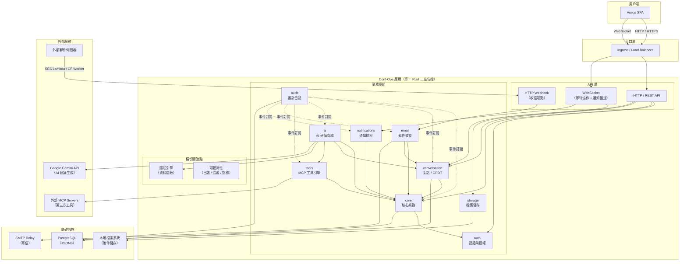
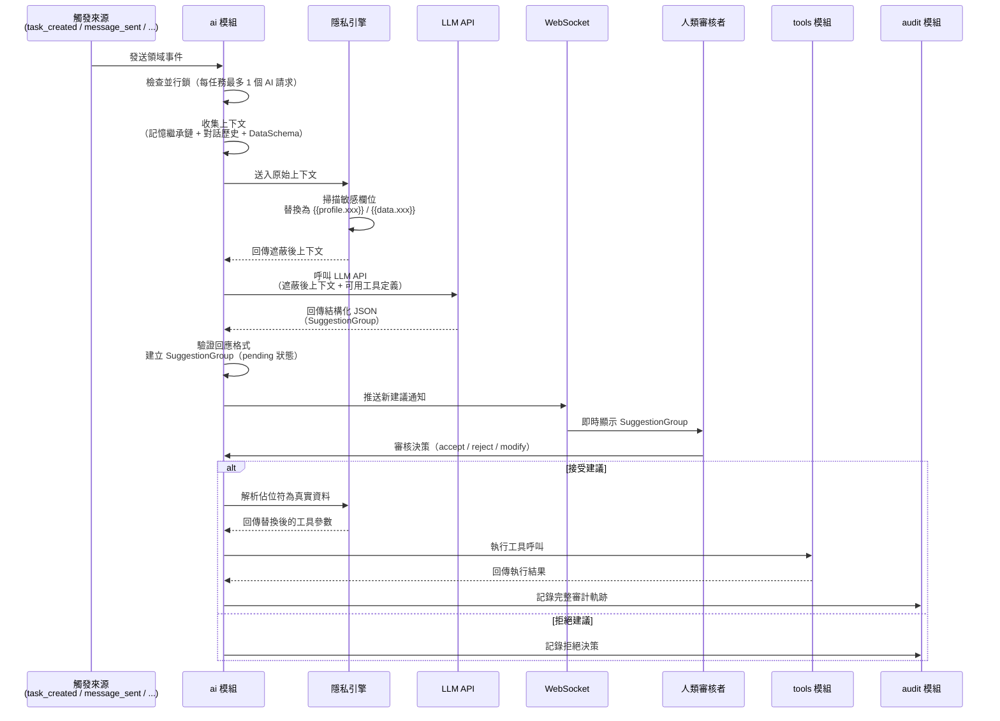
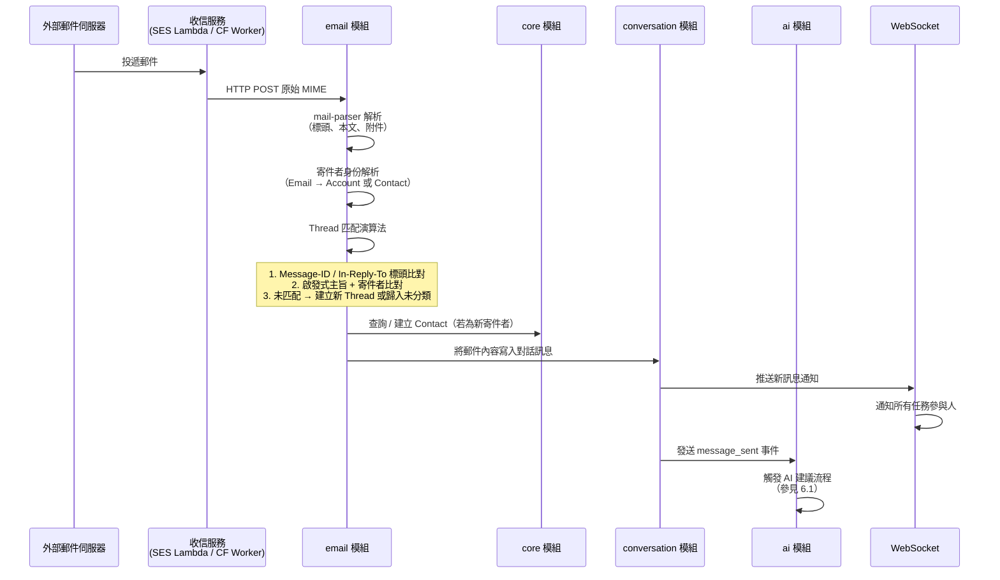

# 系統架構文件

本目錄包含 Conf-Ops 系統的架構設計文件，涵蓋服務架構、部署策略、核心機制與基礎設施等各面向的技術決策與設計細節。

## 1. 系統架構總覽

Conf-Ops 是一套以 AI 輔助的研討會／活動專案管理系統，採用 **Modular Monolith（模組化單體）** 架構，以單一 Rust 二進位檔部署。系統內部劃分九個具備明確邊界的模組，各模組透過 Rust trait 定義公開介面，禁止跨模組直接存取資料庫，確保未來可循序拆分為微服務。

核心特色包括：

- **AI-Human 協作迴圈**：系統偵測事件後觸發 AI 生成結構化建議，經人類審核後由工具引擎執行，全程保留完整審計軌跡
- **即時協作**：基於 CRDT（yrs / Yjs Rust port）實現多人即時共同編輯，透過 WebSocket 同步狀態
- **隱私引擎**：AI 不接觸實際資料值，所有敏感欄位透過佔位符語法遮蔽，執行前才替換為真實資料
- **統一工具介面**：內建工具與外部 MCP Server 工具以統一的 MCP 格式定義與執行

## 2. 高層級架構圖

## 3. 技術棧

| 類別 | 技術 | 說明 |
|------|------|------|
| **後端語言** | Rust | 非同步執行基於 Tokio runtime |
| **前端框架** | Vue.js | Single Page Application (SPA) |
| **關聯式資料庫** | PostgreSQL | 搭配 JSONB 儲存半結構化資料（記憶繼承鏈、工具參數等） |
| **In-Memory 快取** | moka | TTL/LRU 快取（權限計算、記憶繼承鏈），單節點使用 |
| **即時事件廣播** | PostgreSQL LISTEN/NOTIFY | 單節點 WebSocket 廣播、跨模組事件通知 |
| **即時協作 (CRDT)** | yrs | Yjs 的 Rust 移植版，實現 conflict-free 多人共同編輯 |
| **檔案儲存** | 本地檔案系統 | 附件檔案儲存，透過應用程式代理存取（未來可擴展至 S3） |
| **寄信** | lettre | Rust SMTP 客戶端，負責所有外寄郵件 |
| **收信解析** | mail-parser | MIME 解析器，處理收信 Webhook 收到的郵件 |
| **認證 (Passkey)** | webauthn-rs | WebAuthn / FIDO2 無密碼認證 |
| **認證 (Token)** | JWT | Access Token + HTTP-only Refresh Token Cookie |
| **可觀測性** | tracing + OpenTelemetry | 結構化日誌與分散式追蹤 |
| **指標監控** | Prometheus | 應用程式指標收集與暴露 |
| **部署 (開發)** | Docker Compose | 一鍵啟動所有外部依賴 |
| **部署 (生產)** | Docker Compose + Caddy | 單機部署、自動 HTTPS、反向代理（未來可擴展至 K8s） |

## 4. 模組概覽

| 模組 | 職責 | 詳細文件 |
|------|------|----------|
| **auth** | Passkey / WebAuthn 認證、Email Magic Link、JWT 簽發與驗證、Session 管理 | [08-authentication.md](./08-authentication.md)、[09-authorization.md](./09-authorization.md) |
| **core** | Account、Organization、Project、Member、Contact、Task、Todo、DataSheet 等核心實體管理；RBAC deny-first 權限計算 | [01-service-decomposition.md](./01-service-decomposition.md) |
| **conversation** | 任務對話訊息、CRDT 即時共同編輯、WebSocket 同步、awareness protocol、已讀狀態追蹤 | [03-crdt-implementation.md](./03-crdt-implementation.md) |
| **ai** | AI-Human 協作迴圈：事件觸發 → 上下文收集 → 隱私遮蔽 → LLM 呼叫 → SuggestionGroup 生命週期管理 | [04-ai-pipeline.md](./04-ai-pipeline.md) |
| **tools** | 統一 MCP 工具格式、內建工具（Rust 直呼叫）與外部工具（STDIO / SSE）、設定繼承、權限控管、佔位符解析 | [07-mcp-tool-runtime.md](./07-mcp-tool-runtime.md) |
| **email** | HTTP Webhook 收信（SES Lambda / CF Worker）、SMTP 寄信、Thread 匹配演算法、寄件者身份解析、附件處理 | [06-email-integration.md](./06-email-integration.md) |
| **notifications** | 多頻道通知派發（in-app / Web Push / Email）、提醒排程器、偏好路由、Email 摘要 | [10-notification-system.md](./10-notification-system.md) |
| **storage** | 本地檔案系統儲存、上傳 / 下載流程、檔案驗證、孤立檔案清理 | [11-file-storage.md](./11-file-storage.md) |
| **audit** | 事件訂閱式審計日誌、完整操作軌跡記錄、合規查詢介面 | [12-observability.md](./12-observability.md) |

橫切關注點：

- **隱私引擎**：佔位符解析與資料遮蔽管線，確保 AI 不接觸實際資料值 → [05-privacy-engine.md](./05-privacy-engine.md)
- **可觀測性**：結構化日誌、分散式追蹤、Prometheus 指標、健康檢查 → [12-observability.md](./12-observability.md)

## 5. 文件索引

| 編號 | 文件 | 主題 | 說明 |
|------|------|------|------|
| 01 | [服務拆分與模組架構](./01-service-decomposition.md) | 服務拆分與模組邊界 | Modular Monolith 架構決策、九大模組定義、依賴關係、通訊規則、資料庫 Schema 分區、未來微服務拆分策略 |
| 02 | [部署架構](./02-deployment-architecture.md) | 部署架構 | Docker Compose 開發與生產環境、Caddy 反向代理、CI/CD 流水線、資料備份策略 |
| 03 | [CRDT 選型與同步協定](./03-crdt-implementation.md) | CRDT 選型與同步協定 | CRDT 技術選型、yrs（Yjs Rust）實作、WebSocket 同步協定、awareness protocol、lastSeenMessageId 已讀保護 |
| 04 | [AI 建議管線](./04-ai-pipeline.md) | AI 建議管線 | AI-Human 協作迴圈（trigger → suggestion → decision → execution → record）、上下文蒐集、SuggestionGroup 生命週期、LLM API 呼叫 |
| 05 | [隱私引擎](./05-privacy-engine.md) | 隱私引擎與資料遮蔽 | 佔位符解析與資料遮蔽管線、AI 不接觸實際資料值的設計、`{{profile.xxx}}` / `{{data.xxx}}` 語法、執行前替換與人類確認 |
| 06 | [Email 整合系統](./06-email-integration.md) | 收發信架構 | HTTP Webhook 收信（AWS SES Lambda / Cloudflare Email Worker 雙路線）、SMTP 寄信、Thread 匹配演算法（標頭比對 → 啟發式 → 未分類）、寄件者身份解析、附件處理 |
| 07 | [MCP 工具執行引擎](./07-mcp-tool-runtime.md) | MCP 工具執行引擎 | 統一 MCP 格式、內建工具（Rust 直呼叫）、外部工具（STDIO / SSE）、設定繼承、權限控管、佔位符解析 |
| 08 | [認證系統](./08-authentication.md) | Passkey + Magic Link 認證 | Passkey (WebAuthn) 無密碼登入、Email Magic Link 備援、JWT Access Token + HTTP-only Refresh Token Cookie |
| 09 | [RBAC 權限模型](./09-authorization.md) | RBAC 權限模型 | 角色型存取控制、deny-first 策略、組織/專案/任務三層權限、成員標籤工具權限 |
| 10 | [通知系統](./10-notification-system.md) | 通知與提醒系統 | 多頻道通知派發（in_app / web_push / email）、提醒排程器、偏好路由、Email 摘要 |
| 11 | [檔案儲存系統](./11-file-storage.md) | 附件儲存 | 本地檔案系統儲存、上傳/下載流程、檔案驗證、孤立檔案清理 |
| 12 | [可觀測性基礎設施](./12-observability.md) | 可觀測性基礎設施 | 結構化日誌（tracing）、OpenTelemetry 分散式追蹤、Prometheus 指標、審計日誌、健康檢查端點 |

## 6. 跨模組資料流

### 6.1 AI 建議完整流程

從事件觸發到工具執行的端對端資料流：

### 6.2 Email 收發流程

外部 Email 進入系統後的處理流程：

## 閱讀建議

1. **入門**：先閱讀 [01-服務拆分與模組架構](./01-service-decomposition.md) 了解系統整體結構
2. **核心機制**：依序閱讀 04（AI 管線）→ 07（工具執行）→ 05（隱私引擎），理解 AI-Human 協作迴圈
3. **基礎設施**：02（部署）→ 12（可觀測性）了解運行環境
4. **各模組深入**：依需要閱讀 03、06、08、09、10、11

## 相關文件

- [功能規格架構文件](../architecture.md)：系統完整功能規格，包含核心實體、核心機制、權限模型等
- [資料模型](../data-model/README.md)：所有資料表的詳細定義
- [API 規格](../api/openapi.yaml)：OpenAPI 規格文件
